                            

SMS Queue
=========

The **SMS Queue** page displays the status of an SMS message for every single user subscribed to SMS. The **Status** column displays the message status. Under the **Status** column, hover over an icon next to the **Status** to view more details related to the message status. For example, you can view reasons for the **Undelivered**, **Rejected** and **Cancelled** SMS messages. For more details refer to [Status Messages](#Status_SMS).

The **SMS Queue** page displays the following details:

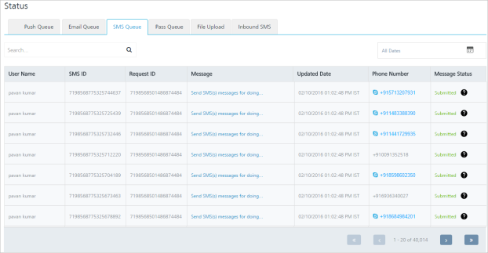

*   **All Dates** calendar: To use **All Dates**, see [All Dates](../Dashboard/Dashboard.md#All_Dates)
*   **Search** field: Click in the **Search** field to view options to search an SMS. You can search SMS messages based on the following criteria:
    *   **User**: Enter the user name in the search field and click **Enter**.
        
        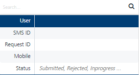
        
        The SMS message appears in the list-view.
        
        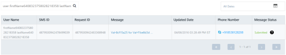
        
    *   **SMS ID**: Enter the **SMS ID** in the search field and click **Enter**.
        
        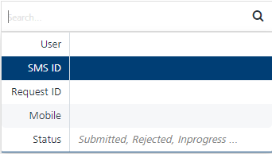
        
        The SMS message appears in the list-view.
        
        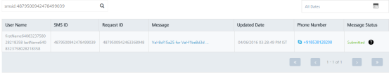
        
    *   **Request ID**: Enter the **Request ID** in the **Search** field and click **Enter**.
        
        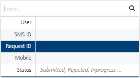
        
        The SMS message appears in the list-view.
        
        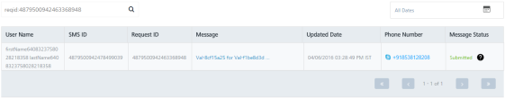
        
    *   **Mobile**: Enter the **Mobile Number** in the search field and click **Enter**.
        
        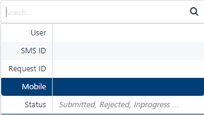
        
        The SMS message appears in the list-view.
        
        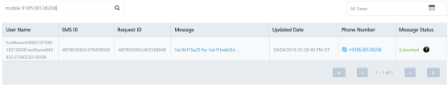
        
    *   **Status**: Enter the **Status** in the **Search** field as **Submitted**, **Rejected** or **In-progress**.
        
        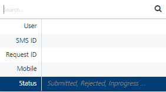
        
        The SMS message appears in the list-view.
        
        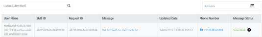
        
        > **_Note:_** To clear your search result, click in the **Search** field to view the **Status** page.
        

The **SMS Queue** list-view displays the following details:

  
| SMS Element | Description |
| --- | --- |
| User Name | The column displays the user names |
| SMS ID | The column displays the unique ID assigned to an SMS message |
| Request ID | The column displays the unique ID assigned to the request. All the SMS scheduled in a request have the same request ID |
| Message | The column displays the message displayed on the SMS template. To know more about message, see [Message](#message) |
| Phone Number | The column displays the phone number used to send the SMS message |
| Updated Date | The column displays the time stamp details:- When an SMS message is submitted to send- When an SMS message is updated- When an SMS message is opned by a SMS subscriber |
| Message Status | The column displays the current message status such as submitted |
| Display controls | By default, the number range is set to 20 so that only 20 messages are displayed in the list-view. You can view more screens by navigating through the forward arrow icon. You can move back through the backward arrow icon. |

*   **Status**: The column displays the current status of the SMS message. You can use the filter from the **Search** drop-down list to sort the SMS messages based on the status. The following table explains the status messages:
    
    | Status | Description |
    | --- | --- |
    | **Initial** | The Engagement services has initiated the SMS message to be sent |
    | **Submitted** | The Engagement services has sent the message to the cloud platform |
    | **Queue Full** | The gateway could not accept the SMS as the queue is full or the gateway is throttled |
    | **Undelivered** | The SMS is not delivered for any reasons such as the request is already expired |
    | **Rejected** | The SMS configuration is not valid |
    | **Cancelled** | The Engagement services did not send the SMS message as it is cancelled |
    | **Opened** | The SMS subscriber opened the message sent through the Engagement services |
    | **Not Attempted** | The Engagement services did not try to send the SMS as the SMS configuration is not available |
    

Message
-------

To view the message details, follow these steps:

1.  Click the desired message under the **Message** column in the list-view to view details.
    
    The **Message Content** pop-up window appears.
    
    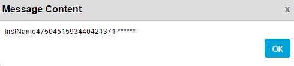
    
2.  Click **OK** to continue.
