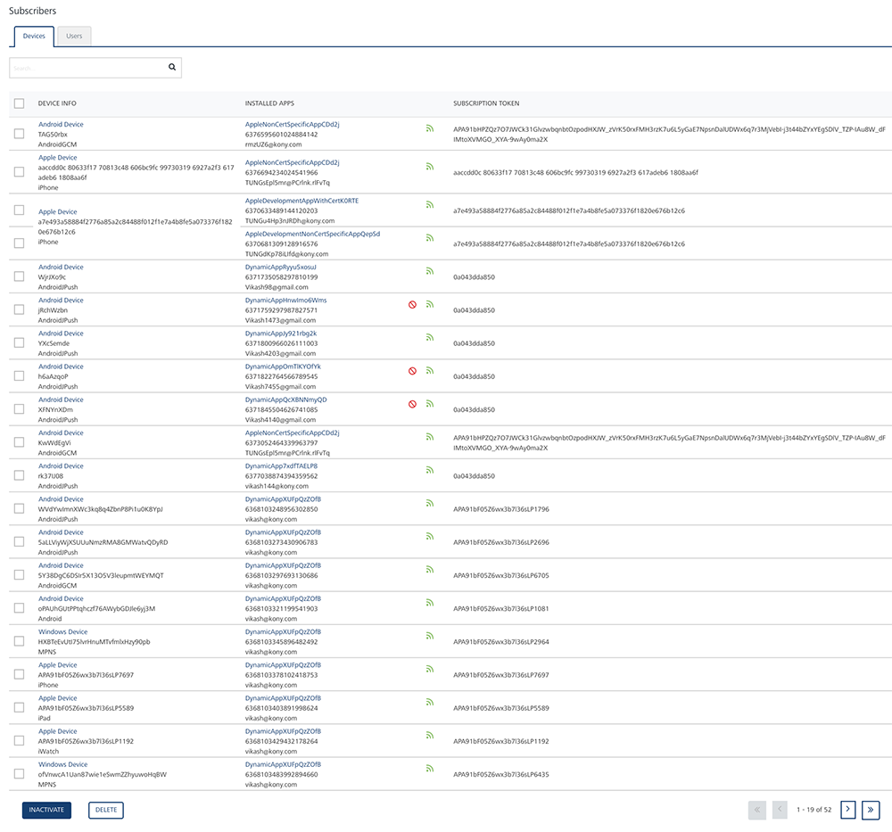

                           

Activating or Inactivating a Subscription from a Device
=======================================================

As an administrator, you can activate or inactivate a subscription from a device. Only active subscriptions are eligible to send push notifications. To stop sending notifications from a device, you need to inactivate that subscription.

The **Engagement** server displays an error message if you try to select a combination of active and inactive devices to perform the activate or inactivate action.

> **_Note:_** You can activate or inactivate a subscription from the **Devices** home page or from the **Device Details** page.

> **_Important:_** Both the **Subscribing** and **Activating** are the same actions. Equally **Unsubscribing** and **Inactivating** are the same actions.  
In the **Apps** list view, under the **Apps** column, hover your mouse over the green icon to view the **Subscribe/Unsubscribe** option.  
You can use the **Inactivate** button available at the bottom of the **Apps** list view to inactivate a subscriber.

Inactivating a Subscription
---------------------------

**To inactivate a subscription from the Device Details page, follow these steps**:

1.  On the **Devices** home page, click the required device under the **Device Info** column in the list view.
    
    The **Device Details** page appears.
    
    
    
2.  In the **Apps** list view, under the **Apps** column, select the check box next to the application name that you want to inactivate.
    
    The **Inactivate** button turns to active.
    
    
    
3.  Click the **Inactivate** button.
    
    The system displays the **Notification** dialog box with a warning message asking if you want to unsubscribe the selected applications.
    
4.  Click **Cancel** if you do not want to inactivate the subscription. The **Notification** dialog box closes without inactivating the application.
5.  Click **Yes** to continue.
    
    The system displays the confirmation message that the subscriber status updated successfully. The icon of the installed app turns to gray under the **Installed Apps** column. The gray color indicates that the application is unsubscribed and cannot receive notifications.
    
    
    

Activating a Subscription
-------------------------

**To activate a subscription, follow these steps**:

1.  In the **Apps** list view, under the **Device Info** column, select the check box adjacent to the application name, you want to activate.
    
    The **Inactivate** button turns to **Activate**.
    
2.  Click the **Activate** button to activate the subscription.
    
    The system displays the **Notification** dialog box with a warning message asking if you want to subscribe the selected applications.
    
3.  Click **Cancel** if you do not want to subscribe the application. The **Notification** dialog box closes without activating the app.
4.  Click **Yes** to continue.
    
    The system displays the confirmation message that the subscriber status updated successfully. The gray icon of the installed app turns to green color under the **Installed Apps** column. The green color indicates that the application is subscribed and can receive push notifications.
    
    
    

Inactivating a Subscription Through a User Interference
-------------------------------------------------------

A user can inactivate a subscription to disable it temporarily. To inactivate, you need to run the **Unsubscribe** API to inactivate a subscription using **KSID** as an input parameter. Once a subscription is removed, a red icon appears next to the app details under the **Installed Apps** column. The red icon indicates that the subscription is forcibly unsubscribed manually on user's request and cannot receive any push notifications or, a user has not installed the app.

