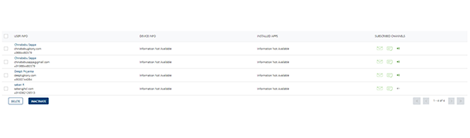
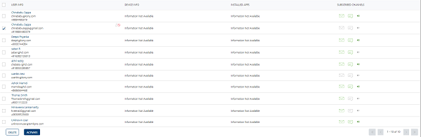

                           

Activating or Inactivating a User
=================================

As an administrator, you can activate or inactivate a user. Only active users can receive push, email, SMS, or pass notifications. To stop notifications to a user, you need to inactivate a user.

To inactivate a user, follow these steps:

1.  Navigate to the **Users** list-view. Under the **User Info** column, select the check box next to the user name, you want to inactivate.
    
    
    
2.  Click the **Inactivate** button.
    
    The system displays the **Inactivate User** dialog box asking if you want to inactivate the selected user.
    
3.  Click **Cancel** if you do not want to inactivate the user. The **Inactivate User** dialog box closes without inactivating the user.
4.  Click **Yes** to continue.
    
    The system displays the confirmation message that the user status is updated.
    
    
    
    > **_Note:_** A stale icon next to the user name under the **User** info column indicates the current status of a user as inactive.
    

To activate a user, follow these steps:

1.  Navigate to the **Users** list view. Under the **User Info** column, select the check box adjacent to the user name, you want to activate.
    
    The **Inactivate** button changes to **Activate**.
    
    
    
2.  Click the **Activate** button.
    
    The system displays the **Activate User** dialog box asking if you want to activate the selected user.
    
3.  Click **Cancel** if you do not want to activate the user. The **Activate User** dialog box closes without activating the user.
4.  Click **Yes** to continue.
    
    The system displays the confirmation message that the user status is updated. The user appears as an active user in the list view.
