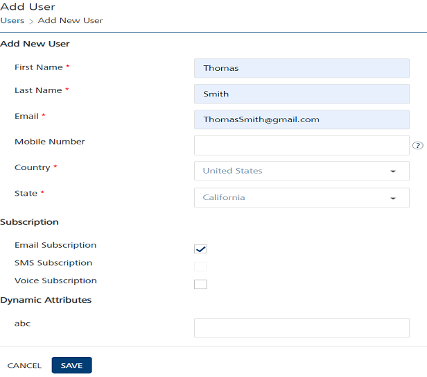
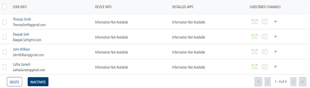
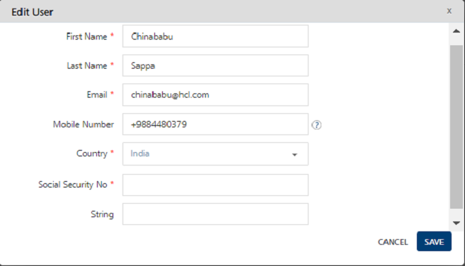

                           

Adding Dynamic User Attribute Types
===================================

You can add a custom user attribute only if the Admin has assigned the permission to you. When you try to access **Settings** > **Configuration** > **User Attributes** tab without permissions (`ROLE_CONFIGURATIONS`,and `ROLE_CREATE_ATTRIBUTES`), the system hides the **Add Attributes** button on the home page. For more information, refer to [Adding Custom User Attributes](../../../../Foundry/vms_console_user_guide/Content/Access_Management/Assigning_or_Unassigning_Permissions_to_a_User.md).

Based on your requirement, you can create dynamic user attribute types and specify them as optional or mandatory. For example, you create a new user, Thomas Smith, and enter all the necessary details to create a new user on the **Add User** page.

When you add a new user, the mandatory dynamic attributes must be specified. If you do not specify the mandatory attribute, the system displays an error message that the dynamic attribute is required.

For example, the **Social Security Number** is a dynamic attribute. When you try to create a new user -Thomas Smith without specifying the Social Security Number, the system displays the warning message that the Social Security Number is required.

You can save the new user after specifying the Social Security Number. The newly added user appears in the Users list view.

> **_Note:_** You can create a new user without mentioning optional dynamic attributes.

When you create a new mandatory dynamic attribute, the already existing users remains unaffected. But when you update any already existing user details, you need to specify the dynamic attribute details.

For example, when you edit details of an already existing user Latha Ganesh, you need to specify the Social Security Number. If you do not provide the details, the system displays the warning message that the Social Security Number is required.

