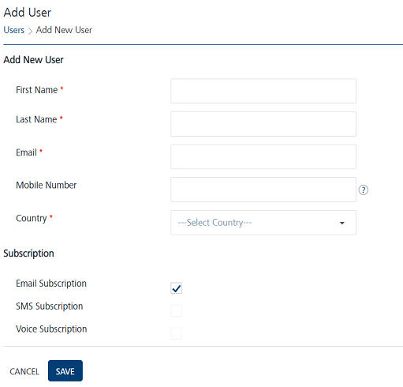
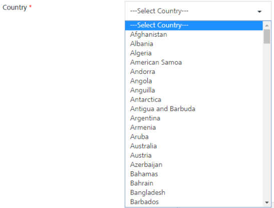
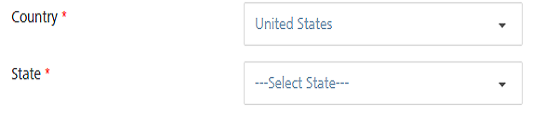
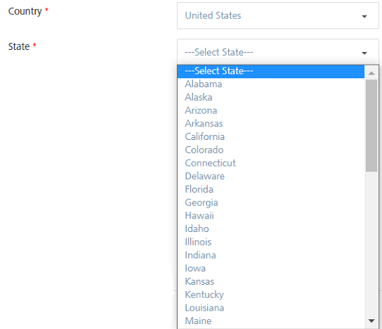
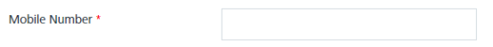
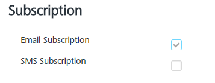
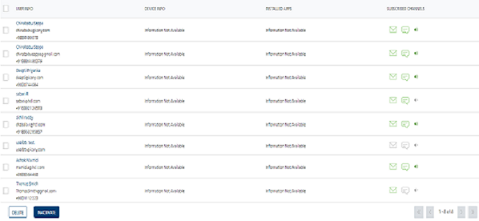
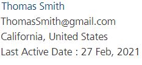

                            

Adding a User
=============

As an admin, you can add a new user to **Engagement** Services. You can add only one user at a time through the **Add New User** button.

To add a new user, follow these steps:

1.  Under **Overview**, click **Subscribers**.
    
    The **Subscribers** page appears. The **Subscribers** page includes two tabs: **Devices** and **Users**.
    
2.  Click the **Users** tab.
    
    The **Users** home page appears.
    
3.  Click the **Add New User** button next to the **Import Users** button.
    
    The **Add User** page appears.
    
    
    
    The **Add User** page includes the following sections:
    
    Add New User
    ------------
    
4.  Enter details in the following fields:  
    
    *   **First Name**: Enter the first name of the user. You cannot create user names with special characters such as / \\ \[ \] : ; | = , + \* ? < > @ ".
    *   **Last Name**: Enter the last name of the user.
    
    > **_Note:_** The **First Name** and **Last Name** fields also support French characters.
    
    *   **Email**: Enter the email address of the user. The address can include alphanumeric and special characters and should follow standard email address representation.
    *   **Mobile Number**: Enter the mobile number of the user. The mobile number must have the country code followed by the 4-13 digit number. For example, if the mobile number is 1234567890 and country code is +91, then the input must be +911234567890.
        
        > **_Note:_** If you miss adding "+" in the number, "+" will be appended before the provided mobile number.
        
    *   **Country**: Select the country from the drop-down list the user belongs to.
        
        
        
        If you select the country as **United States,**, the **State** drop-down list appears.
        
        
        
        Select the required state from the drop-down list. The state option is mandatory for United States (country) only.
        
        
        
        > **_Note:_** The **First Name**, **Last Name**,**Email**, and **Country** fields are mandatory. If you do not enter the details, the system displays an error message that information is required.  
        When you select the **Mobile Number** as a reconciliation key, the **Mobile Number** also becomes a mandatory field.  
        
        
        
    
    Subscription
    ------------
    
    *   **Email Subscription**: By default, the option is set to active. The user receives email messages. You can control when users receive email messages by deselecting the check box option.
    *   **SMS Subscription**:  When you add a new user without providing a mobile number, the SMS subscription value is considered false by default.
    
    > **_Note:_** The **Push** subscriptions are associated to an application installed on a device. However, the SMS and email are associated with the user.
    
    
    
    User Attributes
    ---------------
    
    Based on requirement, you can define different user attributes. Let us assume that you need to run Amazon campaign in Los Angeles County with zip code as 91001. So you define the user attribute - zip code (required).
    
    Next, you add users from Los Angeles County in Engagement server with zip code value as 91001. When you create a segment with user attribute as zip code, all the relevant users are added in to the segment. Now, you can create a campaign adding the segment.
    
    > **_Important:_** You can add 30 user attribute types. To add user attribute types, navigate to [Settings >Configuration > User Attributes > Add Attributes.  
    ](../Administration/Audience_Attribute_tab.md)
    
5.  Click the **Cancel** button to exit from the window without saving any information.
6.  Click the **Save** button.  
    The system adds the new user in the **Users** list view and displays the confirmation message that the user is saved successfully.
    
    
    
7.  Click the desired user in the list view to view the **Recent Activity** timestamp that is associated with the user by default.
    
    
    
    > **_Important:_** By default, the **Recent Activity** timestamp is associated with a user. The new feature is introduced in the Engagement Services Release 8.0. The timestamp is generated when a user is created for the first time either using the UI or the API. The timestamp is displayed on the **User Details** page along with the other user attributes. You can use the timestamp attribute to create segments.
    

<table style="margin-left: 0;margin-right: auto;mc-table-style: url]('../Resources/TableStyles/RevisionTable.css');" class="TableStyle-RevisionTable" cellspacing="0" data-mc-conditions="Default.md"><colgroup><col class="TableStyle-RevisionTable-Column-Column1"> <col class="TableStyle-RevisionTable-Column-Column1"> <col class="TableStyle-RevisionTable-Column-Column1"></colgroup><tbody><tr class="TableStyle-RevisionTable-Body-Body1"><td class="TableStyle-RevisionTable-BodyE-Column1-Body1">Rev</td><td class="TableStyle-RevisionTable-BodyE-Column1-Body1">Author</td><td class="TableStyle-RevisionTable-BodyD-Column1-Body1">Edits</td></tr><tr class="TableStyle-RevisionTable-Body-Body1"><td class="TableStyle-RevisionTable-BodyE-Column1-Body1">8.0</td><td class="TableStyle-RevisionTable-BodyE-Column1-Body1">AU</td><td class="TableStyle-RevisionTable-BodyD-Column1-Body1">AU</td></tr><tr class="TableStyle-RevisionTable-Body-Body1"><td class="TableStyle-RevisionTable-BodyB-Column1-Body1">7.3.2</td><td class="TableStyle-RevisionTable-BodyB-Column1-Body1">AU</td><td class="TableStyle-RevisionTable-BodyA-Column1-Body1">AU</td></tr></tbody></table>
