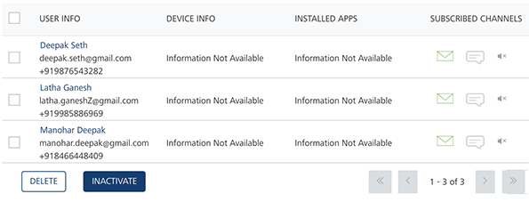
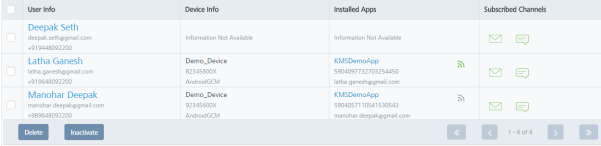
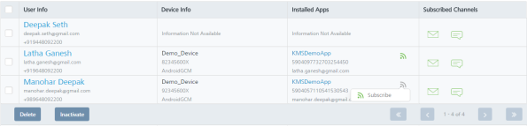
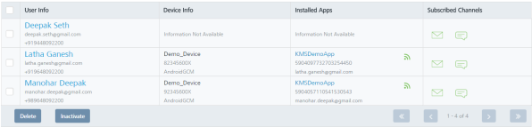

                           

Subscribing or Unsubscribing an App
===================================

Admin can subscribe or unsubscribe an installed app on a device. Once an app is unsubscribed, the device does not receives push notifications.

> **_Important:_** Both Subscribing and Activating are the similar actions. When a device is chosen and subscribe is clicked, all the applications on the device are subscribed for push notifications. Similarly Unsubscribing and Inactivating are the similar actions.

To unsubscribe an app follow these steps:

1.  Navigate to the **Users** list view. Under the **Installed Apps** column, click the green icon.
    
    The **Unsubscribe** link appears.
    
    
    
2.  Click the **Unsubscribe** link.
    
    The system displays the **Unsubscribe** dialog with the warning message, asking if you want to unsubscribe.
    
3.  Click **Cancel** if you do not want to unsubscribe the app. The **Unsubscribe** dialog closes without unsubscribing the app.
4.  Click **Yes** to continue.
    
    The system displays the confirmation message that the subscriber status updated successfully. The app is unsubscribed from the device and the green icon turns to the gray color.
    
    
    

To subscribe an app, follow these steps:

1.  Navigate to the **Users** list view. Under the **Installed Apps** column, click the gray icon.
    
    The **Subscribe** link appears.
    
    
    
2.  Click the **Subscribe** link.
    
    The system displays the **Subscribe** dialog with the warning message, asking if you want to subscribe.
    
3.  Click **Cancel** if you do not want to subscribe the app. The **Subscribe** dialog closes without subscribing the app.
4.  Click **Yes** to continue.
    
    The system displays the confirmation message that the subscriber status updated successfully. The app is subscribed and the gray icon turns to the green color.
    
    
