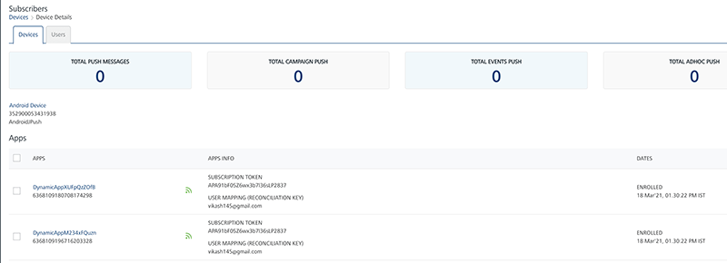
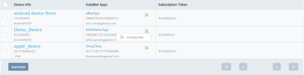
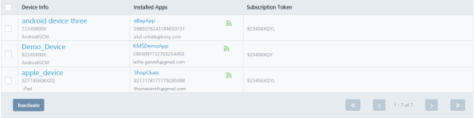

                           

Activating or Inactivating a Device through Installed Apps
==========================================================

Admin can activate or inactivate a device. Once a device is inactivated, the device no more receives messages.

> **_Note:_** You can activate or inactivate a device either from the Devices home page or from the Device Details page.

To inactivate a device follow these steps:

1.  On Devices home page, navigate to the **Devices** list view. Under the **Installed Apps** column, mouse hover the green icon.
    
    The **Unsubscribe** link appears.
    
    
    
2.  Click the **Unsubscribe** link.
    
    The system displays the **Unsubscribe** dialog with the warning message, asking if you want to unsubscribe.
    
3.  Click **Cancel** if you do not want to unsubscribe the device. The **Unsubscribe** dialog closes without unsubscribing the device.
4.  Click **Yes** to continue.
    
    The system displays the confirmation message that the subscriber status updated successfully. The device is unsubscribed and the green icon turns to the gray color.
    
    
    

To activate a device, follow these steps:

1.  Navigate to the **Devices** list view. Under the **Installed Apps** column, hover the mouse over the gray icon.
    
    The **Subscribe** link appears.
    
    
    
2.  Click the **Subscribe** link.
    
    The system displays the **Subscribe** dialog with the warning message, asking if you want to subscribe.
    
3.  Click **Cancel** if you do not want to subscribe the device. The **Subscribe** dialog closes without subscribing the device.
4.  Click **Yes** to continue.
    
    The system displays the confirmation message that the subscriber status updated successfully. The device is subscribed and the gray icon turns to the green color.
    
    
