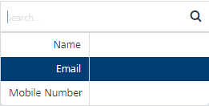

                            

Users
=====

The **Users** page displays users, along with devices if mapped. A user must enable the installed application for notification subscription to receive notifications. The primary attributes that are required to add users in **Engagement** Services are the First Name, Last Name, Email, Mobile Number, Country, State (if in United States), Last Active Date, Location, and Beacon.

> **_Important:_** The **Audience Members** in **Engagement** services Release 6.5 are renamed as **Users**.

> **_Important:_** As a user, you must have the following permissions to perform different tasks based on the role.  
  
    - ROLE\_USERS\_ALL

The **Users** home page displays the following details:

*   **Add New User** button: Helps you add new users to the list.
*   **Import Users** button: Helps you import users to the list from a file.
*   **All Dates**:  For more details, see [Dashboard > All Dates](../../../../Foundry/vms_console_user_guide/Content/Dashboard/Dashboard.md)
*   **Search**: Click in the **Search** field to view options to search a user. You can search users based on the following criteria:
    *   **User Name**: Enter the name of the desired user in the Search field and click **Enter**.
        
        
        
        The required user appears in the list view.
        
        
        
    *   **User Email**: Enter the email of the desired user in the Search field and click **Enter.**
        
        
        
        The required user appears in the list view.
        
        
        
    *   **Mobile Number**: Enter the mobile number of the desired user in the Search field and click **Enter**. 
        
        
        
        The required user appears in the list view.
        
        
        
    *   **Device Name**: Enter the name of the desired device in the Search field and click **Enter**.
        
        
        
        The required user appears in the list view.
        
    *   **Device ID**: Enter the device ID of the required device in the Search field and click **Enter**.
        
        
        
        The required user appears in the list view.
        
        
        
    *   **Application**: Enter the application name in the Search field and click **Enter**.
        
        
        
        The required user appears in the list view.
        
        
        
    *   **KSID**: Enter the **KSID** in the Search field and click **Enter**. 
        
        
        
        The required user appears in the list view.
        
        
        
    *   **Platform**: Enter the platform name in the Search field and click **Enter**. 
        
        
        
        The required user appears in the list view.
        
          
          
        
    *   **UFID**: Enter the **UFID** in the Search field and click **Enter**. 
        
        
        
        The required user appears in the list view.
        
        
        
        > **_Note:_** To clear your search result, click in the **Search** field to view the **Users** home screen.
        
    *   **Searching without Labelling with Multiple Parameters**: Enter the required parameters with a space in the **Search** field. For example, the following image displays search result for three users based on entered parameters.
        
        
        
*   **Users List View**: The **Users** list view contains the following details:
    
    | User Element | Description |
    | --- | --- |
    | User Info | The column displays name, email, and mobile number of the added user. The **User Info** column contains a combination of the **First Name** and the **Last Name** of the added user |
    | Device Info | The column displays the device name, device ID, and the platform name of all the devices that are associated with a user |
    | Installed Apps | The column displays the app name, **UFID** and the **KSID** of each application that is installed on the user’s device |
    | Subscribed Channels | The column displays the subscribed channels (email or SMS) to which the user has opted in |
    | Delete button | The button helps you delete users from the list |
    | Inactivate Button | Helps you inactivate users from the list. Inactivating also causes the user to opt out of email and SMS notifications |
    | Display Controls | By default, the number range is set to 20 so that only 20 users are displayed in the list view. You can view more users through the forward arrow icon. You can navigate back through the backward arrow icon. |
    

You can do the following tasks from the **Users** screen:

*   [Adding a User](Adding_a_User.md)
*   [Adding Dynamic Attributes](Adding_Dynamic_Attributes.md)
*   [Viewing a User](Viewing_a_User.md)
*   [Importing Users](Importing_a_User.md)
*   [Modifying a User](Modifying_a_User.md)
*   [Deleting a User](Deleting_a_User.md)
*   [Activating or Inactivating a User](Activating_or_Inactivating_a_User.md)
*   [Subscribing or Unsubscribing a Channel](Unsubscribing_Channels.md)
