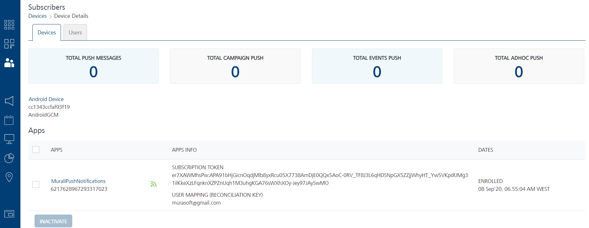

                           

Viewing a Device
================

Using **Engagement** Services console, you can view statistics for a device.

To view statistics for a device, follow these steps:

1.  Under **Overview**, click **Subscribers**.
    
    The **Subscribers** page appears. The **Subscribers** page includes two tabs: **Devices** and **Users**. By default, the **Devices** tab is set to active.
    
2.  On the **Devices** home page, click the desired device under the **Device Info** column in the list view.
    
    
    
    The **Device Details** page appears.
    
    Labels
    ------
    
    On the **Device Details** page, you can view statistics of a device. The following labels appear below the **Devices** tab:
    
    *   **Total Push Messages**: Displays the total number of pushes sent to the device from all the applications to which the device is subscribed.
    *   **Total Campaign Push**: Displays the total number of pushes sent through campaigns.
    *   **Total Events Push**: Displays the total number of pushes sent through the events.
    *   **Total Adhoc Push**: Displays the total number of pushes sent through the **Engagement** > **Adhoc** from all the applications to which the device is subscribed.
    
    Device
    ------
    
    The header displays the device details, such as the **Device Name**, the **Device ID**, and the **Device Platform**.
    
    Apps
    ----
    
    The Apps list view displays the following details:
    
    *   **Apps**: The column displays the app name, **KSID**, and the subscriber icon to indicate the current status of an app as subscribed or unsubscribed.
    *   **Apps Info**: The column displays the subscription token and the reconciliation key.
    *   **Dates**: The column displays the date on which the device is enrolled for the application to receive push notifications.
    *   **Inactivate** button: The button helps you inactivate an installed app on a device. The inactivated app cannot receive push notifications.
