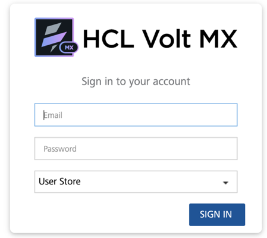
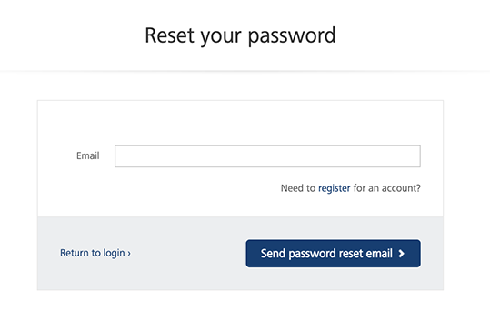
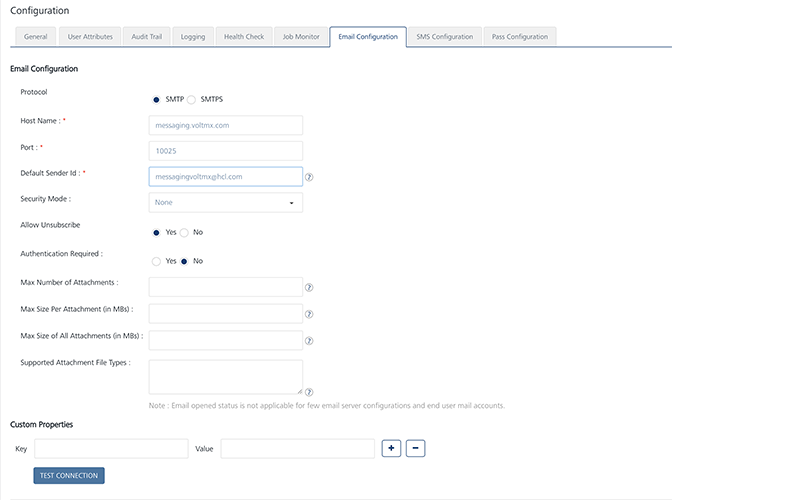
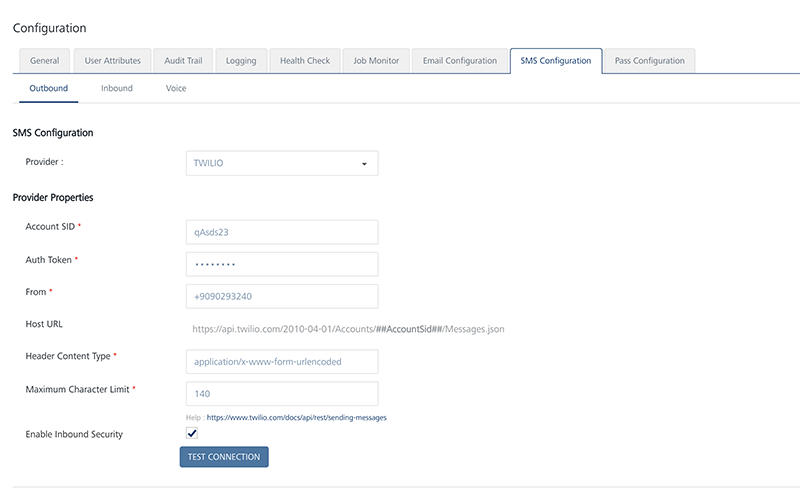

                           

Configuration of the Email and SMS Provider using Engagement Console
====================================================================

The section shows you how to configure the email and SMS providers using Foundry Engagement console. After configuring SMS and email providers, a user can send email and SMS notifications to users and subscribers. To configure email and SMS providers, follow these steps:

1.  Enter _manage.hclvoltmx.com_  in a browser.
2.  The Volt MX Cloud log-in screen appears. Enter your email and password to log in to your account.
3.  Click Sign in to enter your cloud account.
    
    
    
    > **_Note:_** If you forget your password, click the Forget your password? link to reset the password. The Reset your Password appears. Enter your registered email ID, and click **Send Password Reset Email**.
    
    
    
4.  After logging in to Volt MX Foundry Engagement server, click **Settings** > **Configuration** > **Email Configuration**
5.  In the **Email Configuration** screen, choose the correct protocol and security mode for the configuration.You also need to enter the host name, port, and the default sender ID. Click Save to save the configuration.
    
    
    
6.  Click **Settings > Configuration > SMS Configuration** to open the SMS Configuration screen. Chose **Twilio**, **Clickatell** or **Nexmo** as the SMS provider.
    
    > **_Note:_** You need to sign up with **Twilio**, **Clickatell** or **Nexmo** for a free trial or a paid account so that the required data for the SMS configuration can be obtained. Based on the chosen SMS provider, the SMS setting screens varies. As an example, the Twilio settings screen is shown below.
    

1.  Click **Save** to save the configuration.
    
    
