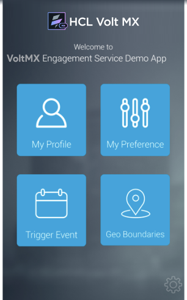
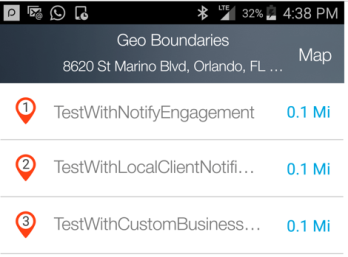
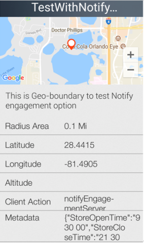
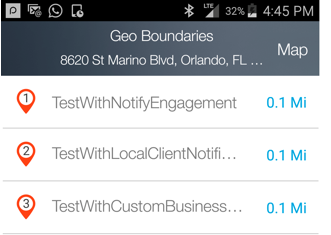
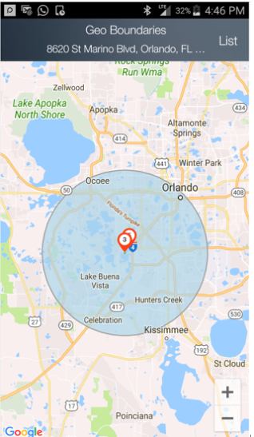
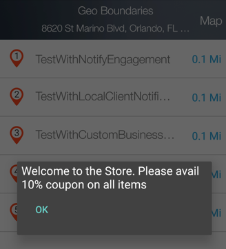

                           

Demo App QuickStart Guide (for Android Devices): Geoboundary Monitoring and Receiving Notifications

Geoboundary Monitoring and Receiving Notifications
==================================================

The section provides details of monitoring the geoboundaries that are created in the previous section using the demo application.

1.  Tap **Geo Boundaries** tab to start the geobioundary monitoring and view the geoboundaries list.
    
    
    
2.  The following screen displays the list of boundaries that are monitored along with the boundary radius of each.
    
    
    
3.  Click any boundary to view the details. The following image displays the details of the **TestWithNotifyEngagement** geoboundary.
    
    The details include: name, radius, latitude, longitude,meta data associated with the geoboundary, and the client action.
    
    
    
4.  Tap the **Map** option in the geoboundaries list. The action displays geoboundaries on a map.
    
    
    
5.  Tap the zoom out option on the screen to view all the geoboundaries. The following screen displays the boundaries one, two and three created in the previous steps. The circle in blue is the radius in which all the geoboundaries will be returned.
    
    
    
6.  If you are in a geoboundary that is being monitored, the notification will be displayed as shown below. The following screen displays a sample notification from custom logic geoboundary.
    
    
