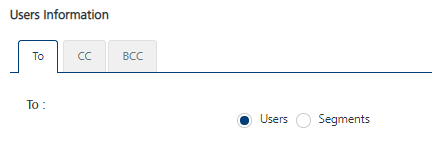
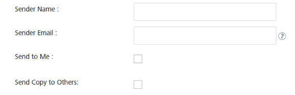
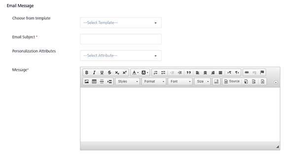
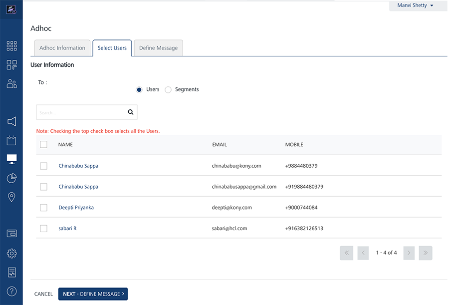

                           

Demo App QuickStart Guide (for Android Devices): Sending Adhoc, Email, SMS and Push Notifications

Sending Adhoc, Email, SMS and Push Notifications
================================================

The section explains how to set up the Engagement demo application on an Android device to receive adhoc push, email and SMS messages after the subscription is complete. Details of the configuring segments are also provided.

To send **Email**, **SMS**, and **Push Notifications** follow these steps:

1.  Open an Internet browser.
2.  Enter the URI: _manage.hclvoltmx.com_ in the address field and press the **Enter** key.
    
    The **Sign in** to your HCL Account page appears.
    
3.  Enter your email address and password. Click **Sign in** to continue.
    
    The system displays the **VoltMX Foundry** homepage.
    
4.  Click the **Engagement Services** tab next to the **Sync Services** tab.
    
    The **Engagement Services** home page (Dashboard) appears.
    
5.  **Engagement** services: In the left panel, click **Subscribers** under the **Overview** section.
    
    The **Subscribers** page appears.
    
6.  Click the **Users** tab to continue.
    
    The Users screen displays the details of the user who subscribed using the application installed on a device.
    
    
    
7.  Next, click the **Devices** to view the list of all devices, their device IDs, and the applications the devices are subscribed.
    
    
    

Configuration of a Segment
--------------------------

The section describes the execution steps needed to create a segment. The created segment is used to send ad hoc email, SMS and push notifications.

1.  Click **Segment** under **Engagement** in the left panel.
    
    The **Segments** page appears.
    
2.  Click **Add Segment** to add a new segment.
    
    
    
    The **Add Segment** page appears. The **Add Segment** page includes the two sections: **Segment Information** and **Define Conditions**.
    
3.  In the **Segment Information** section, enter the details for the following fields:
    *   **Name** (mandatory): Enter a name for the segment that you want to define. Your segment name should include alphanumeric characters only.
    *   **Owner**: The field is populated automatically with the segment owner's name.
    *   **Created Date**: The field is populated automatically with the system's current date and the current time.
        
        
        
4.  In the **Define Conditions** section, do the following:
    
    The **Define Conditions** list-view contains the following fields:
    
    1.  **Conditions**: Click **Add** to add a new condition row. A new condition is added with a number under the **Conditions** column in the grid. The condition numbers are the references to the user attributes that are associated with that condition. The numbered conditions can be used to define different combinations for a segment definition.
    2.  **Attribute**: Under the **Attribute** column, select the attribute from the drop-down list. You can select any user attributes as required. For example, **First Name**, **Last Name**, **Email**, **Mobile Number**, **Country**, **State**, **Location**, **Beacon**, **Last Active Date**, and any dynamic user attribute type.
    3.  **Operator**: Under the **Operators** column, select the required operator from the drop-down list. You compare a user attribute with a value by using a specified operator such as **Contains**, **Equal**, or **NotEqual**. The following table describes operators to define a segment.
        
        | Operator | Description |
        | --- | --- |
        | Contains | The operator checks if the attribute value for all users have a common substring given in the value field |
        | Equal | The operator checks if both operands have the same value |
        | NotEqual | The operator checks if both operands do not have the same value |
        | GreaterThan | The operator checks if the value of the left-hand operand is greater than the value of the right-hand operand |
        | LessThan | The operator checks if the value of the left-hand operand is less than the value of the right-hand operand |
        | GreaterThan CurrentDate + {days} | The operator checks if the date value of the attribute is greater than the current date plus number of days specified in the value field |
        | GreaterThan CurrentDate - {days} | The operator checks if the date value of the attribute is greater than the current date minus number of days specified in the value field |
        | LessThan CurrentDate + {days} | The operator checks if the date value of the attribute is lesser than the current date plus number of days specified in the value field |
        | LessThan CurrentDate - {days} | The operator checks if the date value of the attribute is lesser than the current date minus number of days specified in the value field. |
        
    4.  **Value**: Helps you configure values for conditions. Enter the value in the **Value** field. For example, you may want to create a condition with users whose first letter in the name contains 'a' character such as Albert, Anna, and Alex.
    5.  **Execute Conditions by**: Select the required condition from the drop-down list to use for segment definition.
        
        
        
5.  If you select the execute condition as **Match all conditions** or **Match any condition**, then based on the fulfilled condition(s), the system inserts the number of users under the **Users** column.
    
    
    
6.  If you select the executive condition as **Advanced**, then five logic buttons appear. Based on your requirement, select the logical operators.
7.  Click the **Validate** button.
    
    The system validates, if the logic is correct. It states that the validation is successful.
    
8.  Click **Ok** to continue. The system displays the **View Segment** screen.
    
    The number of added users appears under the **Users** column.
    
    
    
9.  Click **Save** to save the segment.
    
    The system adds the new segment to the segments list-view on the **Segments** screen. The system displays the confirmation message that the segment is saved successfully.
    

Sending Adhoc Push Notifications
--------------------------------

The ability to send push notifications is one of the most important features of Engagement services. The push message feature lets you configure and send push messages based on the preferences and personalization attributes for targeted subscribers or segments. The push messages are sent only to subscribed apps that are active and installed on mobile devices.

### Sending Adhoc Push Notifications to Subscribers

The section describes how to configure push notifications to send them to individual subscribers.

1.  From the **Engagement** section, click **Adhoc** from the left panel. The **Adhoc** screen appears with three tabs: **Adhoc Information**, **Select Users**, and **Define Message**. By default, the **Adhoc Information** tab is set to active.
    
    
    
2.  **Select Channel**: Select the **Push Message** channel from the drop- down list.
    
    The **Select Application** drop-down list appears.
    
3.  Select the required application from the drop-down list.
    
    
    
    The push messages are sent only to the configured platforms with an app.
    
4.  Click the **Next -Select Users** button to continue. The **Select Users** tab becomes active.
    
    
    
    Based on your requirement, select the option as **Subscribers** or **Segment**. Based on selected app, the list-view populates with the details of associated subscribers.
    
    
    
5.  Select the number of subscribers from the list-view and click **Next-Define Message** to continue.
    
    The **Define Message** tab becomes active.
    
    
    
    The **Define Message** page includes the **Message Information** section to add a new push message. The **Message Type** field includes the two options to add a new push message:
    
    *   Silent Push
    *   Standard Push
    
    By default, the message type option is set to standard push.
    
6.  In the **Push Message** section, enter the **Message Title** and the push message in the **Message Box**. If required, select the personalization attributes.
7.  **Enable Rich Push**: Select the check box if you want to associate the rich push. To customize your text, you can use the **Rich Text Editor** tool bar at the top of **Rich Content** box.
8.  **Silent Push**: Select the option, if you wish to enable the silent push. When you check the **Silent Push** option, the system displays the platform specific properties fields only. This is because the **Message Title** and the **Message Text** fields are not applicable for silent push.
9.   Choose the option **Now** to send notification immediately. Click **Send** to deliver the push message.
10. To schedule a later message delivery, choose the **Later** option on the **Adhoc Information** screen. 
11. Select the **Start Date and Time** and **Expiry Date and Time**. Click **Schedule Notification** to schedule the message delivery later.
    
    
    

### Sending Adhoc Push Notifications to Segments

The section describes how to configure push notifications to be sent to the segments (groups of subscribers).

1.  **Select User From**: Select the option as **Segment** in the **Define Message** screen. The **Select Users** list-view appears.
    
    
    
2.  Click the **Select a Segment** drop-down list below the **Select Users** list-view to select the required segments.
    
    
    
3.  The selected segment with associated users appears in the list-view.
    
    
    
4.  Click **Next Define Message** to continue. The **Define Message** screen appears.
    
    
    
5.  In the **Message** section, enter the **Title** and **Message** for the push notification to be sent. Choose **Now** on the **Adhoc Information** page to send the push message immediately. Click **Send.**
6.  To schedule a later message delivery, choose the **Later** option. 
7.  Select the **Start Date and Time** and **Expiry Date and Time**. Click **Schedule Notification** to schedule the message delivery later.
    
    
    

Sending Adhoc Email Notifications
---------------------------------

The **Email Message** feature helps you to configure and send email messages based on the preferences and personalization attributes for the targeted users or segments.

### Sending Adhoc Email Notifications to Users

1.  From the **Engagement** section, click **Adhoc** from the left panel. The **Adhoc** screen appears with three tabs: **Adhoc Information**, **Select Users**, and **Define Message**. By default, the **Adhoc Information** tab is set to active.
2.  **Select Channel**: Select the **Email Message** channel from the drop-down list.
    
    
    
3.  Click **Next- Select Users** to continue. The **Select Users** screen tab becomes active. The **Select Users** screen displays all the users in the list-view. By default the **To** option is set to **Users**.
    
    
    
4.  In the **User Information** section, choose **Users** or **Segments** in the **TO**, **CC** and **BCC** sections of the email. Choose a user or users to send email notifications.
    
    
    
5.  Click **Next -Define Message** to continue. The **Define Message** tab becomes active.
    
    
    
6.  Type the **Sender Name**, **Sender Email** information in the corresponding fields at the end of **Defining Message** Target section.
    
    > **_Note:_** Choose the **Send to Me** option if the sender needs to be copied on the email. Choose **Send Copy to Others** option, if a copy of the email needs to be sent to multiple email addresses.
    
    
    
7.  In the **Message** section, compose a new email message along with the email subject as shown below. Use the **Rich Text Editor** at the top of **Message** text to customize the email text.
    
    
    
8.  Click the **View API Payload** button to view the API payload.
9.  Click **Send** to continue.
10. To schedule the message for a later delivery, choose the **Later** option on the **Adhoc Information** screen . 
11. Select the **Start Date and Time** and **Expiry Date and Time**. Click the **Schedule Notification** to reschedule the message delivery.
    
    
    

### Sending Adhoc Email Notifications to Segments

The steps involved to send the adhoc email notifications are similar to sending adhoc push notifications to segments.

Sending Adhoc SMS Notifications
-------------------------------

The SMS message feature helps you to configure and send SMS messages based on the preferences and personalization attributes for the targeted users or segments.

1.  From the **Engagement** section, click **Adhoc** from the left panel. The **Adhoc** screen appears with the tabs: **Adhoc Information**, **Select Users** and **Define Message**. By default, the **Adhoc Information** tab is set to active.
2.  **Select Channel**: Select the **SMS Message** channel from the drop-down list.
    
    
    
3.  Click **Next- Select Users** to continue. The **Select Users** tab becomes active. The **Select Users** screen displays all the users in the list-view. By default, the **To** option is set to **Users**.
    
    
    
4.  Select the user to send the text message from the list-view.
5.  Click **Next - Define Message** to continue. The **Define Message** tab becomes active.
6.  In the **Message** section, select the personalization attributes from the drop-down list and enter the SMS message in the **Message Box**.
    
    
    
7.  You can also use the **SMS template** to create a new SMS message. Select the SMS template from the drop-down list to create a new SMS message.
    
    
    
8.  Click the **View API Payload** button to view the API payload.
9.  Click **Send** to continue.
10. If you want to schedule the message delivery at a later day and time, choose the **Later** option on the **Adhoc Information** screen.
11. Select the **Start Date and Time** and **Expiry Date and Time.** Click **Schedule Notification** to schedule message delivery at a later date.
    
    
