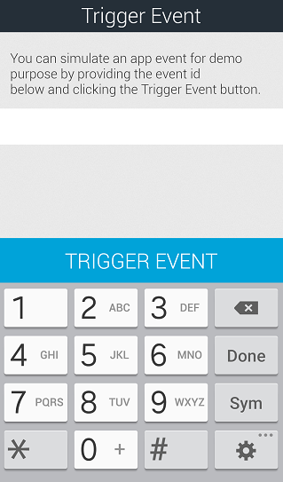

                            

Demo App QuickStart Guide (for Android Devices): Downloading and Configuring the Demo Client Application on an Android Device

Downloading and Configuring Volt MX Foundry Engagement Demo Client Application on an Android Device
==================================================================================================

The section explains how to download Volt MX Foundry Engagement demo application from location below and configure the demo client application to receive email, push and SMS notifications.

1.  Click [Engagement demo application](https://marketplace.hclvoltmx.com/items/voltmx-foundry-messaging-demo-application) where the application is located. Log in with your cloud credentials to download and launch the application.
2.  Launch the **Engagement demo app** that was installed earlier on the Android device.
3.  The first screen of the application prompts the user to accept push notifications. Click **Ok** to receive push notifications.
    
    
    
    The **VoltMX Engagement Services Would Like to Send You**... alert message appears.
    
    
    
4.  Click **Do not Allow** if you do not want to receive the push notifications.
5.  Click **OK** to receive the push notifications.
    
    The **Demo App Settings** screen appears.
    
6.  Enter the following details:
    
    1.  **URL**: URL of the Volt MX Foundry Engagement server (cloud) that you will connect to.
    2.  **Application ID**: Application ID that is configured in the Engagement server console.
    3.  **Sender ID**: The **Sender ID** is same as the project ID used to create the **GCM** key.
    
    
    
7.  Click **Done**.
    
    The **My Profile** screen appears.
    
8.  Next, enter the following details for your profile:
    
    *   **First Name**: Your first name.
    *   **Last Name**: Your last name.
    *   **E-mail Address**: Your personal email address.
    *   **Select Country**: Select the country from the drop-down list.
    *   **Select State**: Select the state if (US only).
    *   **Mobile Number**: Your mobile number.
        
        > **_Note:_** **Engagement** server **Version 7.3.1** onwards: The **Mobile Number** is mandatory only when it is selected as the reconciliation key, else it is optional.
        
    
    
    
9.  Click **Done** to continue.
    
    The system displays the confirmation message that details added successfully. The information helps create the user and subscription in the Engagement server.
    
    
    
10. Click **OK** to continue.
    
    The **My Preferences** screen appears. The My Preferences screen helps you to subscribe for push, email, and SMS notifications.
    
11. Based on your requirement, select the type of notifications.
12. Click **Done** to create a subscription in the **Engagement** server for all the selected types of notifications.
    
    
    
    The system displays the confirmation message that details are added successfully.
    
    
    
13. Click **OK** to continue.
    
    The **VoltMX Engagement Service Demo** app is installed on your mobile device. The app displays the start screen with the **My Profile** icon, My **Preference** icon, and **Trigger Event** icon.
    
    
    
14. Click **My Profile** to view your profile. Edit any information as needed, and click **Done** to update the profile information.
    
    
    
15. Click **My Preferences** to see the existing subscriptions and to update the required subscriptions.
16. Based on your requirement, update the existing subscriptions. Click **Done** to update the information.
    
    
    
17. Click **Trigger Event** to trigger an event using an event ID.
    
    
    
18. The system asks the user to enter the event ID. Click **OK** to continue.
    
    
    
19. The system displays the keypad to enter the event ID.
    
    
    
20. Enter the event ID, and click **Trigger Event** to continue. The **Trigger Event** screen shows the confirmation message that the event is triggered successfully. For more information about how to add events, see [Adding an Event](../../../Foundry/vms_console_user_guide/Content/Events/Adding an Event.md)
21. Click the back icon on the top left corner to launch the start screen.
22. Click the gear icon on the **Start** screen to reset the settings for the demo app.
    
    The system displays the **Demo App Settings** screen.
    
    
    
23. In the **Demo App Setting** screen above, click **Reset Demo App** to delete the existing user information.
24. Click **Ok** on the alert to reset the demo application. The alert displays the confirmation notification that the user is deleted successfully.

  
| Rev. | Author | Edits |
| --- | --- | --- |
| 7.3.1 | AU | AU |
