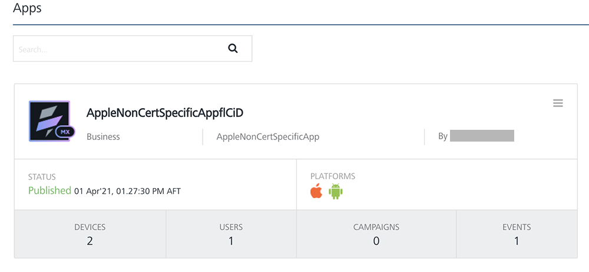
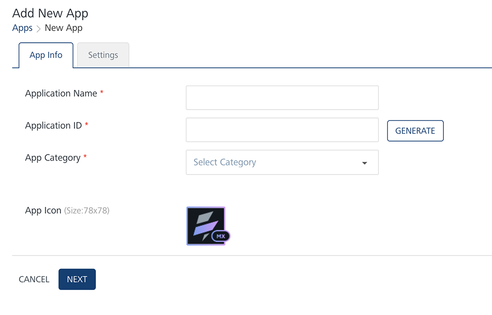
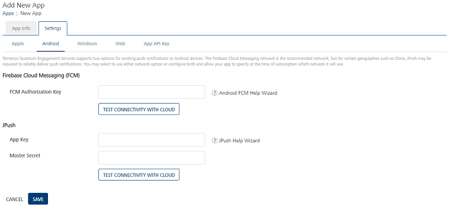
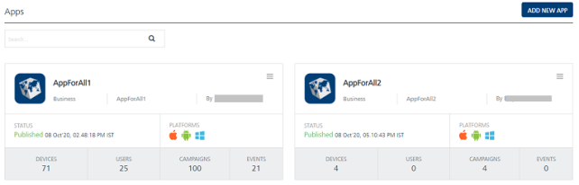
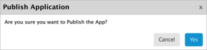

                           

Demo App QuickStart Guide (for Android Devices): Configuring the Demo Application using Engagement Console

Configuring the Engagement Demo Application Using Volt MX Foundry Engagement Console
===================================================================================

The section explains how to configure the Engagement demo application using the Volt MX Foundry Engagement console.

To configure the Engagement demo application follow these steps:

1.  Open an Internet browser.
2.  Enter the URI: _manage.hclvoltmx.com_ in the address field and press the **Enter** key.
    
    The **Sign in to your HCL Account** page appears.
    
    
    
3.  Enter your email address and password. Click **Sign in** to continue.
    
    The system displays the **VoltMX Foundry** homepage.
    
    
    
4.  **VoltMX Foundry** home page: Click **Environments** in the left panel.
    
    The **Clouds** page appears.
    
    
    
5.  Click the **Engagement Services** tab next to the **Sync Services** tab.
    
    The **Engagement Services** home page (Dashboard) appears.
    
6.  **Engagement** services: In the left panel, click **Apps** under the **Overview** section. You can view all the configured applications and configure new applications.
    
    
    
7.  Click the **Add New App** button to configure a new app.
    
    The **Add New App** page appears with the **App Info** tab set to active.
    
8.  **App Info**: Enter the following details.
    *   **Application Name**: Enter the application name.
    *   **Application ID**: Click the **Generate** button to populate the system- generated application ID. You can enter the application ID manually in the text field.
    *   **App Category**: Select the app category from the drop-down list.
    *   **App Icon (Size: 78x78)**: Click the **Browse** button to navigate to the image file location and select it.
        
        
        
9.  Click **Next** to continue.
    
    The **Settings** tab becomes active.
    
10.  Click the **Android** tab to display the Android screen.
11.  **FCM Authorization Key**: Enter the **FCM Authorization Key** to install and run the Engagement demo application on Android devices. For more details about how to create the FCM Authorization Key, refer to, [Engagement Guide to build sample app for Android](../../../Foundry/vmf_msg_quick_start_guide_build_sample_app_android/Content/Introduction.md).
    
     When the GCM/FCM  key is created, a project ID also is created for the project name. The project ID and the secret key ( GCM/FCM key) are used to configure Engagement server and to run the client application.
    
     
    
12.  If the entered **FCM key** is correct, the system displays the confirmation message that the cloud connection is successful. Click **Ok** to continue.
13.  Click **Save** to save the application.
    
     The application appears on the **Apps** home page. In the example below, the newly added app is **TestApp**. The current status of the application is unpublished. You need to publish the app to receive push notifications.
    
      
    
14.  On **AppForAll2**, in the upper-right corner, click the drop-down list and choose the **Publish** option to publish the application.
15.  The system displays the **Publish Application** dialog, asking if you want to publish the app. Click **Yes** to continue.
    
     
    
     The current status of the app changes to published.
