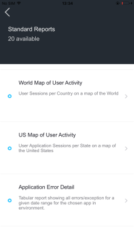
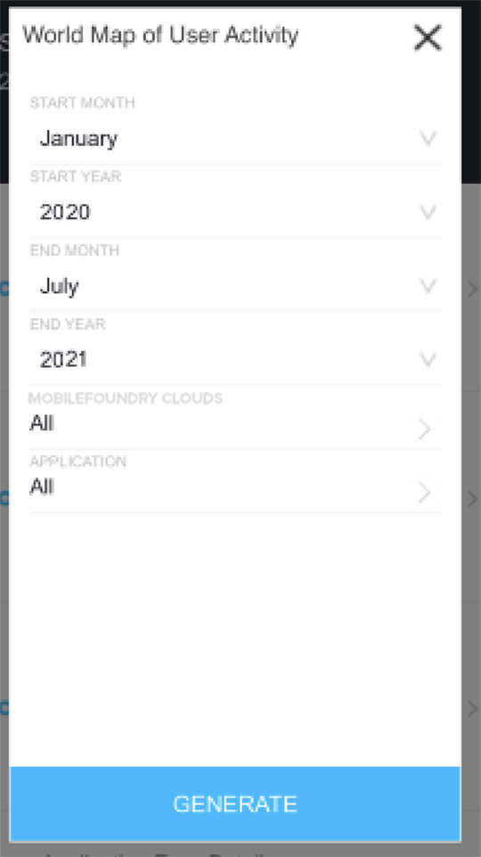
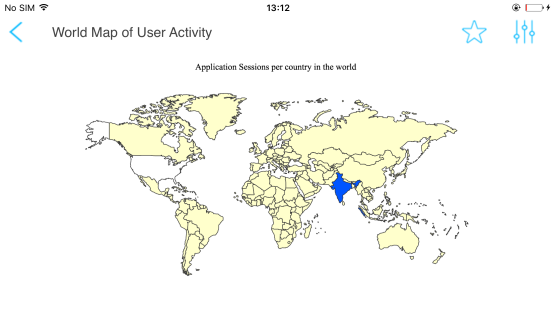
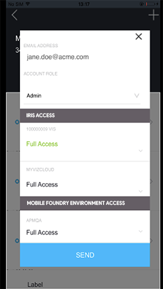

                            

Volt MX  Foundry Analytics Mobile App Guide: Sign In to Volt MX Foundry

Volt MX  Foundry Analytics Mobile App
===================================

The Volt MX Foundry mobile app is published to both iOS App Store and Android Play Store and is available to any users of the Volt MX Foundry cloud console. With the Volt MX Foundry mobile app you can manage your Volt MX Foundry accounts and access and run standard and custom reports that are accessible from the Volt MX Foundry cloud console.

> **_Note:_** Support to the Volt MX Foundry Analytics Mobile App is deprecated from March 2020 onwards. The new **VoltMX App** serves you with all the current features of the previous app version along with additional functionality.

Sign In to Volt MX Foundry
-------------------------

To sign into the Volt MX Foundry Analytics mobile app, do the following:

1.  Launch the Volt MX Foundry app.

    The banner appears with the app depreciation details and the new app version link to the **VoltMX App**.

2.  To install the new version app from the app store, click **OPEN VOLTMX APP**.
    
    > **_Important:_** You can continue to use the same email address and password to use the Volt MX App version.
    
3.  To continue with the current app version. click the **CLOSE** button.
    
    The sign in screen for Volt MX Foundry appears.
    
4.  Enter your username and password and press SIGN IN.

    The Home screen appears.

Switch Accounts
---------------

If you have access to multiple Volt MX Foundry cloud accounts, you can switch between the accounts.

To switch accounts, do the following:

1.  Press the accounts menu at the top of the Home page.

    A menu of accounts appears.

2.  Select an account.

How to Use Standard Reports
---------------------------

The Volt MX Foundry mobile app provides all of the standard metrics and built-in reports for Volt MX Foundry. For information about standard reports, see [Standard Reports and Analytics Guide](../../../Foundry/standard_metrics_reports_guide/Content/standard_metrics_reports_guide.md).

To use Standard Reports, do the following:

1.  Press **Standard Reports**.

    The list of standard reports appears. The number of standard reports that are available is shown at top of screen. The number of available reports is available after a user’s first visit to the Volt MX Foundry Analytics.

    

2.  Select a report

    The filter criteria pop-up appears .

    

3.  Select the filter criteria for the report and click **Generate**.

    Volt MX  Foundry generates and opens the report. The report is available in landscape mode only.

    

4.  Click **Favorites** (star icon) to save the report as a favorite.

    Saving a report as a favorite saves the filter criteria that Volt MX Foundry uses to generate the report.

How to Use Custom Reports
-------------------------

The Analytics mobile app provides all of the custom reports that are available on the Volt MX Foundry account. For information about capturing custom metrics from an application and building reports, see [Custom Metrics and Reports Guide](../../../Foundry/custom_metrics_and_reports/Content/Custom_Metrics_and_Reports_Guide.md).

To use Custom Reports, do the following:

1.  Press **Custom Reports**.

    The list of reports that appears are the custom reports that are available to you for the Volt MX Foundry account in private folders. Click Shared to view the list of custom reports that are available in shared folders. The number of custom reports that are available is shown at top of the screen.

2.  Select a report.

    The filter criteria pop-up appears.

3.  Select the filter criteria for the report and click **Generate**.

    Volt MX  Foundry generates and opens the report. The report is available in landscape mode only.

4.  Click **Favorites** (star icon) if you want to save the report as a favorite.

    Saving a report as a favorite saves the filter criteria that Volt MX Foundry uses to generate the report.

How to Use Favorites
--------------------

You can save often-used filter criteria as favorites and avoid having to set filter criteria each time that you use the report. You can save any standard or custom report as a favorite once it is rendered.

*   In a rendered report, click **Favorites** (star icon) and enter a name for the saved report.

Manage Users
------------

Manage Users is available for administrative users of a Volt MX Foundry cloud account. Use Manage Users to change a user’s level of access to the cloud environments or to invite users to the Volt MX Foundry cloud. Manage Users shows a list of the users that have access to the Volt MX Foundry account and the role of each user. For more information about user management, see User Management.

To edit a user’s level of access to an environment, do the following:

1.  Select a user.

    The user account screen appears. You cannot change the email address or role of a user from the Volt MX Foundry mobile app.

    

2.  Press an environment.

    A popup appears with the access options. You can grant the user full access or deny the user access to the environment.

3.  Select an access option.
4.  If you do not want to grant the user access to the environment, click **No Access**.
5.  Click **Save**.

To add a user to the cloud, do the following:

1.  Press **Add** (the plus icon).

    The invite user screen appears.

2.  When you are prompted to specify the user role, select a role for the user.

    The available roles are Admin, Billing, and Member.

3.  When you are prompted to enter valid details, enter the email address of the user.

    Now you can grant the user access to the configured environments for Iris and Volt MX Foundry.

4.  Press an environment.

    A pop-up appears with the access options. You can grant the user full access to the environment.

5.  Select **Full Access**.
6.  If you do not want to grant the user access to the environment, press **No Access**.
7.  Press **Send**.

Volt MX  Foundry saves the user account and sends an invite email to the user.

<table style="margin-left: 0;margin-right: auto;mc-table-style: url]('Resources/TableStyles/RevisionTable.css');" class="TableStyle-RevisionTable" cellspacing="0" data-mc-conditions="Default.md5 Only"><colgroup><col class="TableStyle-RevisionTable-Column-Column1"> <col class="TableStyle-RevisionTable-Column-Column1"> <col class="TableStyle-RevisionTable-Column-Column1"></colgroup><tbody><tr class="TableStyle-RevisionTable-Body-Body1"><td class="TableStyle-RevisionTable-BodyE-Column1-Body1">Rev</td><td class="TableStyle-RevisionTable-BodyE-Column1-Body1">Author</td><td class="TableStyle-RevisionTable-BodyD-Column1-Body1">Edits</td></tr><tr class="TableStyle-RevisionTable-Body-Body1" data-mc-conditions="Default.Iris7-1"><td class="TableStyle-RevisionTable-BodyB-Column1-Body1">7.1</td><td class="TableStyle-RevisionTable-BodyB-Column1-Body1">IGP</td><td class="TableStyle-RevisionTable-BodyA-Column1-Body1">IGP</td></tr></tbody></table>
