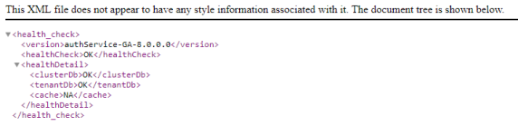
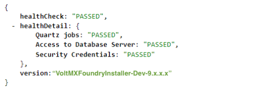

                           

Volt MX  Foundry Deployment Guide: Infrastructure Setup

Deployment Checklist and Example Case Studies
=============================================

This section provides a checklist for a standard production grade Volt MX Foundry deployment. The goal is to help you define a repeatable process to deploy, configure, upgrade, and expand your Volt MX Foundry environment. The case studies that follow, describe a few Volt MX Foundry deployments that were done using well-known infrastructure components and how they were configured for a standard production environment. This document will help you understand the challenges involved and prepare you for a smooth deployment of Volt MX Foundry within your enterprise.

Checklist for Volt MX Foundry Deployment
---------------------------------------

*   [Infrastructure Setup](#infrastructure-setup)
*   [Installing Volt MX Foundry](#installing-volt-mx-foundry)
*   [Manual Steps post-install](#manual-steps-post-install)
*   [Test the setup](#test-the-setup)
*   [Activate the License](#activate-the-license)

### Infrastructure Setup

Most production grade Volt MX Foundry installations need you to consider the following:

*   **Choice of App Server and Database**
    
    Choose from the supported Application Servers and Databases as outlined in the [Supported Application Servers and Databases](../../../Foundry/voltmxfoundry_supported_devices_os_browsers/Content/Introduction.md).
    
*   **Node Sizing**
*   A good starting point is to select a standard node as suggested by the minimum infrastructure requirements that are outlined in the [App Server sizing](Deployment.md#app-server-sizing).
*   Determine the number of nodes by testing actual workloads. Refine the number of nodes iteratively based on the resource usage and cost to improve the model.
*   **Host Configuration**
    
    Host configuration varies based on the OS used and the existing configuration standards. There are some important steps that you need to follow after installing the OS.
    
*   Clock synchronization using NTP or similar service. Clock skew can produce errors that are hard to debug.
*   Hostnames are used for node identification in the cluster. The hostname should not be changed.

*   **Application Server Specific Settings**
*   The JVM Heap memory should be configured.
*   Anything specific to the Application Server such as Volt MX Foundry combinations that had not been taken care of during the installation process should be configured. For example, Configure LOG\_ROOT environment variable in WebSphere for the location of logs.
*   **Database setup**
    
    Every database has its own specific way of setting up redundancy, archival, and load distribution mechanisms. Contact your in-house DBA for further details.
    
*   **Load Balancer considerations**
*   A request forwarded from the load balancer to any of the backend nodes must have the X-Forwarded-For header stamped with the source client IP address. The backend requires the source client IP address because all the requests forwarded from the Load Balancer would have the Load Balancer IP address.
*   Volt MX Foundry Console and Admin components use cookies to direct requests to the node on which the session is currently active. The same needs to be handled appropriately at the load balancer end.
*   **Security considerations**
    
    *   If you need to use the HTTPS protocol for communication, provide a certificate/key from a certificate providing authority. For development environments, you can use self-signed certificates. The SSL connection can either be terminated at the load balancer or passed to the back-end nodes.
    *   `/mfconsole` and `/admin` contexts are administrative consoles and access to the same should be restricted. For a secure approach you can use two firewalls to create a DMZ (De-Militarized Zone). For more details on this, refer to [Deployment Topology](Deployment.md#deployment-topology).
        *   The first firewall also called the perimeter firewall will route traffic to the DMZ only. This is where the Integration or Identity Cluster along with the load balancer reside.
        *   The second or internal firewall will allow traffic from the DMZ to the internal network which is where the Volt MX Foundry Console cluster can be set up.
        *   PUT, PATCH and DELETE HTTP operations need to be allowed for Volt MX Foundry Console users. This will be decided based on whether the users are located within the DMZ or the internal network.
    *   `/authService`, `/middleware`, `/services` are runtime contexts and need to be made available publicly to end-users. You may need to map different URLs for internal users and those that would access identity publicly. Refer to [Support to MAP Public URLs - Reverse Proxy (on-premises)](../../../Foundry/voltmx_foundry_user_guide/Content/Multi-Tenant_URL.md) for more details on how this can be achieved.
    *   You need to whitelist `manage.hclvoltmx.com:443` and `orchestration.voltmx.com:443` for License activation. If you are unable to whitelist domains, contact the Volt MX Foundry Cloud Support team to whitelist individual IP addresses.
    *   Specific security hardening considerations for each Volt MX Foundry component are available in the [Security Hardening](Hardening_Guide.md) section.

### Installing Volt MX Foundry

The Volt MX Foundry installer provides an automated way of installing the Volt MX Foundry components on a node. The installer deploys the Application Server components and executes the database scripts based on your inputs. For more information, refer to the Installation guides for your specific OS at [VoltMX Documentation](http://docs.voltmx.com/).

For cluster setups, you must repeat the installation process for each node by selecting the **use existing DB** option. After you configure the first node, you can update the encryption keys on all the other nodes by selecting the **Copy the encryption keys now** check box and providing the **Previous Installation Directory**. You can skip the creation of the **Administration Account** since you have already configured it once.

### Manual Steps Post-Install

*   The steps for the cluster setup differ based on the Application Server used. Refer to the [Case studies](#case-study-1-tomcat-multi-node-cluster-haproxy-load-balancer-with-mysql-database) for Application Server specific steps.
*   Set up a Memcached Cluster for the Integration nodes, if needed. For more details, refer to [Memcache Configuration](../../../Foundry/vmf_integrationservice_admin_console_userguide/Content/Runtime_Configuration.md#Memcache) in the Integration Admin Console User Guide.
*   Launch the Volt MX Foundry Console URL. This should lead to the registration page. Enter the authService URL. This may either be the load balancer URL or the authService node URL.

### Test the Setup

Use the following Healthcheck URLs post-deployment to check the status of a Volt MX Foundry component on each node:

*   For Volt MX Foundry console: http://<domain\_name>:<port>/mfconsole/health\_check/all
    
    
    
*   For Middleware: http://<domain\_name>:<port>/services/healthcheck
    
    
    
*   For Auth Service: http://<domain\_name>:<port>/authService/v1/manage/checkhealth
    
    
    
*   For Sync: http://<domain\_name>:<port>/syncconsole/healthcheck
    
    
    
*   For Messaging: http://<domain\_name>:<port>:53409/vpns/service/healthcheck/json
    
    
    

### Activate the License

Follow the instructions in the [VoltMX Licensing Guide](../../../Foundry/voltmx_licensing_guide/Content/Homepage.md) for activating the License based on your deployment model.

Case Study 1 - Tomcat Multi-Node Cluster + HAProxy Load Balancer with MySQL Database
------------------------------------------------------------------------------------

### Infrastructure Setup

The Volt MX Foundry Installer includes a pre-configured Tomcat Application server which will be installed followed by deployment of selected components during the install process.

*   **Choice of Application Server and Database**: Tomcat 8.5 and MySQL 5.7.
*   **Node Sizing**
    *   Two nodes for Volt MX Foundry Integration/Identity/Metrics, 16 GB RAM, Intel(R) Xeon(R) CPU E5-2630 v2 @ 2.60GHz.
    *   One node for Volt MX Foundry Console.
    *   One node for MySQL 5.7.
    *   One node for the LoadBalancer.
*   **Host Configuration**
    *   CentOS 6 is installed on all nodes.
    *   Clocks of all nodes are brought to sync with `ntpupdate`.
    *   Hostnames are configured.
*   **Application Server Configuration**: Pre-configured Apache Tomcat 8.5.x is included in the Volt MX Foundry Installer.
*   **Database Setup**: MySQL 5.7 is installed on a node with CentOS 6.
*   **Security Considerations**: Certificate/key from CA is obtained and converted into the .pem format. The load balancer terminates the SSL Connection and communicates with the backend servers using HTTP.
*   **Load Balancer Considerations**: Apache Tomcat does not include a load balancer out of the box. However, there are several standard, and open source load balancers available which are compatible with Tomcat. This case study uses HAProxy with the following configuration:
```

    
    frontend proxy_front
    
    bind * : 80
    
    bind * : 443 ssl crt /root/hclnet.pem   
    #By default all requests(Integration/Identity) will be forwarded to the nodes' backend
    
    Certificate provided for ssl termination
    
    redirect scheme https if !{ ssl_fc }  
    #Redirects to HTTPS if the user comes via HTTP
    
    mode http 
    
    acl url_mfconsole path_beg /mfconsole                 
    
    acl url_mfconsole path_beg /accounts
    
    acl url_mfconsole path_beg /workspace
    
    use_backend console if url_mfconsole  
    #Any request on any of the VoltMX Foundry Console Component contexts will be redirected to the backend of the console
    
    default_backend nodes
    
    backend console
    
    mode http
    
    option forwardfor  
    #Insert the X-Forwarded-For header. HAProxy will stamp this header with the IP of the source client
    
    http-request set-header X-Forwarded-Port %[dst_port]
    
    http-request add-header X-Forwarded-Proto https if {ssl_fc }
    
    server console mbaastest26.hcl.net:9090 check
    
    backend nodes
    
    mode http
    
    balance roundrobin  
    
    option forwardfor
    
    http-request set-header X-Forwarded-Port %[dst_port]  
    
    http-request add-header X-Forwarded-Proto https if {ssl_fc}  
    
    cookie JSESSIONID prefix nocache  
    
    server web1 mbaastest12.hcl.net:8080 check cookie web1  
    
    server web2 mbaastest36.hcl.net:8080 check cookie web2  
    
    
    
```

### Installation of Volt MX Foundry

Since this is a cluster setup, you will need to repeat the installation process for each node by selecting the **use existing DB** option. After you configure the first node, you can update the encryption keys on all the other nodes by selecting the **Copy the encryption keys now** check box and providing the **Previous Installation Directory**. You can skip the creation of the **Administration Account** since you have already configured it once.

### Manual Steps Post-Install

Follow these steps in addition to the steps mentioned in the checklist.

*   Set up a Memcached Cluster for the Integration nodes, if needed. For more details, refer to [Memcache Configuration](../../../Foundry/vmf_integrationservice_admin_console_userguide/Content/Runtime_Configuration.md#Memcache) in the Integration Admin Console User Guide.
*   Re-deploy the WebApps and restart the Application Servers, if needed.

### Test the Setup

*   Use the Healthcheck URLs mentioned at [Test the Setup](#test-the-setup) post-deployment to check the status of a Volt MX Foundry component on each node.
*   Ensure that all health-checks are passed.

### Activate the License

*   Follow the instructions in the [VoltMX Licensing Guide](../../../Foundry/voltmx_licensing_guide/Content/Homepage.md) for activating the License based on your deployment model.
*   Ensure that the License is activated successfully.

Case Study 2 - JBOSS Multi-Node Cluster + Apache/Mod\_Cluster Load Balancer with MySQL Database
-----------------------------------------------------------------------------------------------

### Infrastructure Setup

The Volt MX Foundry Installer needs to be configured on JBoss Application server in Domain mode. For configuring JBoss multinode setup, follow the steps mentioned at [JBoss EAP 7.2 Domain Mode Setup](https://support.hcltechsw.com/csm?id=kb_article&sysparm_article=KB0083295).

*   **Choice of Application Server and Database**: JBoss 7.2 and MySQL 5.7.
*   **Node Sizing**
    *   Two nodes for Volt MX Foundry Integration/Identity/Metrics, 16 GB RAM, Intel(R) Xeon(R) CPU E5-2630 v2 @ 2.60GHz.
    *   One node for Volt MX Foundry Console.
    *   One node for MySQL 5.7.
    *   One node for the LoadBalancer.
*   **Host Configuration**
    *   CentOS 6 is installed on all nodes.
    *   Hostnames are configured.
*   **Application Server Configuration**: Configure JBoss 7.2
*   **Database Setup**: MySQL 5.7 is installed on a node with CentOS 6.

### Integration of Apache/Mod\_Cluster with JBoss

A sample configuration of **Apache 2.4 with mod\_cluster** module used with JBoss is shown below. Changes have to be made to the JBoss master node to integrate the mod\_cluster load balancer.

1.  In the JBoss master node, edit the `/root/EAP-7.2.0/domain/configuration/domain.xml`file. In the socket binding groups you are using, add the following node.  
    For example, if you use full-sockets binding group, go to `<socket-binding-group name="full-sockets" default-interface="public">` and add following node at the end.
```

    
    //Add this Node at the end of the xml file.
    
    <outbound-socket-binding name="proxy1">
    
    <remote-destination host="host1.voltmx.com" port="8020"/>
    
    </outbound-socket-binding>
    
    
```
2.  In JBoss master node, edit `/root/EAP-7.2.0/domain/configuration/domain.xml`. Go to `<subsystem xmlns="urn:jboss:domain:modcluster:4.0">` and to the proxy node, add the **proxies="proxy1"** attribute to proxy node.
```

    
    //Sample Code
    
    <subsystem xmlns="urn:jboss:domain:modcluster:4.0">
    
    <proxy name="default" advertise-socket="modcluster" listener="default" proxies="proxy1">
    
    <dynamic-load-provider>
    
    <load-metric type="cpu"/>
    
    </dynamic-load-provider>
    
    </proxy>
    
    </subsystem>
    
    
```
3.  Install Apache 2.4 and setup the mod\_cluster module. Configure mod\_cluster as per your requirement. Following is a sample snippet of a mod\_cluster configuration in Apache `httpd.conf` file.  
    Example:  
```
MemManagerFile cache/mod_cluster
    
    CreateBalancers 1
    
    <IfModule manager_module>
      Listen host1.voltmx.com:8020
      ManagerBalancerName modcluster
      
      <VirtualHost host1.voltmx.com:8020>  
    	<Directory /> <!--needed if setup on windows -->
    		AllowOverride none
    		Require all granted
    	</Directory>
        ProxyPass "/" "balancer://modcluster/" stickysession=JSESSIONID|jsessionid nofailover=On
        ProxyPassReverse "/" "balancer://modcluster/"
        ProxyRequests Off
        ProxyTimeout 2400
        ProxyBadHeader Ignore 
        UseCanonicalName On
        ProxyPreserveHost On
    	
    	<proxy "balancer://modcluster">
    	        AddDefaultCharset off
                        Require all granted
    	</proxy>
    	
        KeepAliveTimeout 600
        MaxKeepAliveRequests 0
        EnableMCPMReceive on
        ServerAdvertise on host1.voltmx.com:8020
        AdvertiseFrequency 5
    	
    	<Location /mod_cluster_manager>
    	       	SetHandler mod_cluster-manager
           		Require all granted
    	</Location>
    	
       </VirtualHost>
    </IfModule>
```
4.  Start mod cluster by running the HTTP start service.
5.  For setting Identity, Integration, and Console on separate nodes, access mod\_cluster console and for each node, enable only the required requests.  
    Example:  
      
    Enable/Disable as required to manage the load at each node.

### Installation of Volt MX Foundry

Since this is a cluster setup, you will need to repeat the installation process for each node by selecting the **use existing DB** option. After you configure the first node, you can update the encryption keys on all the other nodes by selecting the **Copy the encryption keys now** check box and providing the **Previous Installation Directory**. You can skip the creation of the **Administration Account** since you have already configured it before.

### Manual Steps Post-Install

Follow these steps in addition to the steps mentioned in the checklist.

*   Set up a Memcached Cluster for the Integration nodes if needed. For more details, refer to [Memcache Configuration](../../../Foundry/vmf_integrationservice_admin_console_userguide/Content/Runtime_Configuration.md#Memcache) in the Integration Admin Console User Guide.
*   Launch the Volt MX Foundry Console URL. This should lead to the registration page. Enter the authService URL. This may either be the load balancer URL or the authService node URL.

### Test the Setup

*   Use the Healthcheck URLs mentioned at [Test the Setup](#test-the-setup) post-deployment to check the status of a Volt MX Foundry component on each node.
*   Ensure that all health-checks are passed.

### Activate the License

*   Follow the instructions in the [VoltMX Licensing Guide](../../../Foundry/voltmx_licensing_guide/Content/Homepage.md) for activating the License based on your deployment model.
*   Ensure that the License is activated successfully.
