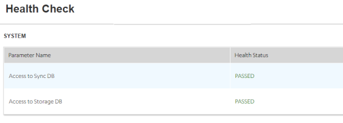
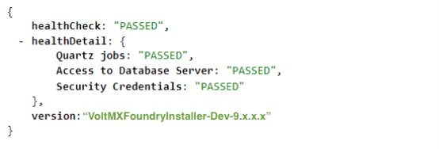

# <a name="top"></a><madcap:keyword term="Deployment Check List">Deployment Checklist and <madcap:keyword term="Deployment Case Studies">Example Case Studies</madcap:keyword></madcap:keyword>


This section provides a checklist for a standard production grade Volt MX Foundry deployment. The goal is to help you define a repeatable process to deploy, configure, upgrade, and expand your Volt MX Foundry environment. The case studies that follow, describe a few Volt MX Foundry deployments that were done using well-known Infrastructure components and how they were configured for a standard production environment. Going through this document will help you understand the challenges involved and prepare you for a smooth deployment of Volt MX Foundry within your enterprise.

## <a name="Checklist"></a>Checklist for Volt MX Foundry Deployment

*   Infrastructure Setup
*   Installing Volt MX Foundry
*   Manual Steps Post-Install
*   Test the setup
*   Activate the License

### <a name="Infrastructure"></a>Infrastructure Setup

Most production grade Volt MX Foundry Installations would need you to keep in mind the following:

*   **Choice of App Server and Database**

    Choose from the supported App Servers and Databases as outlined in the [Supported App Servers and Databases](../../../Foundry/voltmxfoundry_supported_devices_os_browsers/Content/Introduction.md).

*   **Node Sizing**
*   A good starting point is to select a standard node as suggested by the minimum Infrastructure requirements for a node running Volt MX Foundry. Refer to [App Server sizing](Deployment.md#app-server-sizing).
*   Determine the number of nodes by experimentation, and by testing actual workloads. Refine the number of nodes iteratively based on the resource usage and cost to improve the model.
*   **Host Configuration**

    Host configuration varies based on the OS used and the existing configuration standards, but there are some important steps that you need to follow after installing the OS:

*   Clock synchronization using NTP or similar service. Clock skew can produce errors that are hard to debug.
*   Hostnames are used for node identification in the cluster. The hostname must be set in a non-ephemeral way.

*   **App Server Specific Settings**

*   JVM Heap memory needs configuration.
*   Anything specific to the AppServer – Volt MX Foundry combinations which had not been taken care of during the installation process, for example, Configure LOG_ROOT environment variable in WebSphere for the location of logs.
*   **Database setup**

    Every database has its own specific way of setting up Redundancy, archival, and load distribution mechanisms. Contact your in-house DBA for further details.

*   **Load Balancer considerations**

*   A request forwarded from the load balancer to any of the backend nodes should have the X-Forwarded-For header stamped with the source client IP address. The backend needs the source client IP address as all the requests forwarded from the Load Balancer would have the Load Balancer IP address.
*   Volt MX Foundry Console and Admin components make use of cookies to direct requests to the node on which the session is currently active. The same needs to be handled appropriately at the load balancer end.
*   **Security considerations**

    *   If you need to use the HTTPS protocol for communication, you must provide a certificate/key from a CA. For Development environments, you may use self-signed certificates. The SSL connection can either be terminated at the load balancer or passed through to the back-end nodes.
    *   `/mfconsole` and `/admin` contexts are administrative consoles and access to the same should be restricted. A secure approach would be to use two firewalls to create a <madcap:keyword term="DMZ (De-Militarized Zone)">DMZ (De-Militarized Zone). Refer to [Deployment Topology](Deployment.md#deployment-topology).</madcap:keyword>

        *   The first firewall also called the perimeter firewall will route traffic to the DMZ only. This is where the Integration or Identity Cluster along with the load balancer would reside.

        *   The second or internal firewall will allow traffic from the DMZ to the internal network which is where the Volt MX Foundry Console cluster can be set up.

        *   PUT, PATCH and DELETE HTTP operations need to be allowed for Volt MX Foundry Console users. This will be decided based on whether the users are located within the DMZ or the internal network.

    *   `/authService`, `/middleware`, `/services` are runtime contexts and need to be made available publicly to end-users. You may need to map different URLs for internal users and those that would access identity publicly. Refer [Support to MAP Public URLs - Reverse Proxy (on-premises)](../../../Foundry/voltmx_foundry_user_guide/Content/Multi-Tenant_URL.md) for more details on how this can be achieved.

    *   You need to whitelist `manage.voltmx.com:443` and `orchestration.voltmx.com:443` for License activation. If you are unable to whitelist domains, contact the Volt MX Foundry Cloud Support team to whitelist individual IP addresses.
    *   Specific Security Hardening Considerations for each Volt MX Foundry Component are available in the [Security Hardening](Hardening_Guide.md) section.

### <a name="Installation"></a>Installing Volt MX Foundry

The Volt MX Foundry installer provides an automated way of installing the Foundry Components on a node. The Installer deploys the app server components and executes the database scripts based on your inputs. For more information, refer to the Installation guides for your specific OS at [VoltMX Documentation](./../../../index.md).

### <a name="ManualSteps"></a>Manual Steps Post-Install

For Cluster setups, follow these steps Post-Installation:

*   You can find the accounts properties file for the Accounts WebApp at `<Installer Folder>/tomcat/webapps/accounts/WEB-INF/classes/`. Update the **WAAS_BASE_URL** with the load balancer URL for all the nodes. In the same file, configure the **ACCOUNTS_ENCRYPTION_KEY** value with the same value as in all the nodes.

*   You can find the config.properties file for the Volt MX Foundry Console WebApp at : `<Installer Folder>/tomcat/webapps/mfconsole/WEB-INF/classes/`. In the config.properties file, configure the WAAS_BASE_URL and KONY_ACCOUNT_API_BASE_URL with the load balancer URL for all the nodes.

*   You can find the authservice.key file for the AuthService WebApp at: `<Installer Folder>/tomcat/webapps/authService/WEB-INF/classes/`. Update the Authservice.key value with the same value in all nodes.
*   You can find the workspaceService.key and workspaceService.properties files for the Workspace WebApp at `<Installer Folder>/tomcat/webapps/workspace/WEB-INF/classes/`. Copy the workspaceService.key and workspaceService.properties files in all nodes.

*   Set up a Memcached Cluster for the Integration nodes if needed. For more details refer to [Memcache Configuration](../../../Foundry/vmf_integrationservice_admin_console_userguide/Content/Runtime_Configuration.md#Memcache) in the Integration Admin Console User Guide.

*   Re-deploy the WebApps and restart the App Servers if needed.

*   Launch the Volt MX Foundry Console URL. This should lead to the registration page. Enter the authService URL. This may either be the load balancer URL or the authService node URL.

### Test the Setup

Use the following Healthcheck URLs post-deployment to check the status of a Volt MX Foundry component on each node:

*   For Volt MX Foundry console: http://<domain\_name\>:<port\>/mfconsole/health\_check/all
    
    
    
*   For Middleware: http://<domain\_name\>:<port\>/services/healthcheck
    
    
    
*   For Auth Service: http://<domain\_name\>:<port\>/authService/v1/manage/checkhealth
    
    
    
*   For Sync: http://<domain\_name\>:<port\>/syncconsole/healthcheck
    
    
    
*   For Messaging: http://<domain\_name\>:<port\>:53409/vpns/service/healthcheck/json
    
    


### <a name="Activate"></a>Activate the License

Follow the instructions located [VoltMX Licensing Guide](../../../Foundry/voltmx_licensing_guide/Content/Homepage.md) for activating the License based on your deployment model.


## <a name="Case"></a>Case Studies - Tomcat Multi-Node Cluster + HAProxy Load Balancer with MySQL Database

### <a name="InfrastructureCS"></a>Infrastructure Setup

The Volt MX Foundry Installer includes a pre-configured Tomcat app server which will be installed followed by deployment of selected components during the install process.

*   **Choice of App Server and Database**: Tomcat 8.5 and MySQL 5.7.   
*   **Node Sizing**
    *   2 nodes for Volt MX Foundry Integration/Identity/Metrics, 16 GB RAM, Intel(R) Xeon(R) CPU E5-2630 v2 @ 2.60GHz.
    *   1 node for Volt MX Foundry Console.
    *   1 node for MySQL 5.7.
    *   1 node for the LoadBalancer.
*   **Host Configuration**
    *   CentOS 6 is installed on all nodes.
    *   Clocks of all nodes are brought to sync with `ntpupdate`.
    *   Hostnames are configured.
*   **App Server Configuration**: Pre-configured Apache Tomcat 8.5.x is included in the Volt MX Foundry Installer.*   **Database Setup**: MySQL 5.7 is installed on a node with CentOS 6.
*   **Security Considerations**: Certificate/key from CA is obtained and converted into the .pem format. The load balancer terminates the SSL Connection and communicates with the backend servers using HTTP.
*   **Load Balancer Considerations**: Apache Tomcat does not include a load balancer out of the box. However, there are several standard, and open source load balancers available which are compatible with Tomcat. This case study uses HAProxy with the following configuration:

```

    
    frontend proxy_front
    
    bind * : 80
    
    bind * : 443 ssl crt /root/hclnet.pem   
    #By default all requests(Integration/Identity) will be forwarded to the nodes' backend
    
    Certificate provided for ssl termination
    
    redirect scheme https if !{ ssl_fc }  
    #Redirects to HTTPS if the user comes via HTTP
    
    mode http 
    
    acl url_mfconsole path_beg /mfconsole                 
    
    acl url_mfconsole path_beg /accounts
    
    acl url_mfconsole path_beg /workspace
    
    use_backend console if url_mfconsole  
    #Any request on any of the VoltMX Foundry Console Component contexts will be redirected to the backend of the console
    
    default_backend nodes
    
    backend console
    
    mode http
    
    option forwardfor  
    #Insert the X-Forwarded-For header. HAProxy will stamp this header with the IP of the source client
    
    http-request set-header X-Forwarded-Port %[dst_port]
    
    http-request add-header X-Forwarded-Proto https if {ssl_fc }
    
    server console mbaastest26.hcl.net:9090 check
    
    backend nodes
    
    mode http
    
    balance roundrobin  
    
    option forwardfor
    
    http-request set-header X-Forwarded-Port %[dst_port]  
    
    http-request add-header X-Forwarded-Proto https if {ssl_fc}  
    
    cookie JSESSIONID prefix nocache  
    
    server web1 mbaastest12.hcl.net:8080 check cookie web1  
    
    server web2 mbaastest36.hcl.net:8080 check cookie web2  
    
```
    

### <a name="InstallationCS"></a>Installation of Volt MX Foundry

Since this is a cluster setup, you will need to repeat the installation process for each node by selecting the **use existing DB** option and providing the same Database prefix and suffix that was provided during the first install. When prompted for the Host Name/Port, provide the load balancer URL, in case of the Volt MX Foundry Console.

### <a name="ManualStepsCS"></a>Manual Steps Post-Install

Follow the steps in the checklist.

*   You can find the accounts properties file for the Accounts WebApp at `<Installer Folder>/tomcat/webapps/accounts/WEB-INF/classes/`. Update the **WAAS_BASE_URL** with the load balancer URL for all the nodes. In the same file, configure the **ACCOUNTS_ENCRYPTION_KEY** value with the same value as in all the nodes.

*   You can find the config.properties file for the Volt MX Foundry Console WebApp at : `<Installer Folder>/tomcat/webapps/mfconsole/WEB-INF/classes/`. In the config.properties file, configure the WAAS_BASE_URL and KONY_ACCOUNT_API_BASE_URL with the load balancer URL for all the nodes.

*   You can find the authservice.key file for the AuthService WebApp at: `<Installer Folder>/tomcat/webapps/authService/WEB-INF/classes/`. Update the Authservice.key value with the same value in all nodes.
*   You can find the workspaceService.key and workspaceService.properties files for the Workspace WebApp at `<Installer Folder>/tomcat/webapps/workspace/WEB-INF/classes/`. Copy the workspaceService.key and workspaceService.properties files in all nodes.

*   Set up a Memcached Cluster for the Integration nodes if needed. For more details refer to [Memcache Configuration](../../../Foundry/vmf_integrationservice_admin_console_userguide/Content/Runtime_Configuration.md#Memcache) in the Integration Admin Console User Guide.

*   Re-deploy the WebApps and restart the App Servers if needed.

*   Launch the Volt MX Foundry Console URL. This should lead to the registration page. Enter the authService URL. This may either be the load balancer URL or the authService node URL.

*   Run the `./startJMS.sh` from `/<Foundry Install Location>/jboss_jms/bin` to start the JMS queue. Volt MX Foundry needs the JMS queue to capture metrics and generate reports.

### <a name="TestCS"></a>Test the Setup

All health-checks passed.

### <a name="ActivateCS"></a>Activate the License

License Activated successfully.