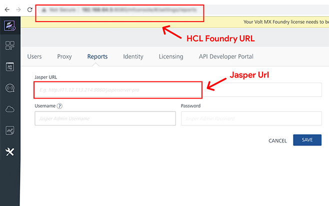

                         
How to Configure Volt MX Foundry in the JasperReports Server
-----------------------------------------------------------

This section explains how to configure Volt MX Foundry components in the JasperReports Server. Based on the configuration of Volt MX Foundry components, such as, accounts, server\_URL, the JasperReports Server provides data to Volt MX Foundry Console. The data is displayed in Volt MX Foundry Console's **Reports** page.

To configure Volt MX Foundry in the JasperReports Server, follow these steps:

1.  From your Jasper install location, open the `applicationcontext-security-web-oauth.xml` file.
    
    For example, `<jasperinstall-dir>/apache-tomcat/webapps/jasperserver-pro/WEB-INF/applicationcontext-security-web-oauth.xml`
    
2.  In the `applicationcontext-security-web-oauth.xml` file, configure the following:
    
    *   Replace  `%%ACCOUNTS_URL%` with the Volt MX Foundry-URL.
        
        For example, `https://<voltmxfoundry-ip>:<port>`
        
        > **_Note:_**   The JasperServer URL is required to be configured in MobileFarbic Console. For more details, refer to the image at the end of this section.
        
    *   Configure the value for the `<property name>` to enable the JasperServer Professional Edition or JasperServer Enterprise Edition. For example, if you set to the value to `true`, the JasperServer Professional Edition is configured. If you set to the value to `false`, the JasperServer Enterprise Edition is configured.
        
        ```
        <property name="singleTenant" value="<enter the value -for example, true or false>" />
        ```  

3.  From your Jasper install location, open the `js.config.properties` file.
    
    For example, `<jasperinstall-dir>/apache-tomcat/webapps/jasperserver-pro/WEB-INF/js.config.properties`.
    
4.  In the `js.config.properties` file, replace  `%%SERVER_URL%` with the JasperServer URL.  
    
    For example, `https://<jasperip>:<port>/jasperserver-pro`
    
    
    
    > **_Note:_**  Enter credentials for jasperadmin. For Jasper Reports Server V7.9.2/7.1, the default credentials for jasper admin are: <br>
    username = jasperadmin|&lt;organization_name&gt;.For example, jasperadmin|organization _1 <br>
    password = jasperadmin

      
    