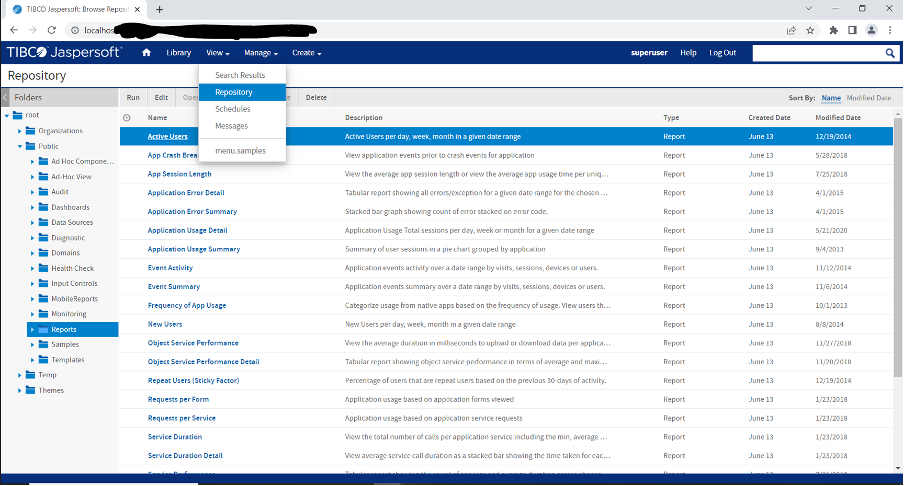
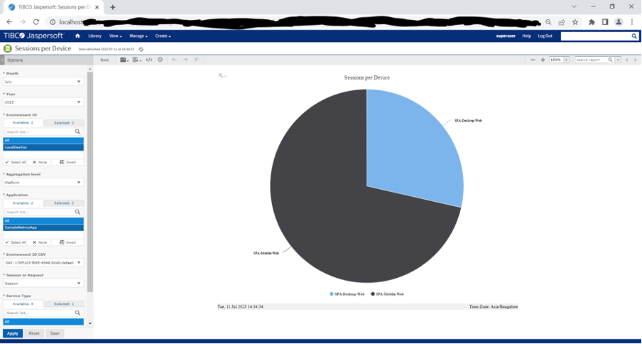

                         

How to Run Reports
------------------

This section explains how to run reports. Reports are generated based on the inputs provided, such as month, year, environment ID, aggregation level, and session\_Request.

To run reports, follow these steps:

1.  Log in to the JasperReports Server.
2.  Click **View > Repository**.
    
    
    
3.  In the left pane, expand **Public**, and then click **Reports**.  
    In the right pane, the **Repository** section displays reports.
    
    
4.  In the **Repository** section, click the report - for example, `Sessions per Device`.  
    The **Options** left pane for the report displays.
    
    
5.  In the **Options** pane, configure the following parameters as required.
    
    *   Month
    *   Year
    *   Environment ID
    *   Aggregation level
    *   Session\_Request
    
    > **_Note:_** The **Environment ID** parameter refers to a Development, QA, or Production environment for which you want to view the report data.
    

1.  After you configure the parameters, click **Save** and **Apply**.
2.  From the toolbar, click **View** > **Export > As PDF** to export the report to a .PDF file.
    
    
    
    A .PDF file for the report is created.
