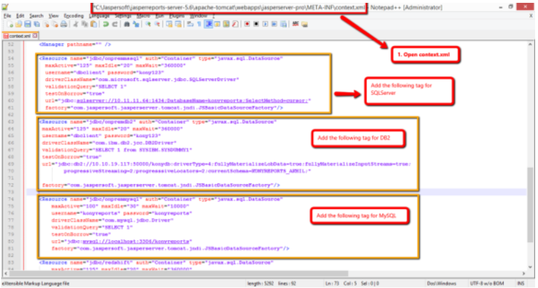
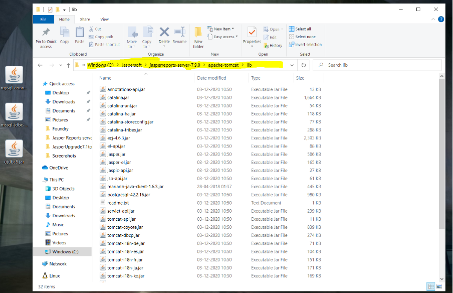

                          


How to Set Up JNDI Data Sources
-------------------------------

The Java Naming and Directory Interface (JNDI) configuration allows the JasperReports Server connectivity to appropriate databases using JDBC drivers. To run reports, the JNDI configuration is required.

To set up the Jasper data sources, follow these steps:

*  From your Jasper install location, open the `context.xml` file.
    
    For example, `\Jaspersoft\jasperreports-server-<7.9.2 or 7.1.0>\apache-tomcat\webapps\jasperserver-pro\META-INF\context.xml`.
    
    
    
*  In the `context.xml` file, add the following JNDI configurations for the reports to access the reports database. You must replace the following fields with appropriate values to access the reports database details. For more details, refer to [VoltMX Foundry\_Installer\_Guide > Installing Volt MX Foundry > Database Details window](../../../Foundry/voltmx_foundry_windows_install_guide/Content/Installing_VoltMX_Foundry_on_Windows.md).
    
    > **_Important:_** JasperReports Server V7.9.2, V7.1.0, and V6.2.0 use Tomcat 8 whereas JasperReports Server V 6.0 is bundled with Tomcat 7.  
    > And data source factory is different for both Tomcat 7 and Tomcat 8.  
    > \- For JasperReports Server V7.9.2, V7.1.0 , and V6.2.0, , the data source is as follows:  
    `com.jaspersoft.jasperserver.tomcat.jndi.JSCommonsBasicDataSourceFactory`  
    > \- For JasperReports Server V6.0, the data source is as follows:  
    `factory="com.jaspersoft.jasperserver.tomcat.jndi.JSBasicDataSourceFactory`
    
    > **_Note:_** In the Installing Volt MX Foundry page, scroll down to the **Database Details window**.
    
    | Field Name | Value |
    | --- | --- |
    | `<username>` | Database User |
    | `<Database Server IP : Database PORT>` | Database Server Hostname/IP |
    | `<password>` | Database Password |
    | `<database_name>` | Reports Database Name |
    

*   The following JNDI configuration is for the DB2 Server:
```
<!-- Add the following to the existing context.xml --> For JasperReports Server 7.9.2/7.1
.
<Resource name="jdbc/onpremdb2" auth="Container"
	type="javax.sql.DataSource"
	maxActive="100" maxIdle="30" maxWait="10000"
	username="<username>" password="<password>"
	driverClassName="com.ibm.db2.jcc.DB2Driver"
	validationQuery="SELECT 1 from SYSIBM.SYSDUMMY1"
	testOnBorrow="true"                   
	 url="jdbc:db2://<Database Server IP: Database
	PORT>/<database_name>:driverType=4; currentSchema=<Schema_name>;
	factory="com.jaspersoft.jasperserver.tomcat.jndi.JSCommonsBasicDataSourceFactory"/>
```  

```
<!-- Add the following to the existing context.xml --> For JasperReports Server 6.0

<Resource name="jdbc/onpremdb2" auth="Container"
	type="javax.sql.DataSource"
	maxActive="100" maxIdle="30" maxWait="10000"
	username="<username>" password="<password>"
	driverClassName="com.ibm.db2.jcc.DB2Driver"
	validationQuery="SELECT 1 from SYSIBM.SYSDUMMY1"
	testOnBorrow="true"                   
	 url="jdbc:db2://<Database Server IP: Database
	PORT>/<database_name>:driverType=4; currentSchema=<Schema_name>;
	factory="com.jaspersoft.jasperserver.tomcat.jndi.JSBasicDataSourceFactory"/>
```


*   The following JNDI configuration is for the MSSQL:
    
```
<!-- Add the following to the existing context.xml --> For JasperReports Server 7.9.2/7.1

<Resource name="jdbc/onpremmssql" auth="Container" type="javax.sql.DataSource"
        maxActive="100" maxIdle="30" maxWait="10000"
        username="<username>" password="<password>"
	driverClassName="com.microsoft.sqlserver.jdbc.SQLServerDriver"
        validationQuery="SELECT 1"
        testOnBorrow="true"
	url="jdbc:sqlserver://<Database Server IP: Database PORT>;databaseName=<database_name>"
        factory="com.jaspersoft.jasperserver.tomcat.jndi.JSCommonsBasicDataSourceFactory"/>
```

```
<!-- Add the following to the existing context.xml --> For JasperReports Server 6.0

<Resource name="jdbc/onpremmssql" auth="Container" type="javax.sql.DataSource"
        maxActive="100" maxIdle="30" maxWait="10000"
        username="<username>" password="<password>"
	driverClassName="com.microsoft.sqlserver.jdbc.SQLServerDriver"
        validationQuery="SELECT 1"
        testOnBorrow="true"
	url="jdbc:sqlserver://<Database Server IP: Database PORT>;databaseName=<database_name>"
        factory="com.jaspersoft.jasperserver.tomcat.jndi.JSBasicDataSourceFactory"/>
```


*   The following JNDI configuration is for the MySQL:
```
// MySQL For JasperReports Server 7.9.2/7.1
<Resource name="jdbc/onpremmysql" auth="Container" type="javax.sql.DataSource"
        maxActive="100" maxIdle="30" maxWait="10000"
        username="<username>" password="<password>"
        driverClassName="com.mysql.cj.jdbc.Driver"
        validationQuery="SELECT 1"
        testOnBorrow="true"
	url="jdbc:mysql://<Database Server IP: Database PORT>/<database_name>"
        factory="com.jaspersoft.jasperserver.tomcat.jndi.JSCommonsBasicDataSourceFactory"/>
```

```
// MySQL For JasperReports Server 6.0
<Resource name="jdbc/onpremmysql" auth="Container" type="javax.sql.DataSource"
        maxActive="100" maxIdle="30" maxWait="10000"
        username="<username>" password="<password>"
        driverClassName="com.mysql.cj.jdbc.Driver"
        validationQuery="SELECT 1"
        testOnBorrow="true"
	url="jdbc:mysql://<Database Server IP: Database PORT>/<database_name>"
        factory="com.jaspersoft.jasperserver.tomcat.jndi.JSBasicDataSourceFactory"/>
```  


*   The following JNDI configuration is for the Oracle:  
    
    > **_Important:_** 
    > Based on your Oracle database version, select the following options:  
    >   * If Oracle database is created with the PDB option of Oracle 12c, use service name pointing to PDB in the JDBC URL such as **pdborcl** or **pdbmfdb**.  
    >  `jdbc:oracle:thin:@<Database_Host_IP>:1521/pdbmfdb` <br>
    >   For example, `jdbc:oracle:thin:@192.168.1.2:1521/pdbmfdb` <br> 
    >  * If your database is either Oracle 11g or Oracle 12c without the PDB option, you can use ORACLE\_SID in the JDBC URL such as orcl or mfdb.    
    >  `jdbc:oracle:thin:@<Database_Host_IP>:1521:mfdb`<br> 
    >  For example, `jdbc:oracle:thin:@192.168.1.2:1521:mfdb`
        
    
```
//Sample code for Oracle

    <Resource name="jdbc/onpremoracle" auth="Container"
        type="javax.sql.DataSource"
        maxActive="100" maxIdle="30" maxWait="10000"
        username="<reportDatabaseName>" password="<password>"
        driverClassName="oracle.jdbc.OracleDriver"
        validationQuery="SELECT 1 from Dual"
        testOnBorrow="true"
        url="jdbc:oracle:thin:@ <Database Server IP: Database
        PORT>:Service_ID  
           factory="com.jaspersoft.jasperserver.tomcat.jndi.JSBasicDataSourceFactory"/>
```
    
   > **_Important:_**  For versions of Oracle 12 c and earlier, where the database service ID is used instead of service name, used the following URL:`  
    "url="jdbc:oracle:thin:@ <Database Server IP: Database PORT>:<database_name>"` 
    
   > **_Important:_** If you are using the latest JasperReports Server V6.2 or higher, [add a new JNDI configuration](#Step2) as custom dashboard feature is available in the latest package. The resource name value should be `jdbc/onpremaccounts` for all supported database types.  

    

*  Download appropriate database drivers for your database from the Jasper website link [http://support.jaspersoft.com/download\_preview.php?rl=60](http://support.jaspersoft.com/download_preview.php?rl=60)  
   > **_Note:_** Delete maraidb-java-client-2.5.3.jar in this path C:\Jaspersoft\jasperreports-server-7.9.0\apache-tomcat\lib   


*  Add appropriate database drivers into the  `\Jaspersoft\jasperreports-server-<7.9.2> or <7.1.0> or <6.2.0> or <6.0>\apachetomcat\lib` folder.
    
    
