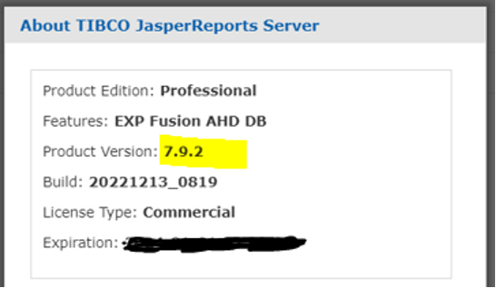
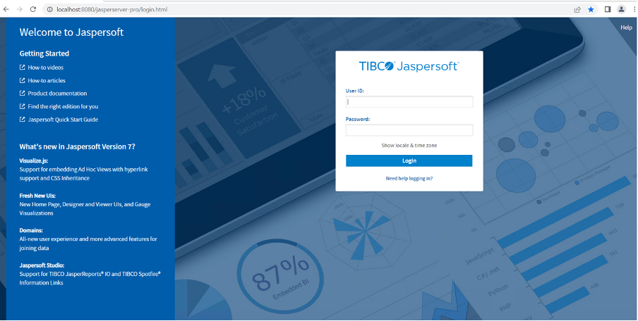
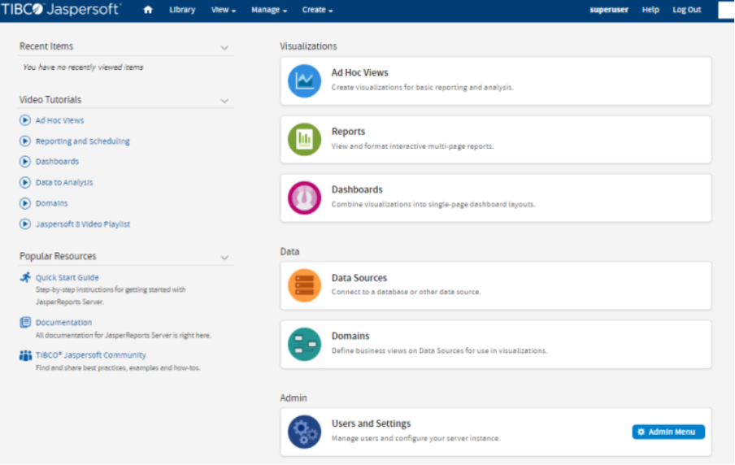
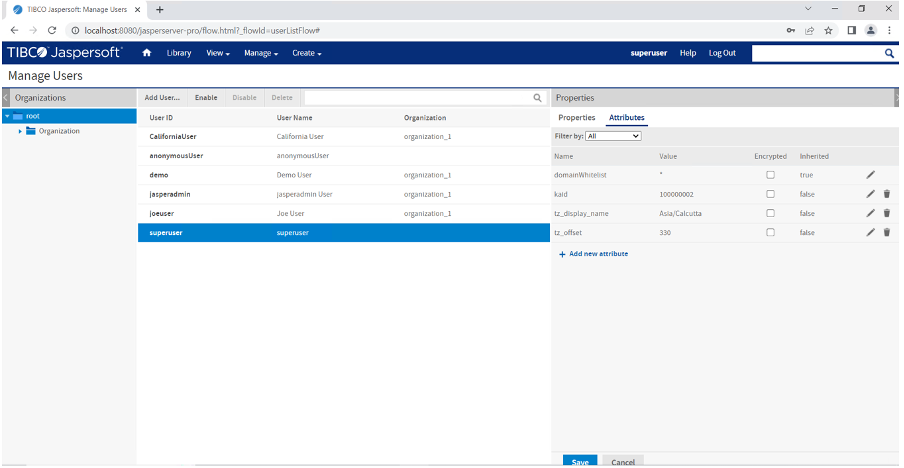
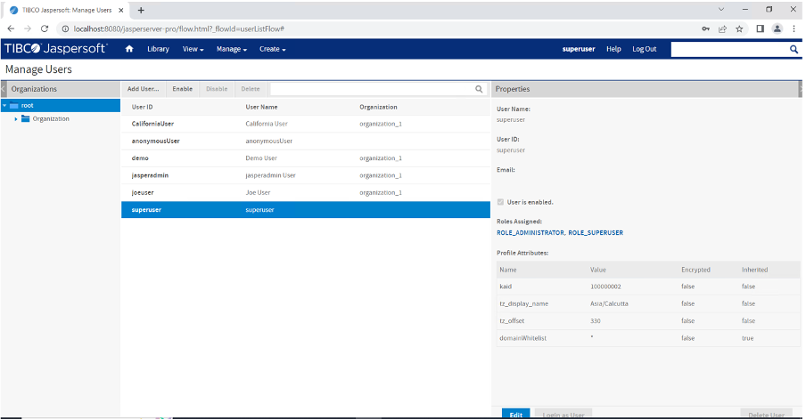

How to Install JasperReports Server V 7.9.2
---------------------------------------------

This section explains how to install JasperReports Server V 7.9 in your local, and apply the hotfix for 7.9.2:

> **_Important:_**  Ensure that you have the required hardware and access to the supporting software as provided in the [Prerequisites](Prereqs.md) section.

1.	Download the required version 'TIBCO JasperReports Server - Professional Edition' from this link TIBCO JasperReports Server - Professional Edition.

2.	Install the JasperReports Server using one of the following:

<b>Windows</b>:

. TIB_js-jrs_7.9.0_win_x86_64.exe

<b>Ubuntu Linux</b>:  

.  TIB_js-jrs_7.9.0_linux_x86_64.run

3.	Replace the JasperReports Server License provided by TIBCO. For example, &lt;js-install-location&gt;jasperserver.license.  

4.	Download the hotfix_JRSPro7.9.2_cumulative_20221213_0819 (https://support.tibco.com/s/article/TIBCO-JasperReports-Server-v7-9-2-cumulative-hotfix-20221213-0819-is-now-available)  from TIBCO Support.  

5.	Apply the hotfix_JRSPro7.9.2_cumulative_20221213_0819 hotfix.
Follow the readme.txt file under the hotfix_JRSPro7.9.2_cumulative_20221213_0819 and apply the hotfix.  

6.	Start and Log into JasperReports Server 7.9.2. 

    a.	Start your application server (Tomcat server).  

    b.	Clear your browsing cache.  

    c.	Log in to the JasperReports Server. You can view the JasperReports Server version upgraded to V7.9.2.  

    To check the upgraded version of the Jasper Reports Server, click the link specified in the footer immediately after the upgrade. The About TIBCO JasperReports Server dialog appears with upgraded details, shown below:  

    ]()

7.	Perform the Post-Installation tasks as specified in the Post-Installation Tasks.

8.	Clear the application server's Work and Temp folder.

    a.	Go to &lt;tomcat&gt;/work folder and delete all the files and folders in that directory.  

    b.	Go to &lt;tomcat&gt;/temp folder and delete all the files and folders in that directory.

9.	Clear the Repository Cache Database table.  

    a.	Run the following commands in the JasperServer's PostgreSQL DB with postgres user.
    
    i.	update JIRepositoryCache set item_reference = null;

    ii.	delete from JIRepositoryCache;

    Now your JasperReports Server is upgraded to V 7.9.2, and all the analytics information from the previous version is available in the upgraded version.

10.	Configure the JasperReports Server. Refer to How to Configure the JasperReports Server.  

How to Configure the JasperReports Server
---------------------------------------------  

After JasperReports Server is installed, attributes such as timezone, location, and account information must be configured for the logged-in user. The Jasper reports internally use the attributes to give accurate results for account and location.

To configure the JasperReports Server, follow these steps:  

1.	Once the JasperReports Server is installed, the Install Complete window appears with the confirmation message. Select the Launch check box to launch the JasperReports Server.  

    The Welcome to Jaspersoft page appears.

    

2.  Provide your default log-in credentials (username as superuser and password as superuser), and then click Login.  

    The Getting Started page appears.  

3.	On the Manage menu, click Users.  

      

    > **__Note__**: You need to edit superuser attributes only if reports are going to be run outside of the Foundry Console's context for users of Foundry 9.X and above.  
    > For most users of Foundry 9.X and above, reports can be directly accessed from Foundry Console after following the setup steps as mentioned in the  [Post-Installation Tasks](Post-Installation_Tasks.md) and [How to Configure Foundry](How_to_Configure_Foundry.md) in the JasperReports Server sections to finish the post-installation tasks and configuring Foundry Console to communicate with JasperReports Server

4.	From the Users list, click superuser, and then click Edit to continue.

     

5.	In the Attributes tab, click the Add button to add a row for the attribute.  

6.	Add the following details:

     

    <table>
    <tr>
    <th>Attribute Name</th>
    <th>Attribute Value</th>        
    </tr>
    <tr>
    <td>kaid - VoltMX Account ID. This value needs to match the Account Id generated by VoltMX Foundry Installer.  
    The value of Account ID field generated for VoltMX Foundry Server can be viewed from the Settings page in Appservices. The Settings URL format is as follows: 
    http://&lt;mfconsoleIP:Port&gt;/admin/console/config/configuration.html</td>
    <td>Example: 100000002 
    <em><b>Note</b></em>: VoltMX Foundry 9.x, the default kaid value is always 100000002.</td>
    </tr>    
    <tr>
    <td>tz_display_name - The timezone display name attribute appears on all reports as a footer indicating the timezone in which a report was generated. It is generally set to the Country/City</td>
    <td>Example: America/New_York</td>
    </tr>    
    <tr>
    <td>tz_offset - The timezone offset attribute indicates the offset in minutes from UTC time. Date calculations are adjusted according to this attribute while running reports to ensure that time is based on a user's timezone.   The offset contains sign (+ or -) with minutes to indicate if it is behind or ahead of UTC. For example: UTC - 5:00 for New York City would be set as -300 minutes varies for Japan which is at UTC + 9:00 would be set as 540 minutes.</td>
    <td>Example: +300</td>
    </tr>
    </table>

7.	Click Save to save the new attributes.  

    > **_Note:_** To change the default password of a user, you can change the password from the edit section of the user as well (optional).

8.	Re-login to JasperReports Server portal with the user to test the reports.  

9.	To modify the attributes of a user, repeat Step 1 through Step 7 in this procedure, after modifying attributes, re-login to JasperReports portal.

