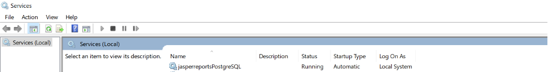
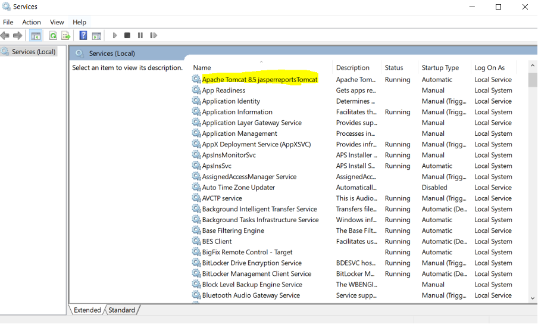

                         

How to Start or Stop JasperReports Server
-----------------------------------------

Restart the JasperReports Server for the configurations changes to take effect.

To start or stop JasperReports Server, follow these steps:

### Windows

1.  Click **Start**, and then click **Run** (Win+R).
2.  In the **Run** box, type `service.msc`, and then click **OK**. The **Services** window appears.
    
    > **_Important:_** Ensure that the **Extended** tab is selected.

    Click jasperreportsPostgreSQL
    
    
    
3.  From the services list, click `Apache Tomcat8.5 jasperreportsTomcat`.
    
    
    
4.  Click **Restart**. The system restarts the service.

### Linux

1.  To start the JasperReports Server, run the following command:
    
    cd &lt;js-install&gt;  
    ./ctlscript.sh start
    
2.  To stop the JasperReports Server, run the following command:
    
    cd &lt;js-install&gt;  
    ./ctlscript.sh stop
    
3.  To start and stop individual components, run the following command:
    
    cd &lt;js-install&gt;  
    ./ctlscript.sh start|stop postgresql  
    ./ctlscript.sh start|stop tomcat  
    
    For more information, refer to [https://community.jaspersoft.com/documentation/jasperreports-server-install-guide/v561/startstop-scripts-linux](https://community.jaspersoft.com/documentation/jasperreports-server-install-guide/v561/startstop-scripts-linux)
