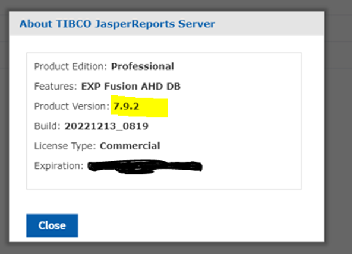

                         

How to Upgrade Jasper Reports Server
------------------------------------

This section explains how to upgrade Jasper Reports Server from `V 7.1` to `V 7.9.2`.


To Upgrade JasperReports Server, follow these steps:

1.  Back up your JRS War file, as follows:
    
    a.  Create a folder where you can save your `jasperserver-pro.war` file. For example, `C:\JS_BACKUP`  or  `/opt/JS_BACKUP`.
    
    b.  Copy the `<tomcat>/webapps/jasperserver-pro` to `<path>/JS_BACKUP`.  
    
2.  Back up your JasperServer Database.
    
    a.  Create a folder where you can save your JasperServer database. For example, `C:\JS_BACKUP` or `/opt/JS_BACKUP`.  

    b.  Run the following commands for PostgreSQL.
    
    1.  ```
            cd <path>/JS_BACKUP
        ```

    2.  ```
           <jrs-server-home>/postgresql/bin/pg_dump.exe --host=<host> --port=<port> --username=<username> jasperserver  >  js-db-7.1-dump.sql
        ```

3.  Export the current Repository Data, as follows:

    *   Command for Windows

    1.  ```
        cd <js-install-7.1>/buildomatic
        ```

    2.  ```
        js-export.bat --everything --output-zip js-export-7.1.zip
        ```

    *   Command for Linux
        
    1.  ```
        cd <js-install-7.1>/buildomatic
        ```

    2.  ```
        js-export.sh --everything --output-zip js-export-7.1.zip
        ```

4.  Download the JasperReports Server 7.9 WAR File Distribution. The WAR file distribution comes in a compressed ZIP file named TIB_js-jrs_7.9.0_bin.zip.Download the WAR file distribution from TIBCO Jaspersoft edelivery website.


5.  Extract all files from the TIB_js-jrs_7.9.0_bin.zip to a local system - for example, &lt;js-install-7.1.0&gt;(C:\Jaspersoft on Windows, /home/&lt;user&gt; on Linux).

    > **_Note:_** If the system displays the error `The filename or extension is too long`, change the parent folder name to a smaller one.

6.  Configure the buildomatic for your Database and Application Server, as follows:

    a.  Copy the `postgresql_master.properties` configuration file located in `<C:\Jaspersoft\TIB_js-jrs_7.9.0_bin\jasperreports-server-pro-7.9.0-bin\ buildomatic/sample_conf/postgresql_master.properties>`  

    b.  Paste the `postgresql_master.properties` file to `<C:\Jaspersoft\TIB_js-jrs_7.9.0_bin\jasperreports-server-pro-7.9.0-bin\ >/buildomatic.` 

    c.  Rename the `postgresql_master.properties`  to  `default_master.properties`.
    

    d.  Edit the `default_master.properties` with your database and application server details.  

      appServerDir=&lt;your Tomcat Server location where you have deployed JasperServer&gt; <br>
      dbUsername=postgres <br>
      dbPassword=postgres <br>
      dbHost=localhost <br>
      dbPort=&lt;port of the database server/postgresql&gt;  

7.  Upgrade to JasperReports Server 7.9

     a.  Stop your application server (Tomcat Server)

    ```
          Ubuntu Linux:
          cd <js-install>
          ./ctlscript.sh stop tomcat
    ```

     b.	Start your Database Server(PostgreSQL Server).
        Make sure that the user running the upgrade commands is the same user that installed the server. <br>
        cd &lt;TIB_js-jrs_7.9.0_bin&gt;/buildomatic
        Please use the js-7.1-export.zip ‘file path location’ from above step here: <br>
        <b>Windows</b>:<br>
        js-upgrade-newdb.bat <path>\js-7.1-export.zip <br>
        <b>Ubuntu Linux</b>:<br>
        ./js-upgrade-newdb.sh <path>/js-7.1-export.zip  <br>


     Output Log Location: The output logs are available at &lt;js-install-7.1&gt;/buildomatic/logs/js-upgrade-&lt;date&gt;-&lt;number&gt;.log

8. Download hotfix_JRSPro7.9.2_cumulative_20221213_0819 from TIBCO Support.

9. Apply the hotfix_JRSPro7.9.2_cumulative_20221213_0819 hotfix. Follow readme.txt file in the hotfix_JRSPro7.9.2_cumulative_20221213_0819\jasperserver-pro and hotfix_JRSPro7.9.2_cumulative_20221213_0819\js-install to apply the hotfix.


10.	Start and Log into JasperReports Server 7.9.2.

    a.	Start your application server (Tomcat server).

    b.	Clear your browsing cache.  

    Log in to the JasperReports Server. You can view the JasperReports Server version upgraded to V7.9.2. <br>
    
    To check the upgraded version of the Jasper Reports Server, click the link specified in the footer immediately after the upgrade. The About TIBCO JasperReports Server dialog appears with upgraded details, shown below:

    


11. Perform the Post-Installation tasks as specified in the Post-Installation Tasks.

12.	Clear the application server's Work and Temp folder.

    Go to  &lt;tomcat&gt;/work folder and delete all the files and folders in that directory.  <br>  
    Go to  &lt;tomcat&gt;/temp folder and delete all the files and folders in that directory.

13.	Clear the Repository Cache Database table.

    a.	Run the following commands in the JasperServer's PostgreSQL DB with postgres user  
    i.	update JIRepositoryCache set item_reference = null;  
    ii.	delete from JIRepositoryCache;  

    Now your JasperReports Server is upgraded to V 7.9.2, and all the analytics information from the previous version is available in the upgraded version.  


14.	Configure the JasperReports Server. Refer to How to Configure the JasperReports Server.

15.	Configure VoltMX Foundry in the JasperReports Server. Refer to How to Configure VoltMX Foundry in the JasperReports Server.


