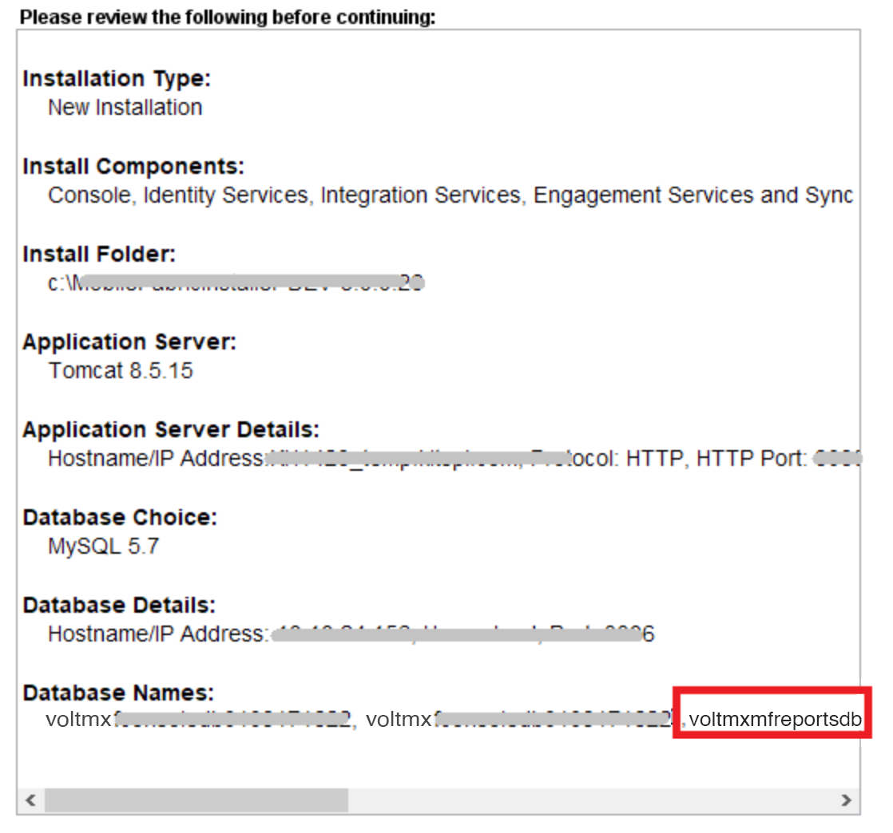

                          

You are here: Software Requirements

Prerequisites
=============

The following section explain the software and hardware required to install JasperReports Server.

Software Requirements
---------------------

  
| Purpose | Software Requirement |
| --- | --- |
| Installer   > **_Note:_** Volt MX Products support only Jasper Professional or Jasper Enterprise edition and not the community edition. | **Windows**: jasperreports-server-7.1-windows-x64-installer.exe jasperreports-server-6.2-windows-x64-installer.exe jasperreports-server-6.0-windows-x64-installer.exe > **_Important:_** To get access to the reports created with latest features, HCL recommends to install Jasper Enterprise edition 6.2 or 7.1 with Volt MX Foundry V8 or latest. |
| JasperSoft License | **Linux**: jasperreports-server-7.1-linux-x64-installer.run jasperreports-server-6.2-linux-x64-installer.run jasperreports-server-6.0-linux-x64-installer.run > **_Important:_** To get access to the reports created with latest features, HCL recommends to install Jasper Enterprise edition 6.2 or 7.1 with Volt MX Foundry V8 or latest. |

> **_Important:_** Make sure to download TIBCO JasperReports Server version 6.0.0 or 6.2.0 or 7.1.0, and install it before configuring user attributes in [How to Set Up the JasperReports Server](How_to_Set_Up_the_Jasper_Server.md).  
  
The license key for JasperSoft on-premises is provided by HCL as part of the software subscription license for Volt MX Foundry Analytics Server.

> **_Note:_**  
For JasperReports Server Installation Documentation, refer to the following:  
  
[https://community.jaspersoft.com/documentation/jasperreports-server-install-guide/**v561**/introduction](https://community.jaspersoft.com/documentation/jasperreports-server-install-guide/v561/introduction).  
  
[http://community.jaspersoft.com/documentation/tibco-jasperreports-server-installation-guide/**v60**/introduction](http://community.jaspersoft.com/documentation/tibco-jasperreports-server-installation-guide/v60/introduction)  
  
[http://community.jaspersoft.com/documentation/tibco-jasperreports-server-installation-guide/**v62**/introduction](http://community.jaspersoft.com/documentation/tibco-jasperreports-server-installation-guide/v62/introduction)  
  
[https://community.jaspersoft.com/documentation/tibco-jasperreports-server-user-guide/**v71**/introduction-jasperreports-server](https://community.jaspersoft.com/documentation/tibco-jasperreports-server-user-guide/v71/introduction-jasperreports-server)  
  
  
For JasperReports Server Distributions, refer to the following:  
  
[https://community.jaspersoft.com/documentation/jasperreports-server-install-guide/**v561**/jasperreports-server-distributions](https://community.jaspersoft.com/documentation/jasperreports-server-install-guide/v561/jasperreports-server-distributions).  
  
[http://community.jaspersoft.com/documentation/tibco-jasperreports-server-installation-guide/**v60**/jasperreports-server-distributions](http://community.jaspersoft.com/documentation/tibco-jasperreports-server-installation-guide/v60/jasperreports-server-distributions)  
  
[http://community.jaspersoft.com/documentation/tibco-jasperreports-server-installation-guide/**v62**/jasperreports-server-distributions](http://community.jaspersoft.com/documentation/tibco-jasperreports-server-installation-guide/v62/jasperreports-server-distributions)  
  
[https://community.jaspersoft.com/documentation/tibco-jasperreports-server-community-edition-release-notes/**v71**/release-distributions](https://community.jaspersoft.com/documentation/tibco-jasperreports-server-community-edition-release-notes/v71/release-distributions)  

Supported Databases and Drivers
-------------------------------

  
| Database Version | Database Connectivity Drivers |
| --- | --- |
| MySQL 5.6.X | mysql-connector-java-5.1.33-bin.jar Click the below link to download the .jar:[http://dev.mysql.com/downloads/connector/j/5.0.html](http://dev.mysql.com/downloads/connector/j/5.0.html) |
| Microsoft SQL Server 2012, 2014 | sqljdbc4.jar Click the below link to download the .jar:[https://msdn.microsoft.com/en-us/sqlserver/aa937724.aspx](https://msdn.microsoft.com/en-us/sqlserver/aa937724.aspx) |
| Oracle 11g, 12c | ojdbc7.jar Click the below link to download the .jar:[http://www.oracle.com/technetwork/database/features/jdbc/jdbc-drivers-12c-download-1958347.html](http://www.oracle.com/technetwork/database/features/jdbc/jdbc-drivers-12c-download-1958347.html) |
| IBM - DB2 10.1 | db2jcc4.jar Click the below link to download the .jar:[http://www-01.ibm.com/support/docview.wss?uid=swg21363866](http://www-01.ibm.com/support/docview.wss?uid=swg21363866) |

Hardware Requirements
---------------------

  
| Supported OS | Resource | Footprint | Minimum | Recommended |
| --- | --- | --- | --- | --- |
| Windows -  Windows 2008 -  Windows 7 -  Windows 8 | Disk | 600 MB | 10 GB free | 40 GB+ |
|^^| RAM |   | 512 MB | 1 GB + |
|^^| Processor |   | 1 GHz (single Pentium) | 1.5 GHz + (multi-core Pentium) |
| Linux  -  Red Hat Enterprise Linux 5, 6 -  Novell SUSE Linux Enterprise 10, 11 -  Debian 6 -  Ubuntu 10 | Disk | 600 MB | 10 GB free | 40 GB+ |
|^^| RAM |   | 512 MB | 1 GB + |
|^^| Processor |   | 1 GHz (single Pentium) | 1.5 GHz + (multi-core Pentium) |

Supported Foundry Versions
-------------------------

  
| Volt MX Foundry Version | Jasper Reports Server Version |
| --- | --- |
| For V8 SP2 and earlier versions | JRS 6.2 and JRS 6.0 |
| For V8 SP3 and later versions | JRS 7.1 and JRS 6.2 |

Reports Database
----------------

While installing Volt MX Foundry, the system creates the reports database, `<prefix>mfreports<suffix>`, based on the following choices only:

*   If you select **Console** check box, the system creates the reports database.
*   If you select **Console** and **Integration Service** check boxes, the system creates the reports database.
    
*   If you select **all** (components: Console, Identity Service, and Integration Service) check boxes, the system creates the reports database.
    

For more details, refer to [VoltMX Foundry Installer\_Guide > Installing Volt MX Foundry > Install Components window.](../../../Foundry/voltmx_foundry_windows_install_guide/Content/Installing_VoltMX_Foundry_on_Windows.md)

> **_Note:_**  In the Installing Volt MX Foundry page, scroll down to the **Install Components** window.

A reports database is created in the **VoltMX Foundry Installation > Pre-Installation Summary** window, shown below:

