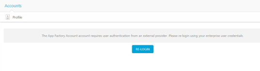
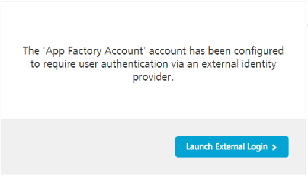
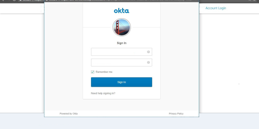
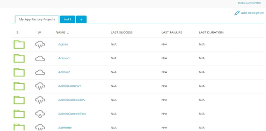

                          

External Authentication for App Factory
=======================================

Volt MX  supports external authentication on an App Factory Account. You can access the App Factory console by using your Okta credentials. By using external authentication, you can download and access the artifacts and MustHaves on your App Factory Account.

> **_Note:_**  
When external authentication is enabled for an App Factory Account, it is enabled for all the tenants of the account.

To access your **App Factory Account** by using third-party applications, follow these steps:

1.  Sign-in to the [VoltMX Foundry Console](https://manage.hclvoltmx.com/).
2.  From the **Accounts** list, select **App Factory Account**.

    If Okta is enabled, a **RE-LOGIN** button appears.

    

5.  Click **RE-LOGIN**.

    The  **Launch External Login**  window appears.

    

    > **_Note:_**  
    If the external Identity Provider user authentication is configured, and you access the App Factory account directly, the **Launch External Login** window appears.

9.  Click **Launch External Login**.

    The **Okta Sign In** page appears.

    

12.  Type your Okta credentials, and the click **Sign In**.

     You are signed-in to your App Factory Account with external authentication.

14.  From the left pane of the Volt MX Foundry Console, select **Environments**.
15.  For the **App Factory** environment that you want to use, click **Build Management**.

     The **App Factory** console appears.

     
