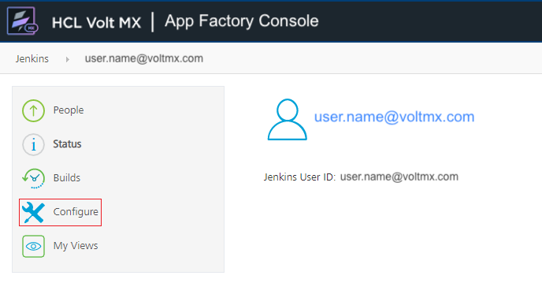

 

App Factory Command-line Interface
==================================

From V9 ServicePack 4, App Factory has added a command-line Interface, which is designed by extending the existing Jenkins CLI. The App Factory Command-line Interface, or AFCLI, can be used to script routine tasks, bulk updates, troubleshooting, and other actions for your App Factory projects. You can use AFCLI to manage the project creation and configuration from your own systems and to minimize interaction with the Jenkins console.

Prerequisites
-------------

*   An App Factory user account with the `Overall/Read` permission
*   The `jenkins-cli.jar` file, which is used to run commands that are related to App Factory.  
      
    To download the JAR file, click **Download AFCLI** on the left panel of the App Factory Console. Alternatively, you can use the following URL: `<appfactory_url>/jnlpJars/jenkins-cli.jar`.  
    Make sure that you replace `<appfactory_url>` with the URL of your App Factory Console, for example: `https://a12345.ci.hcl-cloud.com/jnlpJars/jenkins-cli.jar`.  

*   An App Factory API Token    
    This is applicable only if you want to run Jenkins commands by using AFCLI.  
    For more information, refer to [Generating an API Token in App Factory](#generating-an-api-token-in-app-factory).  


Authentication
--------------

To perform actions on your project by using AFCLI, you need to add authentication to your App Factory commands. For more information about the App Factory commands, refer to [AFCLI Commands](#afcli-commands).

The user account that is used for authentication with the Jenkins controller must have the `Overall/Read` permission to access AFCLI. The account may also require additional permissions for specific commands. For information about the different types of authentication, refer to the following sections.

<details close markdown = "block"><summary id="API_Token">Authentication with API Token</summary>Authentication with an API token uses the global option `-auth`, which requires an argument in the `user:apitoken` format. This authentication mechanism works for App Factory commands and Jenkins commands. For information about API tokens, refer to <a href="#generating-an-api-token-in-app-factory">Generating an API Token in App Factory.</a><br/>

  > ***Note***:  Even if you use `-auth` for authentication, some commands might require the Foundry password to perform specific operations.

  **Syntax**  

  For in-line arguments, the syntax is as follows:

  ```
   java -jar jenkins-cli.jar [-s JENKINS_URL] -auth <username>:<api-token> [command] [command_arguments] [command_options]
  ```

  To load the arguments from a file, the syntax is as follows:

```
java -jar jenkins-cli.jar [-s JENKINS_URL] -auth @/path/to/credentials [command] [command_arguments] [command_options]
```

Make sure that you provide the complete path of your credentials file, for example: `@/home/username/.jenkins-cli`.

<blockquote><em><b>Note: </b></em>
  <p>You can also specify the username and the apitoken arguments by configuring the following environment variables: </p>
<ul>
  <li> username: <code>$JENKINS_USER_ID</code></li>
  <li> apitoken: <code>$JENKINS_API_TOKEN</code></li>
</ul>
  <p>Make sure that both the variables are set simultaneously.</p>
</blockquote>

**Example**

```
java -jar jenkins-cli.jar -s "https://a12345.ci.hcl-cloud.com" -auth username:123456 fetch-build-result MyProject25 iris 19 --password "foundry_password"
```

#### Generating an API Token in App Factory

An API token can be generated by using the `me/configuration` endpoint in your App Factory instance. To access the configuration page and generate an API token, follow these steps:

 1.  Sign-in to your App Factory console.
 2.  On the upper-right corner, click the email address of your account.  
    
 3.  On the left panel of the App Factory User page, click **Configure**.  
    
 4.  On the user configuration page, under **API Token**, click **ADD NEW TOKEN**.
 5.  Type a name for the token, and then click **GENERATE**. An API Token is generated with the specified name.  
    
 6.  Copy the API Token by clicking the copy icon, and then save the token. You can also revoke the token by clicking the revoke icon.  
      

  > ***Important***: Make sure that you save the token value because it will not be visible after you navigate away from the configuration page.

 7.  Click **APPLY**, and then click **SAVE**.

 After saving the user configuration, you can use the API token with the `-auth` option in AFCLI.
</details>


<details close markdown = "block"><summary>Authentication with User Credentials</summary>

Authentication with user credentials uses the command options `--username` and `--password`, which require your VoltMX Foundry credentials as arguments. Alternatively, you can use the `-u` and `-p` command options for the credentials This mechanism only works with App Factory commands and cannot be used with Jenkins commands.

**Syntax**

```
java -jar jenkins-cli.jar [-s JENKINS_URL] [global options] [command] --username '<username>' --password '<password>'
```
 
```
java -jar jenkins-cli.jar [-s JENKINS_URL] [global options] [command] -u '<username>' -p '<password>'
```

**Example**

```
java -jar jenkins-cli.jar -s "https://a12345.ci.hcl-cloud.com" fetch-build-result MyProject25 iris 19  --username 'user.name@hcl.com' --password 'foundry_password'
```
</details>

<!-- Authentication with Foundry tokens (`--foundry-auth`)

Authentication with Foundry tokens uses the command option `--foundry-auth`, which requires an argument in the `user:foundrytoken` format.

Syntax

```
java -jar jenkins-cli.jar [-s JENKINS_URL] [global options] [commands] --foundry-auth "<username>:<foundry-token>"
```

Example

```
java -jar jenkins-cli.jar -s "https://a12345.ci.hcl-cloud.com" fetch-build-result MyProject25 19 --foundry-auth "user.name@hcl.com:abc1234ffe4a"
```
 -->

AFCLI Commands
--------------

The general syntax to run commands is as follows:

```
java -jar jenkins-cli.jar [-s JENKINS_URL] [global options] command [command options] [arguments]
```

The JENKINS_URL parameter can be specified by using the environment variable `$JENKINS_URL`. You can view the summaries of other general options by running the client without any arguments.

AFCLI provides commands that are specific to your App Factory instance. AFCLI also supports built-in Jenkins CLI commands, such as `build` or `list-jobs`. To view the full list of commands that are available in your environment, use the `help` command, which is a Jenkins command that requires [authentication with an API token](#API_Token) (`-auth`). For example:

```
java -jar jenkins-cli.jar -s "https://a12345.ci.hcl-cloud.com" -auth username:123456 help
```

To view information about an App Factory command, type the command name after `help`. For example:

```
java -jar jenkins-cli.jar -s "https://a12345.ci.hcl-cloud.com" -auth username:123456 help create-project
```

For information about the different App Factory commands, refer to the following sections.


<details close markdown = "block"><summary>create-project</summary>

This command is used to create a project on App Factory. Based on the specified options, the output is the project name and the project type.

**Syntax**

```
create-project <appfactory_project> <project_type> [-f] [-s] [-w]
```

```
create-project <appfactory_project> <project_type> [--follow] [--sync] [--wait]
```

**Arguments**

<table style="width: 80%;mc-table-style: url('Resources/TableStyles/Basic.css');" class="TableStyle-Basic" cellspacing="0"><colgroup><col class="TableStyle-Basic-Column-Column1" style="width: 15%;"> <col class="TableStyle-Basic-Column-Column1" style="width: auto;"></colgroup><tbody><tr class="TableStyle-Basic-Body-Body1"><th class="TableStyle-Basic-BodyE-Column1-Body1">Argument</th><th class="TableStyle-Basic-BodyD-Column1-Body1">Description</th></tr><tr class="TableStyle-Basic-Body-Body1"><td class="TableStyle-Basic-BodyE-Column1-Body1"><p><code class="file_names">appfactory_project</code></p></td><td class="TableStyle-Basic-BodyD-Column1-Body1"><p>Specifies the name of the project.</p><p>For example: MyProject25</p></td></tr><tr class="TableStyle-Basic-Body-Body1"><td class="TableStyle-Basic-BodyB-Column1-Body1"><p><code class="file_names">project_type</code></p></td><td class="TableStyle-Basic-BodyA-Column1-Body1"><p>Specifies the type of project that you want to create. The possible values are as follows:</p><ul><li>VoltMX Project</li><li>HCL MicroServices Project</li></ul></td></tr></tbody></table>

**Options**

<table style="width: 80%;mc-table-style: url('Resources/TableStyles/Basic.css');" class="TableStyle-Basic" cellspacing="0"><colgroup><col class="TableStyle-Basic-Column-Column1" style="width: 15%;"> <col class="TableStyle-Basic-Column-Column1" style="width: auto;"></colgroup><tbody><tr class="TableStyle-Basic-Body-Body1"><th class="TableStyle-Basic-BodyE-Column1-Body1">Command Option</th><th class="TableStyle-Basic-BodyD-Column1-Body1">Description</th></tr><tr class="TableStyle-Basic-Body-Body1"><td class="TableStyle-Basic-BodyE-Column1-Body1"><p><code class="file_names">-f</code></p><p>OR</p><p><code class="file_names">--follow</code></p></td><td class="TableStyle-Basic-BodyD-Column1-Body1"><p>Follows the build progress and modifies the exit code based on the outcome of the build. Interrupts are not passed through to the build, therefore, the job will not be interrupted.</p><p class="Note" madcap:autonum="<b><i><span style=&quot;color: #0a9c4a;&quot; class=&quot;mcFormatColor&quot;>Note: </span></i></b>">The build will continue even if you close the command-line interface (terminal).</p></td></tr><tr class="TableStyle-Basic-Body-Body1"><td class="TableStyle-Basic-BodyE-Column1-Body1"><p><code class="file_names">-s</code></p><p>OR</p><p><code class="file_names">--sync</code></p></td><td class="TableStyle-Basic-BodyD-Column1-Body1"><p>Waits until the command is completed or aborted. Interrupts are passed through to the build, therefore, the job can be interrupted.</p></td></tr><tr class="TableStyle-Basic-Body-Body1"><td class="TableStyle-Basic-BodyB-Column1-Body1"><p><code class="file_names">-w</code></p><p>OR</p><p><code class="file_names">--wait</code></p></td><td class="TableStyle-Basic-BodyA-Column1-Body1"><p>Waits till the start of the command.</p></td></tr></tbody></table>

**Example**

```
java -jar jenkins-cli.jar -s "https://a12345.ci.hcl-cloud.com" create-project MyProject25 "MicroServices Project" --username 'user.name@hcl.com' --password 'foundry_password'
```
</details>


<details close markdown = "block"><summary>fetch-project-settings</summary>


This command is used to retrieve the current project settings for the specified App Factory project in a JSON format.

The JSON format can be used as a template to update the settings by using the `update-project-settings` command. For new projects, the JSON keys in the template contain default values or `null`.

*   From the V9 ServicePack 5 release, the [Foundry Project Settings](Project_Settings.md#foundry-project-settings) can be fetched and configured.
*   In V9 ServicePack 4, only the [Iris Project Settings](Project_Settings.md#iris-project-settings) can be fetched and configured.

  

**Syntax**

```
fetch-project-settings <appfactory_project> <appfactory_service>
```

**Arguments**

<table style="width: 80%;mc-table-style: url('Resources/TableStyles/Basic.css');" class="TableStyle-Basic" cellspacing="0"><colgroup><col class="TableStyle-Basic-Column-Column1" style="width: 15%;"> <col class="TableStyle-Basic-Column-Column1" style="width: auto;"></colgroup><tbody><tr class="TableStyle-Basic-Body-Body1"><th class="TableStyle-Basic-BodyE-Column1-Body1">Argument</th><th class="TableStyle-Basic-BodyD-Column1-Body1">Description</th></tr><tr class="TableStyle-Basic-Body-Body1"><td class="TableStyle-Basic-BodyE-Column1-Body1"><p><code class="file_names">appfactory_project</code></p></td><td class="TableStyle-Basic-BodyD-Column1-Body1"><p>Specifies the name of the project.</p><p>For example: MyProject25</p></td></tr><tr class="TableStyle-Basic-Body-Body1" madcap:conditions="Default.V9SP5"><td class="TableStyle-Basic-BodyB-Column1-Body1"><p><code class="file_names">appfactory_service</code></p></td><td class="TableStyle-Basic-BodyA-Column1-Body1"><p>Specifies the service for which you want to fetch the details. Supports the following values:</p><ul><li><code style="font-size: 11pt;">Iris</code></li><li><code style="font-size: 11pt;">Foundry</code></li></ul></td></tr></tbody></table>

**Example**

```
java -jar jenkins-cli.jar -s "https://a12345.ci.hcl-cloud.com" fetch-project-settings MyProject25 iris --username 'user.name@hcl.com' --password 'foundry_password'
```

**Sample Output**

```
{
"sourceControl":{},
"internationalization":{},
"scans":
{
	"sonar":
	{
		"runSonar":false,
		"failBuildOnQualityGateStatus":false,
		"isDebugEnabled":false
	}
},
"notification":{},
"android":{},
"ios":
{
	"signingMethod":"API Key"
},
"models":
{
	"cleanAndRegenerate":true
}
}
```
</details>


<details close markdown = "block"><summary>update-project-settings</summary>


This command is used to configure the project settings of the specified project. The command requires the `-j` or `--json` option followed by a JSON string.

*   From the V9 ServicePack 5 release, the [Foundry Project Settings](Project_Settings.md#foundry-project-settings) can be fetched and configured.
*   In V9 ServicePack 4, only the [Iris Project Settings](Project_Settings.md#iris-project-settings) can be fetched and configured.
*   For the shell input, HCL recommends using single quotes (`'`) or proper escaping to specify the JSON string.

  

**Syntax**

For shell terminals:

```
update-project-settings <appfactory_project> <appfactory_service> [-j] '{"abc":"xyz"}'
```
```
update-project-settings <appfactory_project> <appfactory_service> [--json] '{"abc":"xyz"}'
```

For Windows command prompt:

```
update-project-settings <appfactory_project> <appfactory_service> [-j] "{\"abc\":\"xyz\"}"
```
```
update-project-settings <appfactory_project> <appfactory_service> [--json] "{\"abc\":\"xyz\"}"
```

**Arguments**

<table style="width: 80%;mc-table-style: url('Resources/TableStyles/Basic.css');" class="TableStyle-Basic" cellspacing="0"><colgroup><col class="TableStyle-Basic-Column-Column1" style="width: 15%;"> <col class="TableStyle-Basic-Column-Column1" style="width: auto;"></colgroup><tbody><tr class="TableStyle-Basic-Body-Body1"><th class="TableStyle-Basic-BodyE-Column1-Body1">Argument</th><th class="TableStyle-Basic-BodyD-Column1-Body1">Description</th></tr><tr class="TableStyle-Basic-Body-Body1"><td class="TableStyle-Basic-BodyE-Column1-Body1"><p><code class="file_names">appfactory_project</code></p></td><td class="TableStyle-Basic-BodyD-Column1-Body1"><p>Specifies the name of the project.</p><p>For example: MyProject25</p></td></tr><tr class="TableStyle-Basic-Body-Body1" madcap:conditions="Default.V9SP5"><td class="TableStyle-Basic-BodyB-Column1-Body1"><p><code class="file_names">appfactory_service</code></p></td><td class="TableStyle-Basic-BodyA-Column1-Body1"><p>Specifies the service that you want to update. Supports the following values:</p><ul><li><code style="font-size: 11pt;">Iris</code></li><li><code style="font-size: 11pt;">Foundry</code></li></ul></td></tr></tbody></table>

**Options**

<table style="width: 80%;mc-table-style: url('Resources/TableStyles/Basic.css');" class="TableStyle-Basic" cellspacing="0"><colgroup><col class="TableStyle-Basic-Column-Column1" style="width: 15%;"> <col class="TableStyle-Basic-Column-Column1" style="width: auto;"></colgroup><tbody><tr class="TableStyle-Basic-Body-Body1"><th class="TableStyle-Basic-BodyE-Column1-Body1">Command Option</th><th class="TableStyle-Basic-BodyD-Column1-Body1">Description</th></tr><tr class="TableStyle-Basic-Body-Body1"><td class="TableStyle-Basic-BodyB-Column1-Body1"><p><code class="file_names">-j</code></p><p>OR</p><p><code class="file_names">--json</code></p></td><td class="TableStyle-Basic-BodyA-Column1-Body1"><p>Specifies that the input is in a JSON format. As an argument, this option requires a JSON string inside single quotes (<code class="file_names">'</code>) for a shell terminal; or a pre-escaped JSON wrapped in double quotes(<code class="file_names">"</code>) for Windows command prompt.</p><p>For simpler handling of JSON inputs, HCL recommends using a shell terminal.</p><p>This option is mandatory.</p><p>For example: <code class="codefirst" style="font-size: 11pt;">'{"abc":"xyz"}'</code> or <code class="codefirst" style="font-size: 11pt;">"{\"abc\":\"xyz\"}"</code></p></td></tr></tbody></table>

**Example**

For shell terminals:

```
java -jar jenkins-cli.jar -s "https://a12345.ci.hcl-cloud.com" update-project-settings MyProject25 iris -j   
'{"sourceControl":{"projectPath":"","scmVendor":"GitHub","scmCredentials":"MyGitCreds",  
"repositoryURL":"https://github.com/MyAppFactoryGit/MyProject25.git"},"ios ":{}}' --username 'user.lastname@hcl.com' --password 'foundry_password'
```

For Windows command prompt:

```
java -jar jenkins-cli.jar -s "https://a12345.ci.hcl-cloud.com" update-project-settings MyProject25 iris -j   
"{\"sourceControl\":{\"projectPath\":\"\",\"scmVendor\":\"GitHub\",\"scmCredentials\":\"MyGitCreds\",  
\"repositoryURL\":\"https://github.com/MyAppFactoryGit/MyProject25.git\"},\"ios\":{}}" --username 'user.lastname@hcl.com' --password 'foundry_password'
```
</details>


<details close markdown = "block"><summary>build-project</summary>


This command is used to run the build job of the specified App Factory project. Based on the specified options, the output is either the build number or the queue ID of the job.

**Syntax**

```
build-project <appfactory_project> <appfactory_service> [-s] [-f] [-p] [-v] [-w]
```
```
build-project <appfactory_project> <appfactory_service> [--sync] [--follow] [--parameter] [--verbose] [--wait]
```

**Arguments**

<table style="width: 80%;mc-table-style: url('Resources/TableStyles/Basic.css');" class="TableStyle-Basic" cellspacing="0"><colgroup><col class="TableStyle-Basic-Column-Column1" style="width: 15%;"> <col class="TableStyle-Basic-Column-Column1" style="width: auto;"></colgroup><tbody><tr class="TableStyle-Basic-Body-Body1"><th class="TableStyle-Basic-BodyE-Column1-Body1">Argument</th><th class="TableStyle-Basic-BodyD-Column1-Body1">Description</th></tr><tr class="TableStyle-Basic-Body-Body1"><td class="TableStyle-Basic-BodyE-Column1-Body1"><p><code class="file_names">appfactory_project</code></p></td><td class="TableStyle-Basic-BodyD-Column1-Body1"><p>Specifies the project that contains the build job.</p><p>For example: MyProject25</p></td></tr><tr class="TableStyle-Basic-Body-Body1" madcap:conditions="Default.V9SP5"><td class="TableStyle-Basic-BodyB-Column1-Body1"><p><code class="file_names">appfactory_service</code></p></td><td class="TableStyle-Basic-BodyA-Column1-Body1"><p>Specifies the service for which you want to run the build job. Supports the following values:</p><ul><li><code style="font-size: 11pt;">Iris</code></li><li><code style="font-size: 11pt;">Foundry</code></li></ul></td></tr></tbody></table>

**Options**

<table style="width: 80%;mc-table-style: url]('Resources/TableStyles/Basic.css');" class="TableStyle-Basic" cellspacing="0"><colgroup><col class="TableStyle-Basic-Column-Column1" style="width: 15%;"> <col class="TableStyle-Basic-Column-Column1" style="width: auto;"></colgroup><tbody><tr class="TableStyle-Basic-Body-Body1"><th class="TableStyle-Basic-BodyE-Column1-Body1">Command Option</th><th class="TableStyle-Basic-BodyD-Column1-Body1">Description</th></tr><tr class="TableStyle-Basic-Body-Body1"><td class="TableStyle-Basic-BodyE-Column1-Body1"><p><code class="file_names">-s</code></p><p>OR</p><p><code class="file_names">--sync</code></p></td><td class="TableStyle-Basic-BodyD-Column1-Body1"><p>Waits until the command is completed or aborted. Interrupts are passed through to the build, therefore, the job can be interrupted.</p><p>This option provides the <code class="file_names" style="font-size: 11pt;">Build_Id</code> and the final result as the output.</p></td></tr><tr class="TableStyle-Basic-Body-Body1"><td class="TableStyle-Basic-BodyE-Column1-Body1"><p><code class="file_names">-f</code></p><p>OR</p><p><code class="file_names">--follow</code></p></td><td class="TableStyle-Basic-BodyD-Column1-Body1"><p>Follows the build progress and modifies the exit code based on the outcome of the build. Interrupts are not passed through to the build, therefore, the job will not be interrupted.</p><p>This option provides the <code class="file_names" style="font-size: 11pt;">Build_Id</code> and the final result as the output.</p><p class="Note" madcap:autonum="<b><i><span style=&quot;color: #0a9c4a;&quot; class=&quot;mcFormatColor&quot;>Note: </span></i></b>">The build will continue even if you close the command-line interface (terminal).</p></td></tr><tr class="TableStyle-Basic-Body-Body1"><td class="TableStyle-Basic-BodyE-Column1-Body1"><p><code class="file_names">-param</code></p><p>OR</p><p><code class="file_names">--parameter</code></p></td><td class="TableStyle-Basic-BodyD-Column1-Body1"><p>Specifies a build parameter in the <code class="codefirst" style="font-size: 11pt;">"key=value"</code> format.</p><p>You can specify multiple parameters by separating them with a space. For example: <code class="codefirst" style="font-size: 11pt;">-param"Key1=Value1" -param"Key=Value2"</code></p><p>For more information about the build parameters, refer to the following docs:</p><ul><li><a href="BuildingAnApp.html" target="_blank">Building a Iris App</a></li><li><a href="BuildingFoundryApp.html">Building a Foundry App</a></li></ul></td></tr><tr class="TableStyle-Basic-Body-Body1"><td class="TableStyle-Basic-BodyE-Column1-Body1"><p><code class="file_names">-v</code></p><p>OR</p><p><code class="file_names">--verbose</code></p></td><td class="TableStyle-Basic-BodyD-Column1-Body1"><p>Prints the console output of the build. This option must be used with the <code class="codefirst" style="font-size: 11pt;">-s</code> option.</p></td></tr><tr class="TableStyle-Basic-Body-Body1"><td class="TableStyle-Basic-BodyB-Column1-Body1"><p><code class="file_names">-w</code></p><p>OR</p><p><code class="file_names">--wait</code></p></td><td class="TableStyle-Basic-BodyA-Column1-Body1"><p>Waits till the start of the command.</p><p>This option provides the <code class="file_names" style="font-size: 11pt;">Build_Id</code> as the output.</p></td></tr></tbody></table>

**Example**

```
java -jar jenkins-cli.jar -s "https://a12345.ci.hcl-cloud.com" build-project MyProject25 iris -param"Key1=Value1" -param"Key=Value2" --username 'user.name@hcl.com' --password 'foundry_password'
```
</details>


<details close markdown = "block"><summary>fetch-build-result</summary>

This command is used to fetch the results of the specified build job in an App Factory project. Based on your inputs to the command, the output is either the result or the status of the job.

  
> ***Important***: This command requires a Foundry password to fetch information about the build and the artifacts from the Foundry Console (or the S3 storage). <br/>  
If you are using [authentication with an API token](#API_Token), make sure that you include the `--password` option in the command.

**Syntax**

```
fetch-build-result <appfactory_project> <appfactory_service> <build_number> --password "foundry_password"
```
```
fetch-build-result <appfactory_project> <appfactory_service> <queue_id> --password "foundry_password"
```

**Arguments**

<table style="width: 80%;mc-table-style: url('Resources/TableStyles/Basic.css');" class="TableStyle-Basic" cellspacing="0"><colgroup><col class="TableStyle-Basic-Column-Column1" style="width: 15%;"> <col class="TableStyle-Basic-Column-Column1" style="width: auto;"></colgroup><tbody><tr class="TableStyle-Basic-Body-Body1"><th class="TableStyle-Basic-BodyE-Column1-Body1">Argument</th><th class="TableStyle-Basic-BodyD-Column1-Body1">Description</th></tr><tr class="TableStyle-Basic-Body-Body1"><td class="TableStyle-Basic-BodyE-Column1-Body1"><p><code class="file_names">appfactory_project</code></p></td><td class="TableStyle-Basic-BodyD-Column1-Body1"><p>Specifies the project that contains the build job.</p><p>For example: MyProject25</p></td></tr><tr class="TableStyle-Basic-Body-Body1" madcap:conditions="Default.V9SP5"><td class="TableStyle-Basic-BodyE-Column1-Body1"><p><code class="file_names">appfactory_service</code></p></td><td class="TableStyle-Basic-BodyD-Column1-Body1"><p>Specifies the service for which you want to run the build job. Supports the following values:</p><ul><li><code style="font-size: 11pt;">Iris</code></li><li><code style="font-size: 11pt;">Foundry</code></li></ul></td></tr><tr class="TableStyle-Basic-Body-Body1"><td class="TableStyle-Basic-BodyB-Column1-Body1"><p><code class="file_names">build_number</code></p><p>OR</p><p><code class="file_names">queue_id</code></p></td><td class="TableStyle-Basic-BodyA-Column1-Body1"><p>Specifies the build number or the queue ID of the job for which you want to fetch the results.</p><p>For example: 19</p><p class="Important" madcap:autonum="<b><i><span style=&quot;color: #ff6600;&quot; class=&quot;mcFormatColor&quot;>Important: </span></i></b>">The queue ID&nbsp;is not valid to fetch the result if the job has already started.</p></td></tr></tbody></table>

<!-- **Options**

<table style="width: 80%;mc-table-style: url('Resources/TableStyles/Basic.css');" class="TableStyle-Basic" cellspacing="0" madcap:conditions="Default.Not Ready for Publish"><colgroup><col class="TableStyle-Basic-Column-Column1" style="width: 15%;"> <col class="TableStyle-Basic-Column-Column1" style="width: auto;"></colgroup><tbody><tr class="TableStyle-Basic-Body-Body1"><th class="TableStyle-Basic-BodyE-Column1-Body1">Command Option</th><th class="TableStyle-Basic-BodyD-Column1-Body1">Description</th></tr><tr class="TableStyle-Basic-Body-Body1"><td class="TableStyle-Basic-BodyB-Column1-Body1"><p><code class="file_names">--json</code></p></td><td class="TableStyle-Basic-BodyA-Column1-Body1"><p>Prints the output (build result) in a JSON format.</p></td></tr></tbody></table> -->

**Example**

Using Foundry credentials for authentication:

```
java -jar jenkins-cli.jar -s "https://a12345.ci.hcl-cloud.com" fetch-build-result MyProject25 iris 19  --username 'user.name@hcl.com' --password 'foundry_password'
```

Using API token for authentication:

```
java -jar jenkins-cli.jar -s "https://a12345.ci.hcl-cloud.com" -auth username:123456 fetch-build-result MyProject25 iris 19  --password 'foundry_password'
```

**Sample Output (if the build is running)**

```
{
"ciURL": "https://a12345.ci.hcl-cloud.com",
"project": "MyProject25",
"status": "RUNNING",
"buildJob":
{
	"jobName": "buildIrisApp",
	"buildid": 19,
	"queueid": 0,
	"durationms": 0,
}
}
```


**Sample output (if the build is complete)**

```
{
"ciURL": "https://a12345.ci.hcl-cloud.com",
"project": "MyProject25",
"status": "COMPLETED",
"buildJob":
{
	"jobName": "buildIrisApp",
	"buildUrl": "job/MyProject25/job/Iris/job/Builds/job/buildIrisApp/19/",
	"buildid": 19,
	"queueid": 0,
	"duration": "3 min, 1 sec",
	"result": "SUCCESS",
	"buildCause": "Started by user.name@hcl.com",
	"durationms": 181205,
	"artifacts":
	[
		"\"12345/MyProject25/Builds/buildIrisApp/19/buildResults-PASS.html\""
	]
},
"channels":
[
{
	"jobName": "buildAndroid",
	"buildUrl": "job/MyProject25/job/MyProject25/job/Iris/job/Builds/job/Channels/job/buildAndroid/176/"
	"buildid": 176,
	"queueid": 0,
	"duration": "2 min, 41 sec",
	"result": "SUCCESS",
	"buildCause": "Started by upstream project \"MyProject25/Iris/Builds/buildIrisApp\" build number 19",
	"durationms": 163812,
	"artifacts":
	[
		"\"12345/MyProject25/Builds/AppFactoryServer/Android/Mobile/Native/176/MyProject25_176.apk\""
	]
}
]
}
```
</details>

<details close markdown = "block"><summary>fetch-download-url</summary>


This command is used to fetch a URL to download the build artifacts. The artifacts contain details about the binaries of the specified build. The output is the download URL in a JSON format.

  
> ***Important***: This command requires a Foundry password to fetch information about the build and the artifacts from the Foundry Console (or the S3 storage).<br/>  
If you are using [authentication with an API token](#API_Token), make sure that you include the `--password` option in the command.

**Syntax**

```
fetch-download-url <artifact_type> <appfactory_project> <appfactory_service> <build_number> --password "foundry_password"
```

**Arguments**

<table style="width: 80%;mc-table-style: url('Resources/TableStyles/Basic.css');" class="TableStyle-Basic" cellspacing="0"><colgroup><col class="TableStyle-Basic-Column-Column1" style="width: 15%;"> <col class="TableStyle-Basic-Column-Column1" style="width: auto;"></colgroup><tbody><tr class="TableStyle-Basic-Body-Body1"><th class="TableStyle-Basic-BodyE-Column1-Body1">Argument</th><th class="TableStyle-Basic-BodyD-Column1-Body1">Description</th></tr><tr class="TableStyle-Basic-Body-Body1"><td class="TableStyle-Basic-BodyE-Column1-Body1"><p><code class="file_names">appfactory_project</code></p></td><td class="TableStyle-Basic-BodyD-Column1-Body1"><p>Specifies the project that contains the build job.</p><p>For example: MyProject25</p></td></tr><tr class="TableStyle-Basic-Body-Body1" madcap:conditions="Default.V9SP5"><td class="TableStyle-Basic-BodyE-Column1-Body1"><p><code class="file_names">appfactory_service</code></p></td><td class="TableStyle-Basic-BodyD-Column1-Body1"><p>Specifies the service for which you want to run the build job. Supports the following values:</p><ul><li><code style="font-size: 11pt;">Iris</code></li><li><code style="font-size: 11pt;">Foundry</code></li></ul></td></tr><tr class="TableStyle-Basic-Body-Body1"><td class="TableStyle-Basic-BodyB-Column1-Body1"><p><code class="file_names">build_number</code></p></td><td class="TableStyle-Basic-BodyA-Column1-Body1"><p>Specifies the number of the build job for which you want to fetch the download URL.</p><p>For example: 19</p></td></tr></tbody></table>

<!-- Options

<table style="width: 80%;mc-table-style: url('Resources/TableStyles/Basic.css');" class="TableStyle-Basic" cellspacing="0" madcap:conditions="Default.Not Ready for Publish"><colgroup><col class="TableStyle-Basic-Column-Column1" style="width: 15%;"> <col class="TableStyle-Basic-Column-Column1" style="width: auto;"></colgroup><tbody><tr class="TableStyle-Basic-Body-Body1" madcap:conditions=""><th class="TableStyle-Basic-BodyE-Column1-Body1">Command Option</th><th class="TableStyle-Basic-BodyD-Column1-Body1">Description</th></tr><tr class="TableStyle-Basic-Body-Body1" madcap:conditions=""><td class="TableStyle-Basic-BodyB-Column1-Body1"><p><code class="file_names">--json</code></p></td><td class="TableStyle-Basic-BodyA-Column1-Body1"><p>Prints the output (build result) in a JSON format.</p></td></tr></tbody></table> -->

**Example**

Using Foundry credentials for authentication:

```
java -jar jenkins-cli.jar -s "https://a12345.ci.hcl-cloud.com" fetch-download-url test MyProject25 iris 19 --username 'user.name@hcl.com' --password 'foundry_password'
```

Using API token for authentication:

```
java -jar jenkins-cli.jar -s "https://a12345.ci.hcl-cloud.com" -auth username:123456 fetch-download-url test MyProject25 iris 19 --password 'foundry_password'
```

**Sample Output**

```
{
"artifacts":
[
	"https://a12345-builds.s3.amazonaws/%2212345/MyProject25/Builds/buildIrisApp/25/buildResults-PASS.html%22?AWSAccessKeyId=1A2B3C4D5E&amp;Signature=abcd1234%2FPQRS7890",
	"https://a12345-builds.s3.amazonaws/%2212345/MyProject25/Builds/AppFactoryServer/Android/Mobile/Native/176/MyProject25_176.apk%22?AWSAccessKeyId=1A2B3C4D5E&amp;Signature=PQRS7890%2Fabcd1234"
]
}
```
</details>
