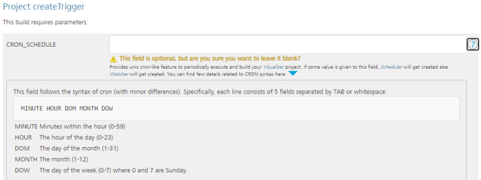
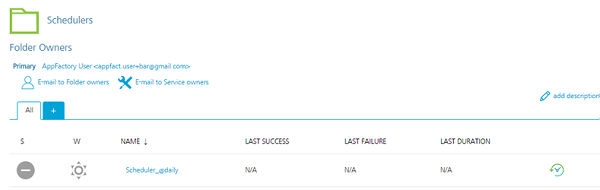

                          

Scheduling a Iris Build
=============================

App Factory provides the ability to create triggers, which are specialized jobs that are used to automate and run tasks for your projects.

Consider a scenario in which a developer wants to implement a nightly build system. The administrator can create a scheduler that runs the build jobs for the app at a specified time (such as 12AM) everyday.

Every project contains a sub-folder called **Triggers** in the Iris folder. The Triggers folder contains a job called **createTrigger** (to create auto-triggered jobs), and two sub-folders called **watchers** and **schedulers** (to store the created jobs).

Configuring a Scheduler Job in App Factory
------------------------------------------

1.  From the folder of your project, navigate to the **Triggers** sub-folder.

3.  In the **Triggers** folder, click the **build** icon for the **createTrigger** job.  
    Alternatively, select the **createTrigger** job, and then select the **Build with Parameters** option from the left panel.

5.  For the CRON\_SCHEDULE parameter, type a Cron expression that corresponds to the time at which the build job must be triggered.  
    For information about cron expressions, refer to [Cron](https://en.wikipedia.org/wiki/Cron).

7.  Configure the remaining parameters, which are the same as the [buildIris job](Configuration.md).

Jobs that are triggered by Cron expressions are stored in the **Schedulers** folder. Every Scheduler contains a cron string in the name to simplify searches.

### Schedule Nightly Builds

You might have a requirement to build applications at night on a regular basis. Nightly builds provide better performance and efficient resource allocation. Nightly builds are also used for solid product building and testing without ongoing development.

To configure a nightly build for your project, create a **Scheduler** for your project as mentioned earlier ([Configuring Auto-triggered Jobs on App Factory](#configuring-a-scheduler-job-in-app-factory)). For the CRON\_SCHEDULE parameter, type the [Cron](https://en.wikipedia.org/wiki/Cron) expression: `0 0 * * *`. The createTriggers job creates the **Schedule\_0 0 \* \* \*** job in the **Schedulers** folder. This job is launched everyday at 00:00 hrs (12:00 AM).
