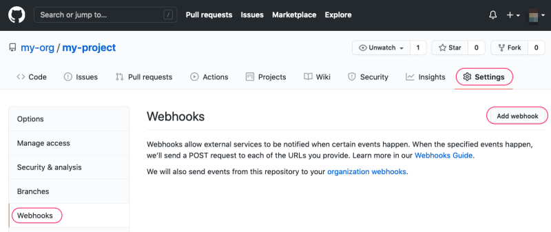
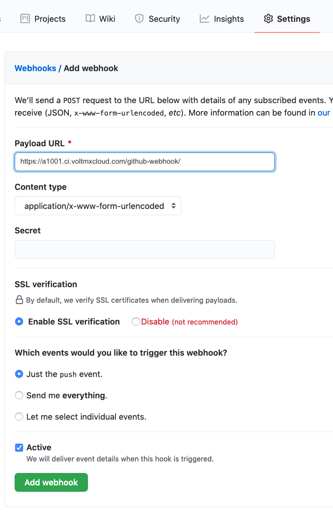
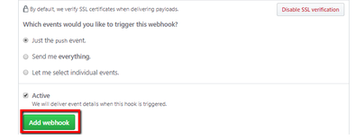
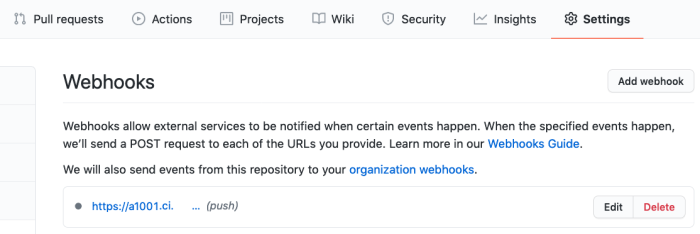
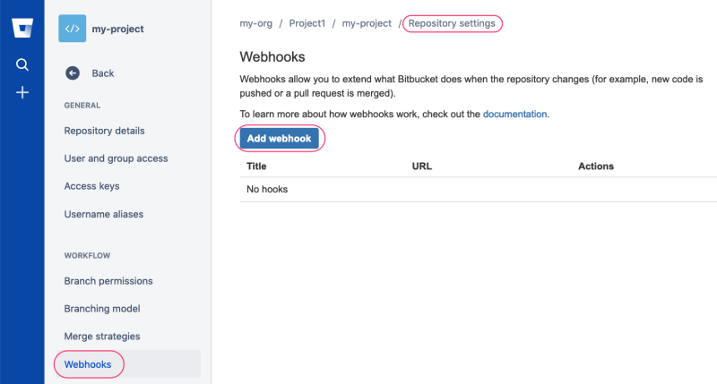
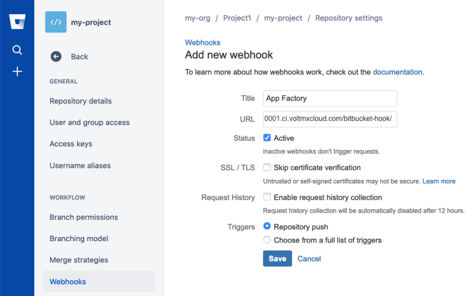
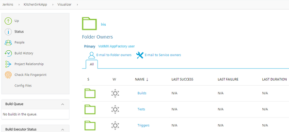
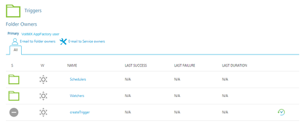
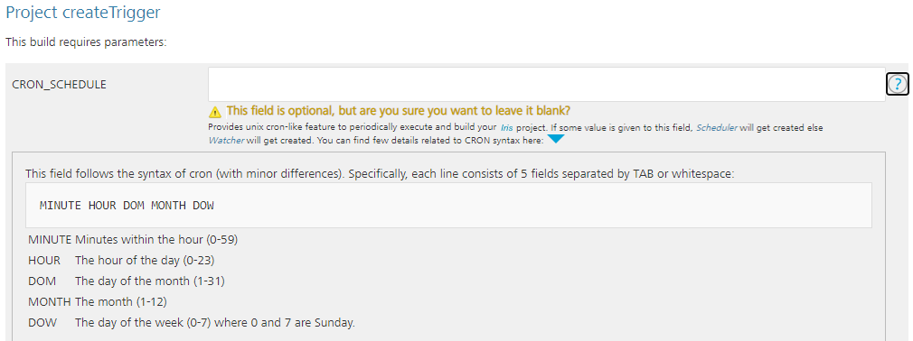
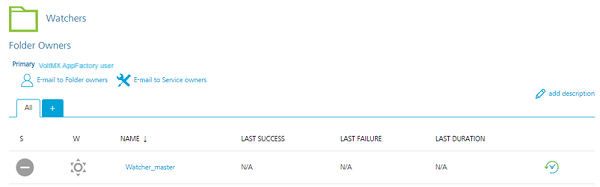

                          

Build On Push for Iris apps
=================================

App Factory provides the ability to create triggers, which are specialized jobs that are used to automate and run tasks for your projects.

Consider a scenario in which a developer wants to verify whether an app runs after code changes are pushed to the source control. The administrator can create a watcher that runs the build and test jobs whenever a change is pushed to the source code.

To create a watcher, you must create a [Webhook](https://en.wikipedia.org/wiki/Webhook) in the SCM that you use for your App Factory projects. For more information about creating Webhooks, refer to the following sections.

*   [Creating Webhooks in GitHub](#creating-webhooks-in-github)
*   [Creating Webhooks in Bitbucket](#creating-webhooks-in-bitbucket)

After you create a webhook, you can create watcher jobs in App Factory. For more information, refer to [Configuring a Watcher Job in App Factory](#configuring-a-watcher-job-in-app-factory).

Every project contains a sub-folder called **Triggers** in the Iris folder. The Triggers folder contains a job called **createTrigger** (to create auto-triggered jobs), and two sub-folders called **watchers** and **schedulers** (to store the created jobs).

Creating Webhooks in GitHub
---------------------------

### Prerequisites

Make sure that you have permissions to change the settings of the GitHub repository.

### Configuring a Webhook

1.  Open your GitHub repository in a web browser, navigate to **Settings** → **Webhooks**, and then click **Add webhook**.  
    The **Add webhook** page opens.

    

3.  Configure the following parameters in the **Add webhook** page:
    *   Set the Payload URL to: `https://<App Factory domain>/github-webhook/`  
        For example: `https://a1001.ci.voltmxcloud.com/github-webhook/`  
        For more information, refer to [Payload URL Format](#reference-payload-url-format).
        
        > **_Note:_** The last forward slash in the Payload URL is mandatory.
        
    *   Content type must be `application/x-www-form-urlencoded`
    *   Jenkins verification does not require a **Secret**. Leave the field empty.
    *   Select the **Just the push event** option. Only pushes of code to a specific branch trigger the **Flyway** job.
    *   The **Active** option should be marked by default.
    
    
    
4.  After you configure the necessary parameters, click **Add Webhook**.  
    The webhook is created.

6.  You can Edit or Delete a Webhook by clicking the respective button. For more information about Webhooks, refer to the [GitHub Webhook Documentation](https://developer.github.com/webhooks).  
    

Creating Webhooks in Bitbucket
------------------------------

### Prerequisites

Make sure that you have permissions to change the settings of the Bitbucket repository.

Make sure you have the [Stash Webhook to Jenkins for Bitbucket add-on](https://marketplace.atlassian.com/plugins/com.nerdwin15.stash-stash-webhook-jenkins/server/overview) installed.

### Configuring a Webhook

1.  Open your BitBucket repository in a web browser, navigate to **Repository Settings** → **Webhooks**, and then click **Add webhook**.  
    The **Add webhook** page opens.  
    
2.  On the Add new webhook page, configure the following parameters:
    
    *   Set the title to `App Factory`
    *   Set the URL to: `https://<App Factory domain>/github-webhook/`  
        For example: `https://a1001.ci.voltmxcloud.com/github-webhook/`  
        For more information, refer to [Payload URL Format](#reference-payload-url-format).
        
        > **_Note:_** The last forward slash in the Payload URL is mandatory.
        
    *   Leave the status set to **Active**
    *   Select the **Triggers** option for **Repository push**
    
    
    
3.  After configuring all parameters, click **Save**.

Configuring a Watcher Job in App Factory
----------------------------------------

1.  From the folder of your project, navigate to the **Triggers** sub-folder.

    

3.  In the **Triggers** folder, click the **build** icon for the **createTrigger** job.  
    Alternatively, select the **createTrigger** job, and then select the **Build with Parameters** option from the left panel.

    

5.  For the CRON\_SCHEDULE parameter, make sure that the field is blank.

    

7.  Configure the remaining parameters, which are the same as the [buildIris job](BuildingAnApp.md).

    Jobs that are triggered by a push to the SCM are stored in the **watchers** folder. Every Watcher has a branch name in the name of Job to simplify job search.

    

Reference: Payload URL Format
-----------------------------

The format of the Payload URL depends on the type of Git server. App Factory supports the following Git servers:

<table style="mc-table-style: url('Resources/TableStyles/Basic.css');width: 60%;" class="TableStyle-Basic" cellspacing="0"><colgroup><col class="TableStyle-Basic-Column-Column1" style="width: 20%;"> <col class="TableStyle-Basic-Column-Column1" style="width: 40%;"></colgroup><tbody><tr class="TableStyle-Basic-Body-Body1"><th class="TableStyle-Basic-BodyE-Column1-Body1">Server Type</th><th class="TableStyle-Basic-BodyD-Column1-Body1">Payload URL</th></tr><tr class="TableStyle-Basic-Body-Body1"><td class="TableStyle-Basic-BodyE-Column1-Body1">GitHub Server</td><td class="TableStyle-Basic-BodyD-Column1-Body1"><code class="codefirst" style="font-size: 11pt;">&lt;App Factory URL&gt;/github-webhook/</code></td></tr><tr class="TableStyle-Basic-Body-Body1"><td class="TableStyle-Basic-BodyB-Column1-Body1">Bitbucket Server (Stash)</td><td class="TableStyle-Basic-BodyA-Column1-Body1"><code class="codefirst" style="font-size: 11pt;">&lt;App Factory URL&gt;/bitbucket-hook/</code></td></tr></tbody></table>
