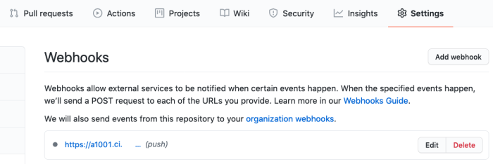

# Build on Push for Microservice jobs

App Factory provides the ability to create triggers, which are specialized jobs that are used to automate and run tasks for your projects.

To execute your Microservices jobs on push, you must configure a [Webhook](https://en.wikipedia.org/wiki/Webhook) in your SCM system to invoke App Factory, and then create a watcher job in your App Factory project to fire in response.

For more information about creating Webhooks, refer to the following sections.

*   [Creating Webhooks in GitHub](#Webhook_GitHub)
*   [Creating Webhooks in Bitbucket](#Webhooks_Bitbucket)

For more information on how to create a watcher job in App Factory, refer to [Configuring a Watcher Job in App Factory](#AppFactory).

Every project contains a sub-folder called **Triggers** in the **Microservices** folder. The Triggers folder contains a job called **createConfigureMSTrigger** (to create triggers), and a sub-folder called **watchers**, which contains the jobs that build a specific branch selection when they receive a call from the webhook on the SCM system.

## Creating Webhooks in GitHub

### Prerequisites

Make sure that you have permissions to change the settings of the GitHub repository.

### Configuring a Webhook

1.  Open your GitHub repository in a web browser, navigate to **Settings** → **Webhooks**, and then click **Add webhook**.  
    The **Add webhook** page opens.

    

3.  Configure the following parameters in the **Add webhook** page:
    *   Set the Payload URL to: `https://<App Factory domain>/github-webhook/`  
        For example: `https://a1001.ci.voltmxcloud.com/github-webhook/`  
        For more information, refer to [Payload URL Format](#PayloadURL).

        The last forward slash in the Payload URL is mandatory.

    *   Content type must be `application/x-www-form-urlencoded`
    *   Jenkins verification does not require a **Secret**. Leave the field empty.
    *   Select the **Just the push event** option. Only pushes of code to a specific branch trigger the **ConfigureMS** job.
    *   The **Active** option should be marked by default.

    

4.  After you configure the necessary parameters, click **Add Webhook**.  
    The webhook is created.

    

6.  You can Edit or Delete a Webhook by clicking the respective button. For more information about Webhooks, refer to the [GitHub Webhook Documentation](https://developer.github.com/webhooks).  
    

## Creating Webhooks in Bitbucket

### Prerequisites

Make sure that you have permissions to change the settings of the Bitbucket repository.

Make sure you have the [Stash Webhook to Jenkins for Bitbucket add-on](https://marketplace.atlassian.com/plugins/com.nerdwin15.stash-stash-webhook-jenkins/server/overview) installed.

### Configuring a Webhook

1.  Open your BitBucket repository in a web browser, navigate to **Repository Settings** → **Webhooks**, and then click **Add webhook**.  
    The **Add webhook** page opens.  
    
2.  On the Add new webhook page, configure the following parameters:
    *   Set the title to `App Factory`
    *   Set the URL to: `https://<App Factory domain>/github-webhook/`  
        For example: `https://a1001.ci.voltmxcloud.com/github-webhook/`  
        For more information, refer to [Payload URL Format](#PayloadURL).

        The last forward slash in the Payload URL is mandatory.

    *   Leave the status set to **Active**
    *   Select the **Triggers** option for **Repository push**

    

3.  After configuring all parameters, click **Save**.

## Configuring a Watcher Job in App Factory

1.  From the **Database** folder of your project, navigate to **Triggers**.
2.  In the **Triggers** folder, click the **build** icon for the **createConfigureMSTrigger** job.  
    Alternatively, open the drop-down menu for the **createConfigureMSTrigger** job, and then select **Build with Parameters**.  
    
3.  For the CRON_SCHEDULE parameter, make sure that the field is blank.
4.  Configure the remaining parameters for the job, which are the same as the [ConfigureMS job](ConfigureMS_Job.md).
5.  After you configure the parameters, click **BUILD**.

Jobs that are triggered when changes are pushed to a branch are stored in the watchers folder. You can tell what branch it watches by the branch specifier expression that is appended to the job name.

## Reference: Payload URL Format

The format of the Payload URL depends on the type of Git server. App Factory supports the following Git servers:

<table style="mc-table-style: url('Resources/TableStyles/Basic.css');width: 60%;" class="TableStyle-Basic" cellspacing="0"><colgroup><col class="TableStyle-Basic-Column-Column1" style="width: 20%;"> <col class="TableStyle-Basic-Column-Column1" style="width: 40%;"></colgroup>

<tbody>

<tr class="TableStyle-Basic-Body-Body1">

<th class="TableStyle-Basic-BodyE-Column1-Body1">

Server Type

</th>

<th class="TableStyle-Basic-BodyD-Column1-Body1">

Payload URL

</th>

</tr>

<tr class="TableStyle-Basic-Body-Body1">

<td class="TableStyle-Basic-BodyE-Column1-Body1">

GitHub Server

</td>

<td class="TableStyle-Basic-BodyD-Column1-Body1">

<code>&lt;App Factory URL&gt;/github-webhook/</code>

</td>

</tr>

<tr class="TableStyle-Basic-Body-Body1">

<td class="TableStyle-Basic-BodyE-Column1-Body1">

Bitbucket Server (Stash)

</td>

<td class="TableStyle-Basic-BodyD-Column1-Body1">

<code>&lt;App Factory URL&gt;/bitbucket-hook/</code>

</td>

</tr>

</tbody>

</table>