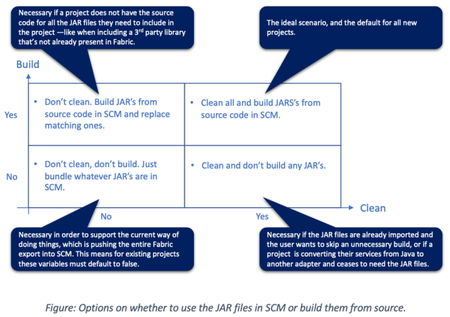

                          

Building Java dependencies
==========================

From the V9 ServicePack1 release, App Factory supports the import, build, and export of Java assets of a Foundry app These assets include [Preprocessors](../../../Foundry/voltmx_foundry_user_guide/Content/Java_Preprocessor_Postprocessor_.md), [Postprocessors](../../../Foundry/voltmx_foundry_user_guide/Content/Java_Preprocessor_Postprocessor_.md), and [Java services](../../../Foundry/voltmx_foundry_user_guide/Content/Java_Adapter.md).

As an App Factory user, you can build the Java assets that are required for your Foundry app from a repository that contains Foundry apps and the Java code to build the dependencies. You can store the Foundry app and the Java source code in the same repository and export the Foundry app and the Java source code to the same repository for version changes and updates. For more information, refer to [Versioning a Foundry project in SCM](FoundryProjectVersioning.md#Foundry).

Build Scenarios
---------------

The build scenarios that are covered by App Factory depend on the options to **Clean Java assets** and **Build Java assets**. The combination of these options cover the following scenarios:

*   Build assets from the source, but don't clean existing assets
*   Clean existing assets and build assets from the source
*   Clean existing assets, but don't build any assets from the source
*   Neither clean existing assets nor build assets from the source

For more information, you can refer to the following diagram:



Maven Support for Java dependencies
-----------------------------------

To manage the Java assets and to compile the source code to generate binaries, your repository must contain Maven configuration files (`pom.xml`). When you build an app with Java dependencies, you need to configure parameters related to Maven. For more information, refer to [Maven related parameters](BuildingFoundryApp.md#Maven).

> **_Note:_**

*   App Factory only supports Maven 3.
*   If you enable PUBLISH\_FOUNDRY\_APP in the build parameters, then App Factory builds the app with the Java dependencies and publishes them to the specified run-time environment.

### JAR File Naming Convention

App Factory only bundles the JAR files that follow Maven naming conventions.

For example, if your Maven configuration (`pom.xml`) contains the following code, App Factory generates a JAR file with the name `HelloWorld-1.0-SNAPSHOT.jar`

```
<artifactId>HelloWorld</artifactId>
<version>1.0-SNAPSHOT</version>
```

If you want to use a different name for your JAR file, you can use the **finalName** build property for Maven 3.

For example, if you want to name your JAR file **MyJAR**, then you need to add the following build property in your Maven configuration (`pom.xml`):

```
<build>
	<finalName>MyJAR</finalName>
</build>
```

### Limitations

*   If you configure the **finalName** build property by using Maven 2, the JAR file is not bundled with the Foundry app.  
    For example: The following configuration will not bundle the JAR file with the Foundry app
```
<plugin>
    	<groupId>org.apache.maven.plugins</groupId>
    	<artifactId>maven-jar-plugin</artifactId>
    	<version>2.3.2</version>
    	<configuration>
    		<finalName>MyFinalJarName</finalName>                   
    	</configuration>
    </plugin>
```
*   **Variable interpolation** for the **finalName** property is not supported by App Factory.  
    For example: The following configuration will not bundle the JAR file with the Foundry app.  
```
<build>
    	<finalName>My${project.name}-NEW</finalName>
    </build>
```
