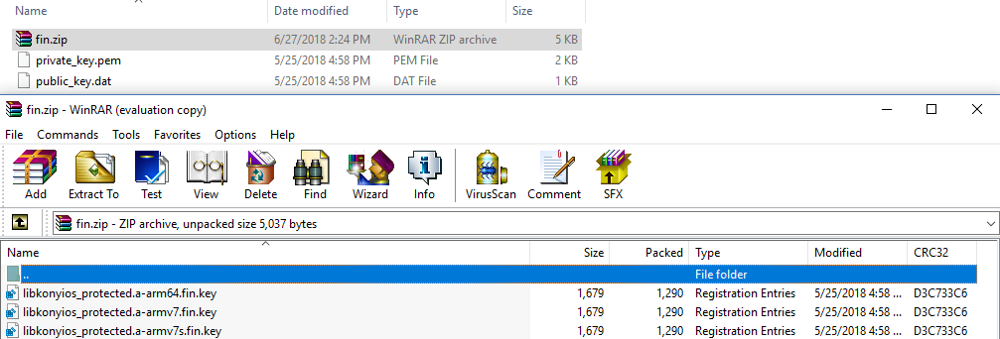
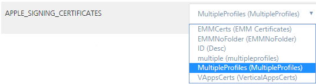
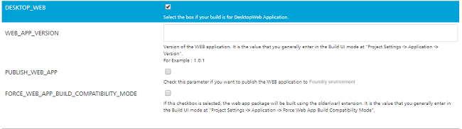
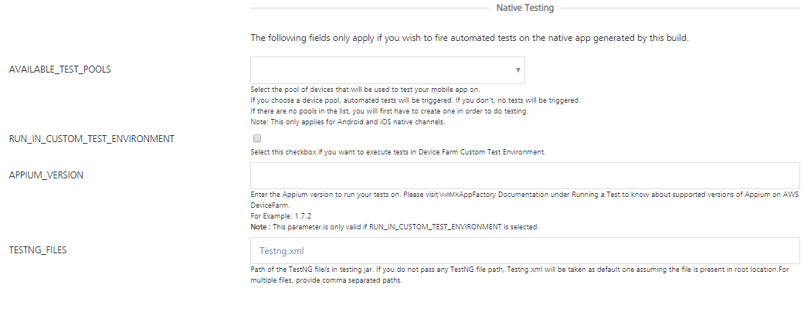

                          

Configuration
-------------

To run a build flow navigate to the **buildIrisApp** job under new App Factory project folder, click **Build with Parameters** in the menu on the left side of the screen. If it is the first time you perform a build, you need to configure the build job. For future builds, the App Factory stores the settings from the previous build to make configurations of the future builds easy. The following steps and screenshots show how to access the **Build with Parameters** for the job.

1.  Open an app project folder and navigate to **Iris/Builds/buildIrisApp**.

    

2.  You can access the **Build with parameters** option for a job in the following ways.
    
    *   On the right of job list, you can select the icon which represents **Build with Parameters** action.
    *   You can open drop-down menu at the **buildIrisApp** job and choose **Build with Parameters** action from the list.
    *   You can open the **buildIrisApp** job and execute **Build with Parameters** action on the left panel of the job.
    
    

The **buildIrisApp** job allows you to choose multiple channels to build, what environment you want to deploy to and the mode to build the application. Before running the build, you need to provide all required parameters that are listed and choose required channels to build.

There are several groups of parameters that are required to run Facade job. The parameters are as following:

1.  **Source control related**
    *   **PROJECT\_SOURCE\_CODE\_BRANCH** - branch required to point Git client to the branch you push your application code. Git is supported only.
    *   **PROJECT\_SOURCE\_CODE\_REPOSITORY\_CREDENTIALS\_ID** is required for access to repository where your Iris project is stored.
        
        > **_Important:_** Provide Git credentials depending on git URL format. If https link is provided, then user credentials (Username and password) are sufficient. In case of ssh link - ssh key needs to be added.
        
    
    
    > **_Note:_** If your repository is protected with 2FA (two-factor authentication) in GitHub, you need to add the GitHub credentials to your project. For more information, refer to [GitHub 2FA](Prerequisites.md#git). If you want to add SSH credentials, refer to [Add SSH Key Credentials](ManagingCredentials.md#Adding_SourceCode).
    
2.  **Volt MX Iris & Volt MX Foundry related parameters**:
    *   **BUILD\_MODE** allows Debug, Release, or Release-Protected mode. Debug build mode adds debug information at binaries that increase their size and allows debug problematic code.
        
        
        
        > **_Note:_** If you are building your project for automated testing, you must build your project in **test** mode.  
          
        If you build in **Debug** mode, the landing screen in the generated app will be Volt MX's debugger screen (which your test automation scripts will most likely not be prepared to navigate away from).  
          
        If you choose to build your Iris project in **Release** mode, this mode will not enable additional security and build the application in release unprotected mode.  
          
        If you choose to build your Iris project in **Release-protected** mode, this mode enables additional security with encryption keys. This is the value you enter in build UI mode at **Project Settings**\>> **Native**\>> **iPhone/iPad/Watch or Android** >> **Protected Mode** in Iris.  
        For more information about the protected mode, refer Iris User Guide.
        
        > **_Important:_** Set the Android KeyStore options for Release build mode. Refer to description of Android related parameters.
        
    *   **FOUNDRY\_CREDENTIALS\_ID** - A Volt MX Foundry user and password which App Factory will use to build your Iris project on your behalf. If you choose to build Web channel, these credentials will be used to upload the generated .war/.zip file to Volt MX Foundry and also to publish the application if PUBLISH_WEB_APP is selected.
    *   **FOUNDRY\_APP\_CONFIG** - Volt MX Foundry app configuration details like app name, account ID, on-premises console, or identity URLs to connect your Iris app to an instance of your Foundry app published to a specific environment. For more information, refer to [Adding Volt MX Foundry App Configuration](ManagingCredentials.md#Adding_SourceCode). If you do not have any Foundry service integration, you can skip this input build parameter.
    *   **DEFAULT\_LOCALE** - Example: EN
    
        <!--  -->
    
3.  **Protected Build Parameters**:  
    Parameters used for enabling corresponding channel build. Click the checkbox provided across the channel to enable the channel build.  
    
    *   **PROTECTED_KEYS** - The Protected_Keys field appear only when you select **Release Protected** from the **BUILD_MODE** list. Select either the public key, private key or fin key to enable additional security with Iris app. You can skip this input build parameter if your build mode is other than release-protected.  

        **Adding New Keys to the application**:

        Temenos App Factory provides an option to build protected binaries for both Android and iOS platform using the Volt MX Iris tool. The Volt MX Iris tool allows you to add protected mode build support from App Factory.

        Perform the following steps to add a new build keys for the **buildIrisApp** job.

        1.  Click **Add** drop-down list displayed across PROTECTED_KEYS.

            The drop-down list displays the list of **Credential Providers**.

        2.  Select a **Credential Provider** from the list.

            The **Add Credentials** window displays.

            

            Enter the following details to add a new protected keys.

            *   **Domain**: Displays the domain name as **Global Credentials (Unrestricted)**.
            *   Choose **Kind** as **Volt MX Protected Mode Build Keys** from the drop-down list.

                

            *   **Scope**: Determines where the build keys are used. The Global credential is available to the object on which the credential is associated and on all the child objects of the object. Typically, you must use the global-scoped credentials for jobs.
            *   Enter **ID**. It is an internal unique ID used to identify the credentials from jobs and other configuration.
            *   Enter **Description**.
            *   Upload **Public Key**, **Private Key**, and **Fin Keys** files.

                Fin Keys must be provided as a zip file. It should not have any sub-folder within the zip.

                

            *   Click **Add**. The new **Volt MX Protected buildIrisAppMode Build Keys** is added in project.
        3.  Click PROTECTED_KEYS drop-down list.

            You can find the new build keys in the drop-down list.

        4.  Select the new build keys.

            

4.  **Builds**

    In order to run the tests, you must select any of the following channels listed.

    

    *   **ANDROID** - Select the checkbox if your build is for ANDROID specific application. All the android related parameters appear once you select the checkbox.
    *   **IOS** - Select the checkbox if your build is for IOS specific application.

        > **_Note_**: App ID must be registered prior to the build of any Apple artifacts! Please refer to: [Maintaining Identifiers, Devices, and Profiles](http://developer.apple.com/).

    *   **DESKTOP_WEB** - Select the checkbox if your build is for DesktopWeb specific application.

    
5.  Android related parameters:  
    <!--  -->

    *   **ANDROID_UNIVERSAL_NATIVE** - Select the checkbox if you want to build Android universal app and then fill all required parameters below.
        *   **ANDROID_UNIVERSAL_APP_ID** - Provide the Universal app (Mobile and Tablet) unique application ID, to identify your app on the device and in Google Play Store. Universal app ID is the value you enter in build UI mode at **Project Settings**>> **Native**>> **Android**>> **Package Name**.  
            **Example**: `com.voltmxappfactory.KitchenSink`
    *   **ANDROID_MOBILE_NATIVE** - Select the checkbox if you want to build Android app for Mobile and fill all the required parameters below.
        *   **ANDROID_MOBILE_APP_ID**- Provide the unique application ID of your mobile app, to identify your app on the device and in Google Play Store. Unique application ID is the value you enter in a build UI mode at **Project Settings** >> **Native** >> **Android** >> **Package** **Name**.  
            **Example**: `com.voltmxappfactory.KitchenSink`
    *   **ANDROID_TABLET_NATIVE** - Select the checkbox if you want to build Android app for Tablet and fill all the required parameters below.
        *   **ANDROID_TABLET_APP_ID** - Provide the unique application ID of your tablet app, to identify your app on the device and in Google Play Store. Unique application ID is the value you enter in a build UI mode at **Project Settings** >> **Native** >> **Android** >> **Package Name**.  
            **Example**: `com.voltmxappfactory.KitchenSink`
    *   **ANDROID_APP_VERSION** - A version of the Android application used to enter in build UI mode at **Project Settings** >> **Application** >> **Version**.  
        **Example**: 1.0.1  

    *   **ANDROID_VERSION_CODE** - App internal version number is used to determine the recent versions (higher numbers indicating the more recent versions). You enter the app internal version number in build UI mode at **Project Settings** >> **Native** >> **Android** >> **Version Code**.  
        **Example**: An integer value such as 1.
    *   **ANDROID_APP_BUNDLE** - Select the checkbox to build the Android binary in Android App Bundle (AAB) format for store submission.
    *   **SUPPORT_X86_DEVICES** - Select the checkbox to generate binaries for android x86 architecture OS devices. If you select this checkbox, the build notification mail will have ARM_64 bit , x86_64 bit binaries.
    *   **SUPPORT_32BIT_DEVICES** - Select the checkbox to generate 32-bit binaries for android 32-bit OS devices. If you select this checkbox, the build notification mail will have ARM_32 bit , ARM_64 bit binaries.

        > **_Note:_** If you select X86 and 32BIT checkboxes, the build notification mail will have ARM_64 bit , x86_64 bit and ARM_32 bit , x86_32 bit binaries. If you don't select any of these checkboxes, the build notification mail will have ARM_64 bit binaries.

    *   **ANDROID_KEYSTORE_FILE** - The keystore file which stores the key that is used to sign in the Android binary. Allowed formats include .keystore, .jks. For more information, refer official Android documentation after signing.  

        > **_Note:_** **ANDROID_KEYSTORE_FILE** is an optional parameter for Android debug mode builds.

    *   **ANDROID_KEYSTORE_PASSWORD** - The password for the keystore file selected. For more information, refer official Android documentation after signing.

        > **_Note:_** **ANDROID_KEYSTORE_PASSWORD** is an optional parameter for Android debug mode builds.

    *   **ANDROID_KEY_PASSWORD** - The password to the key in the keystore file used to sign in to Android library. For more information, refer official Android documentation after signing.

        > **_Note:_** **ANDROID_KEY_PASSWORD** is an optional parameter for Android debug mode builds.

    *   **ANDROID_KEY_ALIAS** - The alias of signing key inside the keystore. For references, click **Sign Your App** in Android Studio help.

        > **_Note:_** **ANDROID_KEY_ALIAS** is an optional parameter for Android debug mode builds.

    > **_Note:_** The KeyStore build parameters appear only when you select **Release** or **Release-Protected** in **BUILD_MODE**.

8.  Apple related parameters:

    <!--  -->

    *   **SIGNING_METHOD** - Choose the mode of signing the iOS binary (ipa file). The options available are Apple-Accounts and Manual-Certificates.
    *   **APPLE_ID** - credentials at [https://developer.apple.com](https://developer.apple.com/). The account is used to generate certificate and for signing iOS app. It is applicable for Apple-Accounts signing method.
    *   **APPLE_DEVELOPER_TEAM_ID** - You must provide a parameter when your Apple ID is a part of multiple development teams. You can skip the parameter if you are enrolled in the **Apple Developer Program** as an individual. You can get a value for Apple Developer Team ID by signing in to the [developer.apple.com/account](https://developer.apple.com/account) and under **Membership** select **Team ID**.

        > **_Note:_** If your first build of a project on App Factory has a value for APPLE_DEVELOPER_TEAM_ID, you need to enter the value for this parameter in each build.  
        If the parameter is empty for the first build of the project, it has to remain the same for all the upcoming builds.

    *   **APPLE_SIGNING_CERTIFICATES** - Upload an Apple Signing Certificate to App Factory to sign your app for iOS native channels.

        

        **Adding a new signing certificate**: To add a new signing certificate, follow these steps:

        1.  Click **Add** drop-down list that displays the list of **Credential Providers** across **APPLE_SIGNING_CERTIFICATES**.
        2.  Select a **Credential Provider** from the list.

            The **Add Credentials** window displays. Enter the following details to add a new signing certificate:

            *   **Domain**: Displays the domain name as **Global Credentials (Unrestricted)**.
            *   Choose **Kind** as **Apple Signing Certificates** from the drop-down list.

                

            *   **Scope**: Determines where the signing certificate is used. The Global credential is available to the object on which the credential is associated and on all the child objects of the object. Typically, you must use the global-scoped credentials for jobs.
            *   Enter **ID**. It is an internal unique ID used to identify the credentials from jobs and other configuration.
            *   Enter **Description** for the signing certificate.
            *   Upload the **Provision Certificate** to sign the IPA.
            *   Enter a password for the uploaded provision certificate.
            *   Upload a **Mobile Provisioning Profile**.
                *   For single profile, upload a mobile provision file.
                *   For multiple profiles, you must upload a zip that contains multiple mobile provision profiles.
            *   Click **Add**. The new signing certificate is added in **buildIrisApp** project.

                

        3.  Click **APPLE_SIGNING_CERTIFICATES** drop-down list to find the new certificate.

            

        4.  Select the certificate.

            

        > **_Note:_** **APPLE_ID** or **APPLE_SIGNING_CERTIFICATES** only one of the two parameters is mandatory.

        > **_Note:_** Currently, App Factory does not support wild card provisioning profiles.

        > **_Note:_** Ensure the uploaded certificate (or) profile has not expired. If the uploaded certificate (or) profile expires, the build fails and system throws an error.

    *   **IOS_UNIVERSAL_NATIVE** - Select the checkbox if you want to build iOS universal app and fill all required parameters below.
        *   **IOS_UNIVERSAL_APP_ID** - A bundle ID for Universal application (Mobile and Tablet), used to provision devices and by the operating system when the app is distributed to customers. Universal app ID is the value you enter in build UI mode at **Project Settings**>> **Native** >> **iPhone/iPad/Watch**>> **Bundle Identifier**.  
            **Example**: `com.voltmxappfactory.KitchenSink`
    *   **IOS_MOBILE_NATIVE** - Select the checkbox if you want to build iOS app for Mobile and fill all the required parameters below.
        *   **IOS_MOBILE_APP_ID**- A bundle ID for mobile application is used to provision devices and operating system when the app is distributed to customers. The value for iOS_MOBILE_APP_ID is entered in build UI mode at **Project Settings** >> **Native** >> **iPhone/iPad/Watch** >> **Bundle Identifier**.  
            **Example**: `com.voltmxappfactory.KitchenSink`
    *   **IOS_TABLET_NATIVE** - Select the checkbox if you want to build iOS app for Tablet and fill all the required parameters below.
        *   **IOS_TABLET_APP_ID** - A bundle ID for a tablet application is used to provision devices and operating system when the app is distributed to the customers. The value for iOS_TABLET_APP_ID is entered in build UI mode at **Project Settings** >> **Native** >> **iPhone/iPad/Watch** >> **Bundle Identifier**.  
            **Example**: `com.voltmxappfactory.KitchenSink`
    *   **IOS_APP_VERSION** - A version of the iOS application used to enter in build UI mode at **Project Settings** >> **Application** >> **Version**.

        **Example**: 1.0.1

    *   **IOS_BUNDLE_VERSION** - A version of the application used to enter in build UI mode at **Project Settings**>> **Native**>**iPhone/iPad/Watch**>>**Bundle Version**.

        **Example**: 1.0.1

    *   **IOS_DISTRIBUTION_TYPE**- Apple developer profile is required for signing IPAs for Apple channels build. Check Distribution methods in Xcode help for the references.

        The purpose of distributing the build of your app to iOS Native channels is:

        *   **Development**: If you are building your app for testing and/or debugging.
        *   **Adhoc**: If you are building your app for QA and/or UAT.
        *   **Enterprise**: If you are building a release to distribute your app internally and your company is enrolled in Apple's Developer Enterprise Program, you must build your app in release mode.
        *   **App Store**: If you are building a release to distribute your app in public through an Apple App Store. You must build the app in release mode.

        If you are building your app to test using App Factory's DeviceFarm integration, you can select any of the above options.

        Both Development and Adhoc will allow you to install and run devices (you physically control) registered in your Apple Developer account. Adhoc will allow you to test using Apple's production level app services such as Push Notifications and so on.

    *   **APPLE_WATCH_EXTENSION**: Click the checkbox to build iOS app with Watch extension. If the checkbox is enabled, App Factory also builds iOS binary compatible for Apple watch.

        > **_Note:_** Apple watch extension build can be triggered along with iOS build only.

9.  **DesktopWeb related parameters** 

    *   **PUBLISH_WEB_APP** enabled if user want to publish the App to Volt MX Foundry Cloud/OnPrem.

        If you are building both DesktopWeb and SPA channels and the checkbox is selected, a combined archive is generated and published to the selected Volt MX Foundry environment.

    *   **WEB_APP_VERSION**: App version of the Web (DesktopWeb and SPA) application. The app version value is entered in the Build UI mode at **Project Settings**>> **Application**>> **Version**.

        **Example**: Version 1.0.1

    *   **FORCE_WEB_APP_BUILD_COMPATABILITY_MODE**: Enable the checkbox to build the web app package using the older (war) extension. It is the value that you generally enter in the Build UI mode at **Project Settings**>> **Application**>> **Force Web App Build Compatibility Mode**.

        .war extension is not supported with multi-tenant environment in Volt MX Foundry.

        Newer extension (zip) is only supported with V8 service pack 2 on Volt MX Cloud. If your app is using a lower set of plugins, keep the checkbox enabled.

10.  **Custom Hooks** - The following parameter is applicable only for Custom Hooks.

     

    **RUN_CUSTOM_HOOKS** click the checkbox for Custom Hooks execution.

    You can uncheck the check box to skip App Factory Custom Hooks execution.

11.  **Testing**

    > **_Note:_** Make sure that you have selected appropriate channels to build in order to run the tests.

    *   **TEST_FRAMEWORK**- Choose one of the Test Frameworks in which tests have been written for testing the application.

        

    *   **RUN_NATIVE_TESTS** - Select this checkbox if you want to execute Native tests. If you select this checkbox, the following fields appear depending on the type of test framework selected:  

        **TestNG**

        *   **TEST_ENVIRONMENT** - Select the environment to run the tests. The options available are **Standard** and **Custom**.
        *   **APPIUM_VERSION**- Enter the appium version to run your tests. New version such as 1.9.0 will be installed on the environment as a part of AWS run. This field is applicable for Custom test environment.

            For more information on supported versions of Appium on AWS DeviceFarm, refer [Custom Test Environment Run](CustomTestEnvRun_RawMode.htm).

            For information on artifacts available in the notification mail for AWS Custom Environment Run, refer [Building an App in AWS Custom Environment](BuildingAnApp.htm#AWS_Custom).

        *   **TESTNG_FILES** Path of the TestNG file(s) in your testing JAR. Testng.xml located in the root of the JAR is selected by default. You can specify the path of your TestNG file. This field is applicable for Custom test environment.

            To specify multiple TestNG file paths, use comma separated path values such as `voltmx/Testng.xml`, `voltmx/appfactory/Testng.xml`, `testng.xml` has three TestNG files at different locations to be rendered.

        **Jasmine**

        *   **NATIVE_TEST_PLAN** - Enter the relative path of test plan (ex: testRunner.js) that you would like to execute. This path should be relative to the "/testresources/Jasmine/Mobile/Test Plans" or "/testresources/Jasmine/Tablet/Test Plans" folder. If no value is provided, the default plan(testPlan.js) will be executed.
        *   **APPIUM_VERSION**- Enter the appium version to run your tests. New version such as 1.9.0 will be installed on the environment as a part of AWS run. This field is applicable for Custom test environment.

            For more information on supported versions of Appium on AWS DeviceFarm, refer [Custom Test Environment Run](CustomTestEnvRun_RawMode.htm).

            For information on artifacts available in the notification mail for AWS Custom Environment Run, refer [Building an App in AWS Custom Environment](BuildingAnApp.htm#AWS_Custom).

        *   **AVAILABLE_TEST_POOLS** enables tests on selected device pool.  
        For more information about device pools, refer to [Configuring Device Pools](Configuring_Device_Pools.htm).

12.  **Native Testing related Parameters** - The following parameters are applicable only if you want to fire automated tests on native app generated by this build. 

     

    *   **RUN_IN_CUSTOM_TEST_ENVIRONMENT** click the checkbox to execute tests in Device Farm on Custom Test Environment. For more information on refer [Custom Test Environment Run](CustomTestEnvRun_RawMode.htm).

        If the checkbox is not selected, the tests are executed in Standard mode.

13.  **Web Testing related Parameters:** The following parameters are applicable only if you want to fire automated tests on web app generated by this build.
    *   **RUN_DESKTOPWEB_TESTS** - select the checkbox to execute DesktopWeb tests. The following fields appear:

        > **_Note:_** **Prerequisites for testing:**  
        Appium tests must be placed under <project folder>/test/testNG folder.  
        Selenium tests (DesktopWeb tests) must be placed under <project folder>/test/testNG/DesktopWeb.

        
        
        *   **WEB_TEST_PLAN** - Type the relative path of test plan (ex: testRunner.js) that you would like to execute. This path should be relative to the "/testresources/Jasmine/Desktop/Test Plans" folder. If no value is provided, the default plan(testPlan.js) will be executed. This is applicable only for Jasmine test framework.
        *   **RUN_DESKTOPWEB_TESTS_ARGUMENTS** - allows you to pass arguments in Maven command to the DesktopWeb tests.

            **Example**: If you pass -Dsurefire.suiteXmlFiles=resources/Testng.xml, the argument will trigger the tests present in resources/Testng.xml file. If you do not pass TestNG file, Testng.xml is selected as a default file.

        *   **AVAILABLE_BROWSERS** - allows you to select the browser to run the DesktopWeb tests.
        *   Currently, App Factory supports only Google Chrome version 68.0.3419.0 for DesktopWeb testing.

        *   **SCREEN_RESOLUTION** - Select the screen resolution from the list.
14.  **Notifications** - The following parameter is used to configure settings specific to notifications.

    

    **RECIPIENTS_LIST** is comma-separated list of recipients e-mails.

15.  Click **Build** to build the Iris app.