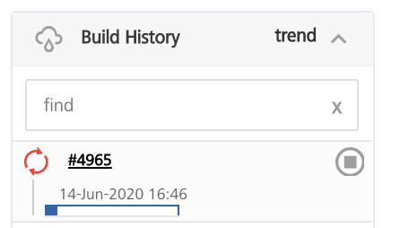

# Running the ConfigureMS job

To build and deploy Microservices, you need to run the **ConfigureMS** job. When you perform a build for the first time, you need to configure the build settings. App Factory stores the settings from the build to make configurations of the future builds easier by providing the **Rebuild** option.

To run the ConfigureMS job and configure the parameters, follow these steps:

1.  Open the **Microservice** folder of your project, and then the select the **ConfigureMS** job.
2.  Run the job by using the **Build with parameters** option. You can access the option by following either of these steps.  

    > **_Note:_** If you don’t see the option, you might not have ownership permissions to the project. You can verify whether your name is listed in the Folder Owners section of the project. The Primary owner of the project can add users as secondary owners to grant permissions to the builds.

    *   On the right-side of the job row, select the icon that represents Build with Parameters
    *   Open the drop-down list for the **ConfigureMS** job, and then select **Build with Parameters**
    *   Open the **ConfigureMS** job and click **Build with Parameters** on the left panel  

3.  Configure the build parameters for the job. For more information about the parameters, refer to the following sections.  
       

    

Source Control related parameters
  
    <table>
    <tr>
    <th>Parameter</th>
    <th>Description</th>
    </tr>
    <tr>
    <td>SCM_BRANCH</td>
    <td>Specifies the branch, release tag, or the commit ID of the repository that contains the source code of the Microservice configuration files.</td>
    </tr>
    </table>
    

    
    

Microservice related parameters
  
    <table>
    <tr>
    <th>Parameter</th>
    <th>Description</th>
    </tr>
    <tr>
    <td>MICROSERVICE_BASE_URL</td>
    <td>Specifies the base URL of the generic config Microservice API. This parameter is mandatory. For example: <code>http://&lt;hostname&gt;:&lt;port&gt;/ms-genericconfig-api/api/v2.0.0/</code> <b>Note:</b> Make sure that the Microservice Base URL is accessible from App Factory.</td>
    </tr>

    <tr>
    <td>DEPLOY_JOLT_FILES</td>
    <td>Specifies whether App Factory must build and deploy the Jolt files from the repository. For more information about Jolt files, refer to <a href="https://docs.oracle.com/cd/E35855_01/tuxedo/docs12c/interm/jolt.html">Oracle Jolt</a>. If this parameter is enabled, App Factory displays the following build parameters: <ul><li>GROUP_ID</li><li>JOLT_FILES_DIR</li><li>JOLT_FILES_LIST</li></ul></td>
    </tr>
    
    <tr>
    <td>GROUP_ID</td>
    <td>Specifies the group ID for the type of Microservice that must be deployed. This parameter is mandatory if you want to deploy Jolt files. For example: <code>PaymentOrder.jolt</code> or <code>Party.jolt.</code> <b>Note: </b>This parameter is displayed only if DEPLOY_JOLT_FILES is enabled.</td>
    </tr>
    

    <tr>
    <td>JOLT_FILES_DIR</td>
    <td>
    Specifies the path of the directory that contains the Jolt files that you want to build. 
    <b>Note: </b>The job does not fetch files from the sub-folders of the directory. 
    The directory path must be relative to the root of the repository. For example, if your files are stored in <code>&lt;Repository&gt;/path/to/Jolt</code>, the path of the directory is <code>/path/to/Jolt</code>. 
    <b>Note: </b>This parameter is displayed only if DEPLOY_JOLT_FILES is enabled.
    </td>
    </tr>
    
    <tr>
    <td>JOLT_FILES_LIST</td>
    <td>
    Specifies the list of Jolt files that must be fetched from the specified directory. You can specify multiple files by separating them with a comma. 
    If this parameter is left empty, App Factory picks all files with a <code>.json</code> extension from the specified directory. 
    <b>Note: </b>This parameter is displayed only if DEPLOY_JOLT_FILES is enabled.
    </td>
    </tr>

    <tr>
    <td>DEPLOY_POLICY_FILES</td>
    <td>
    Specifies whether App Factory must build and deploy the policy files from the repository. 
    If this parameter is enabled, App Factory displays the following build parameters: 
    <ul><li>POLICY_FILES_DIR</li><li>POLICY_FILES_LIST</li></ul>
    </td>
    </tr>
    
    <tr>
    <td>POLICY_FILES_DIR</td>
    <td>
    Specifies the path of the directory that contains the policy files that you want to build. 
    <b>Note: </b>The job does not fetch files from the sub-folders of the directory. 
    The directory path must be relative to the root of the repository. For example, if your files are stored in <code>&lt;Repository&gt;/path/to/policy</code>, the path of the directory is <code>/path/to/policy</code>. 
    <b>Note: </b>This parameter is displayed only if DEPLOY_POLICY_FILES is enabled.
    </td>
    </tr>

    <tr>
    <td>POLICY_FILES_LIST</td>
    <td>
    Specifies the list of policy files that must be fetched from the specified directory. You can specify multiple files by separating them with a comma. 
    If this parameter is left empty, App Factory picks all files with a .xml extension from the specified directory. 
    <b>Note: </b>This parameter is displayed only if DEPLOY_POLICY_FILES is enabled.
    </td>
    </tr>
    
    </table>
    

    

4.  After you configure the parameters for the **ConfigureMS** job, click BUILD.

After a Build is successfully triggered, you can check the status of the build in the **Build History** panel. The following screenshot displays a build that is in progress (#4965) with the progress indicator icon.

You can click the icon to see the detailed output of the current build, or click the progress bar to open the build page of the job. From the build page, you can click **Console Output** to display the detailed output of the running build.