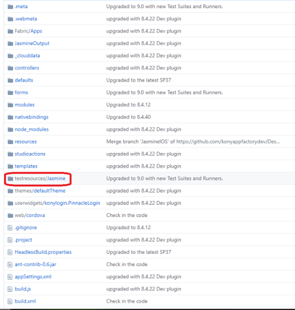
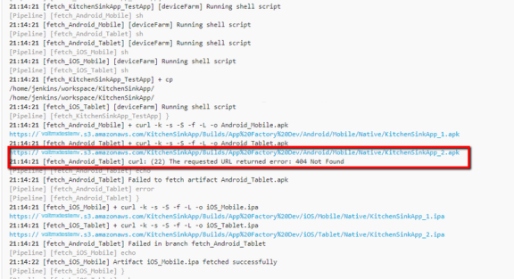

                          
Testing an App - Jasmine Test
-----------------------------

App Factory supports two types of platforms to run the tests.

*   Native Tests - Run the Native test cases using Jasmine framework.
*   DesktopWeb Tests - Run the DesktopWeb test cases using Jasmine framework.

> **_Note:_** You can run the Jasmine tests only during a build.

### Native Tests

You can run the Jasmine tests on the native platform only in a Custom Test Environment. Standard test environment is not supported for the Jasmine test execution.

**Custom Test Environment**: Jasmine tests always run in the Custom Test Environment. App Factory uses the default Appium version to launch the app on the test device. But, you can override the Appium version by providing the same on the Build Parameters page. You can also enter the name of the Test Runner file that you want to run on the test device.

Prerequisites

You must meet the following prerequisites to test the application:

*   Make sure that the Iris project is available and it contains the Jasmine test in **<Project-Root>/testresources/Jasmine/Mobile** location for mobile or **<Project-Root>/testresources/Jasmine/Tablet** location for tablet.
*   Jasmine tests are executed in the AWS Device Farm Cloud environment.
    
    > **_Note:_** You can find the Jasmine tests in the root folder of the project.  
    
    
*   Make sure that you configure a device pool before you test the application. You can do the following to configure the device pool:  
    *   [Creating Device Pool](javascript:void(0);)
        
        Before you start running the tests you must specify list of mobile devices. These devices are limited with predefined list that AWS Device Farm supports. To specify devices, navigate to Tests folder under **<project folder>/Iris/**. Once you are in the Tests folder, verify that you see all jobs listed as shown in the screenshot below:
        
        
        
        Run the **Build with Parameters** at the managePool job by clicking on the corresponding icon. The managePool configuration appears; fill the details. Once you enter the date, you can use predefined device pool for running tests. There is no limitation for the number of device pools you can create. The list of devices available in the following screenshot are taken from AWS Device Farm approved list.
        
        
        
        POOL\_NAME specifies name of the device pool which will be used in dropdown menu during running tests and full build. See Building Iris project above.
        
        DEVICE\_LIST specifies list of device models for ANDROID, iOS VERSIONS, different VENDORS, MODELS of PHONES and TABLETS. You may use a filter to focus on a specific MODEL for example
        
        
        
        > **_Note:_** If you select one or more devices using a filter and try to modify your selection by changing the filter (selecting another set of devices), the previous selection is overwritten with the current selection.
        
        After filling properties above, submit the device pool by **BUILD** button. When device pool **BUILD** is complete, managePool job passes successfully. Please verify the screenshot below where Build #1 is green and marked successfully.
        
        
        
        Now, a new device pool has been created and you can run tests either separately or within full build and tests process.
        
    *   [Removing Device Pool](javascript:void(0);)
        
        A device pool needs to be removed when it is outdated or obsolete. To remove a device pool perform the following
        
        *   Navigate to the folder where the pool is created. <project\_root>/Iris/Tests.
        *   Once you are in the Tests folder, verify that all jobs are listed.
        *   Run the **Build with Parameters** at the managePool job by clicking on the corresponding icon. The managePool configuration appears.
        *   Upon launch of the managePool pick a device pool from the drop-down menu against AVAILABLE\_TEST\_POOLS, where all existing device pools are listed. You may use a filter to make selection faster.
        *   Once device pool is selected press **BUILD** button. After build pass please verify that build status is successful as shown at the picture below.
            
            You can see that the selected pool device is removed from the list. See the following screenshot for more details.
            
        
        
        
    *   [Updating Device Pool](javascript:void(0);)
        
        For adding or removing particular devices from a device pool which are already created, please remove device pool and recreate new one with correct devices. For more information on how to create/remove device pool, refer to [Creating Device Pool](#Creating) and [Removing Device Pool](#Removing) sections.
        

#### **The following fields apply only for running tests on Native channels**:

*   **ANDROID\_UNIVERSAL\_NATIVE\_BINARY\_URL** specifies the location of Android universal binaries. URL should be accessible via internet.
*   **ANDROID\_MOBILE\_NATIVE\_BINARY\_URL** specify URL to Android Mobile binary, generated by build or locally. URL should be accessible via internet. For example, you can specify URL to S3 taken from email notification sent by Iris build job.
*   **ANDROID\_TABLET\_NATIVE\_BINARY\_URL** specify URL to Android Tablet binary, generated by build or locally. URL should be accessible via internet. For example, you may specify URL to S3 taken from email notification sent by Iris build job.
*   **IOS\_UNIVERSAL\_NATIVE\_BINARY\_URL** specified the location of IOS universal binaries. URL should be accessible via internet.
*   **IOS\_MOBILE\_NATIVE\_BINARY\_URL** specify URL to iPhone binary, generated by build or locally. URL should be accessible via internet. For example, you may specify URL to S3 taken from email notification sent by Iris build job.
*   **IOS\_TABLET\_NATIVE\_BINARY\_URL** specify URL to iPad binary which was generated by build or locally. URL should be accessible via internet. For example, you may specify URL to S3 taken from email notification sent by Iris build job.
*   **AVAILABLE\_TEST\_POOLS** specifies device pool in drop-down menu. This device pool needs to be created upfront to run tests process. If the device pool is empty, the build fails.

#### Custom Test Environment Run (Raw Mode)

In a custom test environment, you can select the Appium version to run your test.

> **_Note:_** Please make sure that you provide an appropriate Appium version. For more information refer to [AWS Device Farm](https://docs.aws.amazon.com/devicefarm/latest/developerguide/test-types-android-appium-java-junit.md).

Configuring Parameters

**Native Testing related Parameters** - The following parameters are applicable only if you want to fire automated tests on native app generated by the protected build. 

*   **RUN\_IN\_CUSTOM\_TEST\_ENVIRONMENT**\- Click the checkbox to execute tests in Device Farm on Custom Test Environment. For more information refer [Custom Test Environment Run](CustomTestEnvRun_RawMode.md).
    
    > **_Note:_** Even if you don't select the checkbox, Appfactory will treat the Jasmine tests only in the custom test environment
    
*   **APPIUM\_VERSION**\- Enter the appium version to run your tests.
    
    For more information on supported versions of Appium on AWS DeviceFarm, refer [Custom Test Environment Run](CustomTestEnvRun_RawMode.md).
    
    For information on artifacts available in the notification mail for AWS Custom Environment Run, refer [Building an App in AWS Custom Environment](BuildingAnApp.md#AWS_Custom).
    
*   **TEST PLAN**\- Enter the test plan you want to execute. These test plans files are in **<Project-Root>/testresources/Jasmine/Mobile/TestPlans**.
*   **NATIVE\_TEST\_PLAN** - Enter the relative path of test plan (ex: testRunner.js) that you would like to execute. This path should be relative to the "/testresources/Jasmine/Mobile/Test Plans" or "/testresources/Jasmine/Tablet/Test Plans" folder. If no value is provided, the default plan(testPlan.js) will be executed.

> **_Important:_** You can use the universal application binary and run the tests on both mobile and tablet devices based on the availability in the device pool.  
You can trigger a run test job either with universal binary or with individual mobile/tablet.

> **_Important:_** If you are running the tests individually, public URL must be provided to **NATIVE\_TESTS\_URL**, **FOUNDRY\_APP\_URL**, **ANDROID\_MOBILE\_NATIVE\_BINARY\_URL**, **ANDROID\_TABLET\_NATIVE\_BINARY\_URL**, **IOS\_MOBILE\_NATIVE\_BINARY\_URL**, **IOS\_ TABLET\_NATIVE\_BINARY\_URL**, and **DESKTOPWEB\_TESTS URL**, **ANDROID\_UNIVERSAL\_NATIVE\_BINARY\_URL**, **IOS\_UNIVERSAL\_NATIVE\_BINARY\_URL**.

### **DesktopWeb**

Prerequisites

You must meet the following prerequisites for testing the application in desktop web:

*   Make sure that the Iris project is available and it contains Jasmine test in **<Project-Root>/testresources/Jasmine/Desktop** location.

*   Make sure that the Jasmine tests are running in your local machines in Google Chrome.

#### The following fields apply only for tests running on DesktopWeb channels:

*   **FOUNDRY\_APP\_URL** Enter the foundry app URL where the desktopWeb app WAR is deployed.
*   **AVAILABLE\_BROWSERS** allows you to select the browser from the drop-down list to run the DesktopWeb tests.
*   **SCREEN\_RESOLUTIONS** Select the resolution in which the browser must launch and run the tests.
    
*   **WEB\_TEST\_PLAN** - Type the relative path of test plan (ex: testRunner.js) that you would like to execute. This path should be relative to the "/testresources/Jasmine/Desktop/Test Plans" folder. If no value is provided, the default plan(testPlan.js) will be executed.

### **Custom Hooks**

**The following field apply for Custom Hooks:**

*   **RUN\_CUSTOM\_HOOKS** Click this check-box if there are hooks defined to run in Post-Test stage. For more information refer [Running Custom Hook](CustomHooksIris.md) .

**Notifications** - **The following field is used to configure settings specific to Notifications.**

*   **RECIPIENTS\_LIST** setting list of e-mails IDs separated by coma, up as recipients of email notifications.

### Running Tests from buildIrisApp job

You can trigger the tests from the buildIrisApp job available at **Project Name** > **Iris** > **Builds** folder. It is the simplest way to validate your code by launching tests right after Building the application. There is no need to specify all parameters as they are provided while running the tests manually. The results can be viewed in line to the Test Results of Manual Tests.

### Test Results

#### Native Tests

When the project test build is complete and the test results are published at S3, e-mail notifications are sent to recipients:

On unsuccessful build for the tests run, the following e-mail is sent to the recipients:

 

In the final stage, the consolidated test run status is notified via e-mail. Refer the following screenshots for the sample email for consolidated status.

Sample email for Native tests

To download test data fetched from AWS Device Farm, click **Download File** link. Data is stored at S3 and available for review without time limitations.

Click the **Test Report** link to view the detailed test report.

#### Desktop Web

When the project test build is complete and the test results are published at S3, e-mail notifications are sent to recipients:

On unsuccessful build for the tests run, the following e-mail is sent to the recipients:

In the final stage, the consolidated test run status is notified via e-mail. Refer the following screenshots for the sample email for consolidated status.

Sample email for DesktopWeb tests

The summary of the test results are shown based on the tests executed on specified browser that includes passed, failed, skipped. Usually the tests are skipped when the driver initialization fails.

You can click the respective links in Brief Summary table to view the test summary.

Click the **Detailed Test Report** link to view the detailed test report.

Click the **Browser Console Log** link to view the details on browser log.

#### Test Status

Test Status is available in the test result email which is sent to the recipient after you execute the test cases. Following are different statuses in the test result email:

**PASSED**: The status of the test result is **PASSED** when the test case is run without any issues, and when the assertion is successful.

**FAILED**: The status of the test result is **FAILED** when the expected result does not match with the actual result of the test case, the assertion will fail and hence the test case status will be set to **FAILED**.

**SKIPPED**, **WARNED**, **STOPPED**, **ERRORED** statuses are not applicable for Jasmine Tests.

### Troubleshooting Issues

The following errors might help you during troubleshooting runTests job fail:

*   **Error** - Jasmine Tests can only be executed when the app is built in Debug mode.  
    **Solution** - Ensure that you have selected the build mode as debug when the app is built before running the tests.

*   **Error** - Please provide pool to test on.  
    **Solution** - Ensure that you provide a value to AVAILABLE\_TEST\_POOLS parameter to run the native tests.
*   **Error** - Sorry, You can't run test for Android Universal binary along with Android Mobile/Tablet.  
    **Solution** - The universal binary tests both the Mobile and Tablet binaries based on the availability of the devices in the device pool. So it is not required to provide mobile/tablet binary when you give universal binary.
*   **Error** - Build parameter <parameter name> value is not valid URL!  
    

**Solution** - Ensure that the URL you provide for any of the following parameters is valid:

*   ANDROID\_MOBILE\_NATIVE\_BINARY\_URL
*   ANDROID\_TABLET\_NATIVE\_BINARY\_URL
*   IOS\_MOBILE\_NATIVE\_BINARY\_URL
*   IOS\_TABLET\_NATIVE\_BINARY\_URL
*   NATIVE\_TESTS\_URL
    
*   ANDROID\_UNIVERSAL\_NATIVE\_BINARY\_URL
    
*   DESKTOPWEB\_TESTS\_URL
    
*   IOS\_UNIVERSAL\_NATIVE\_BINARY\_URL
    

The builds that failed during the test can be tracked for the issues that caused the failure. For analysis let us consider build #4 test run from the following screenshots of runTests job. Perform the following steps to troubleshoot the issue

*   Navigate to <project folder>/Iris/Tests.

*   Open runTests job and find the **#4** build. Alternatively, find the link **#4** rounded within rectangle and click to open it.

*   Once the failed build is open, select the **Console Output** on the left panel. The **Console Output Log** opens on the right pane, for view.

*   Scroll down to find errors in the log that caused the build to fail. For the example considered, you can trace an error related to invalid Android Tablet URL in the following screenshot.

*   Check if the ANDROID\_TABLET\_NATIVE\_BINARY\_URL parameter is valid.
*   To simplify the search for root cause, you can alternatively choose to troubleshoot the issue from the stages of Manual Testing. For more details see the following screenshot and corresponding procedure.

*   Observe from the screen above that the last build is successful and all process stages are completed successfully too. However, build #4 failed. Here we have an option to navigate to a particular failed stage and review the issues there.
    
    Hover your mouse over the **Fetch binaries** stage of build #4. A new pop-up window is displayed. Open full log using narrow link as highlighted in the screenshot.
    
    
    
*   The log messages in the **Stage Logs** window can be expanded to view more details of a single log message. See the image below for more details.

*   Identify the error message as Android URL not found. Check for ANDROID\_TABLET\_NATIVE\_BINARY\_URL parameters accordingly.

### Auto Triggering Tests

Currently, there are two types of auto-triggered test jobs: scm-triggered(Watchers) and cron-triggered(Schedulers). Every project structure has folder called "Tests" in "Iris" sub-folder, that contains job for creation of auto-triggered jobs (createTrigger) and two sub-folders where created jobs are stored.

To setup auto-triggered job, perform the following steps:

1.  Go to **Tests** folder under project's root folder.
2.  Click on **createTest** job.

4.  Provide all required parameters (they are the same as in "Facade" job).

> **_Important:_** Please note, that there is one additional parameter, which is called "CRON\_SCHEDULE". If "CRON\_SCHEDULE" parameter is given, then a cron-triggered job is created and stored in "Schedulers" sub-folder. If the parameter is not provided, a scm-triggered job is created and stored in "Watchers" sub-folder.

7.  Check that the createTest job is complete.

> **_Important:_** Every Scheduler that is created, will have cron string in job's name to simplify the job search. Refer the image below.

> **_Important:_** Every Watcher that will be created, will have branch name in job's name to simplify job search.

