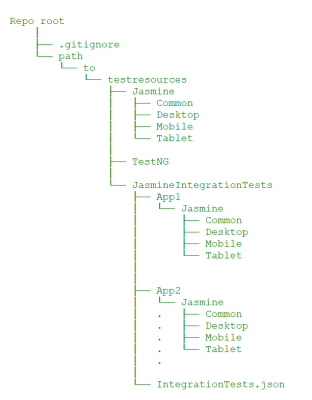
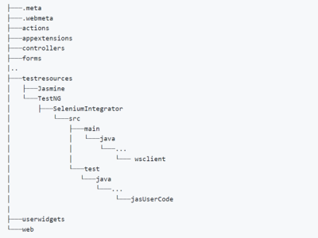
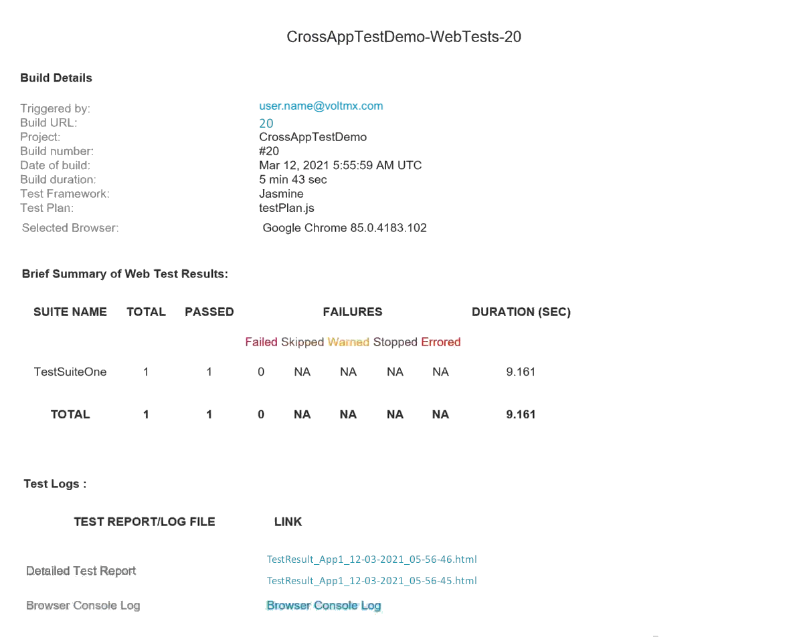

# <a name="Cross"></a>Cross-Application Testing

From the VoltMX V9 ServicePack 3 release, App Factory has added support to run tests across multiple apps.From the V9 ServicePack 5 release, you can run cross-app tests for Native channels. You can also run tests across VoltMX apps and non-VoltMX apps.

> ***Important***: For VoltMX versions V9SP4 or earlier, App Factory supports cross-app testing only with the **Jasmine** test framework for the **Web** channel.

For more information, refer to the [Cross-Application Testing](https://opensource.hcltechsw.com/volt-mx-docs/95/docs/documentation/Iris/iris_user_guide/Content/TestAutomation.html#cross-application-testing) section in the Iris User Guide.

## <a name="VoltMX-VoltMX"></a>Testing Across VoltMX Apps

To run cross-application tests across VoltMX Apps, you need to place the Jasmine Integration Test resources within the source of the base app in the SCM. For more information, refer to the folder structure in the following image.



For more information about the files and folders that are required for Jasmine integration tests, refer to the [Cross-Application Testing](https://opensource.hcltechsw.com/volt-mx-docs/95/docs/documentation/Iris/iris_user_guide/Content/TestAutomation.html#cross-application-testing) section in the Iris User Guide.


<blockquote><em><b>Important: </b></em>
<ul>
<li>Make sure that the dependent apps are built in the test mode and are deployed at URLs that are accessible by App Factory.</li>
<li>During every test run, the <b>protocol</b> and <b>ScriptURL</b> keys in the <code>IntegrationTests.json</code> file are overwritten based on the run-time values.</li>
</ul>
</blockquote>


## <a name="VoltMX-non-VoltMX"></a>Testing Across VoltMX and non-VoltMX Apps

You can use Selenium automation to test apps and widgets that are not part of VoltMX, for example, a third-party login from a web browser. To integrate Jasmine tests with Selenium automation, you must implement a Java interface and the respective methods. You also need to use the [Cross-App Testing APIs](https://opensource.hcltechsw.com/volt-mx-docs/95/docs/documentation/Iris/iris_api_dev_guide/content/voltmx.automation_namespace.html#cross-app-testing-apis) to connect to a WebSocket and exchange messages between the Jasmine and Selenium frameworks.

The test resources for Selenium automation must be placed as a Maven project at the following path: `<Iris Project>/testresources/TestNG/SeleniumIntegrator/`. After implementing the interface and the methods, the Java file must be stored at the following path: `<Iris Project>/testresources/TestNG/SeleniumIntegrator/src/main/java/com/temenos/user/wsclient`.

For more information, refer to the folder structure in the following image.



For more information about the Java interface and methods, refer to the following sections.

<details close="markdown"><summary><code>CrossAppClientInterface </code>[Mandatory interface]</summary>This interface must be implemented to integrate the Selenium automation code with the Jasmine tests. It can also be used to add automation capabilities for apps and widgets that are not part of VoltMX. <br/><br/>

The interface contains two key methods: <code>onMessage</code> and <code>onInitDriver</code>, which must be implemented along with the code that is executed when a message is received from the Jasmine framework. You can use <a href="https://opensource.hcltechsw.com/volt-mx-docs/95/docs/documentation/Iris/iris_api_dev_guide/content/voltmx.automation_namespace.html#cross-app-testing-apis">Cross-App Testing APIs</a> to connect to a WebSocket and to exchange messages between the Jasmine and Selenium frameworks.<br/><br/>

The interface also contains the <code>getDriverCapabilities</code> method, which can be used to override a set of driver capabilities.<br/><br/>

During the run time, App Factory identifies the class that implements this interface, and then invokes the <code>onInitDriver</code> method to fetch the driver object.  <br/><br/>


<b>Syntax</b><br/>
<code>public interface CrossAppClientInterface</code>
</details>


<details close="markdown"><summary><code>onMessage </code>[Mandatory method]</summary>The App Factory CI Pipeline invokes this method when it receives a message from the Jasmine framework. This method passes the message <a href="https://stleary.github.io/JSON-java/org/json/JSONObject.html">JSONObject</a> from the Jasmine framework to the Selenium framework, and returns a message <a href="https://stleary.github.io/JSON-java/org/json/JSONObject.html">JSONObject</a> to the Jasmine framework. <br/><br/>

<b>Syntax</b><br/>
<code>public JSONObject onMessage(JSONObject Object)</code><br/>


<b>Parameters</b><br/>
<code>Object [<em>JSONObject</em>]</code><br/>
Specifies the message that is received from the Jasmine framework during the run time.<br/>


<b>Return Type</b><br/>
<em>JSONObject</em>  <br/>
Specifies the message that must be passed to the Jasmine framework during the run time.
</details>


<details close="markdown"><summary><code>onInitDriver </code>[Mandatory method]</summary>

<blockquote><em><b>Important: </b></em>If you are using VoltMX version V9SP4 or earlier, the name of this method is <code>onInitWebDriver</code>.</blockquote>

The App Factory CI Pipeline invokes this method after it creates the driver object; the type of the object is based on the platform. Make sure that you check the type of object before assigning it to a variable.  


<table style="mc-table-style: url('Resources/TableStyles/Basic.css');width: 30%;" class="TableStyle-TemenosTables" cellspacing="0"><colgroup><col class="TableStyle-TemenosTables-Column-Column1"> <col class="TableStyle-TemenosTables-Column-Column1"></colgroup>
<tbody>
<tr class="TableStyle-TemenosTables-Body-Body1">
<th class="TableStyle-TemenosTables-BodyE-Column1-Body1" scope="row">Platform</th>
<th class="TableStyle-TemenosTables-BodyD-Column1-Body1" scope="row">Object Type</th>
</tr>
<tr class="TableStyle-TemenosTables-Body-Body1" data-mc-conditions="Default.V9SP5">
<td class="TableStyle-TemenosTables-BodyE-Column1-Body1">
Android
</td>
<td class="TableStyle-TemenosTables-BodyD-Column1-Body1">
<code>AndroidDriver</code>
</td>
</tr>
<tr class="TableStyle-TemenosTables-Body-Body1" data-mc-conditions="Default.V9SP5">
<td class="TableStyle-TemenosTables-BodyE-Column1-Body1">
iOS
</td>
<td class="TableStyle-TemenosTables-BodyD-Column1-Body1">
<code>IOSDriver</code>
</td>
</tr>
<tr class="TableStyle-TemenosTables-Body-Body1">
<td class="TableStyle-TemenosTables-BodyB-Column1-Body1">
Web
</td>
<td class="TableStyle-TemenosTables-BodyA-Column1-Body1">
<code>ChromeDriver</code>
</td>
</tr>
</tbody>
</table>


<b>Syntax</b><br/>
<code>public void onInitDriver(WebDriver driver);</code><br/>


<b>Parameters</b><br/>
<code>driver</code> [<em>WebDriver</em>]  
Specifies the driver object that is sent by the App Factory CI pipeline after initialization.<br/>

<b>Return Type</b><br/>
<em>void</em>

<h4> Sample code: Check platform and object type</h4>

<pre><code style="display:block;background-color:#eee;">//For the web platform
	if (driver instanceof ChromeDriver)
	{
		myDriver = (ChromeDriver) driver;
	}
	else
	{
		System.out.println("Wrong driver is initialised.");
	}

	//For the Android platform
	if (driver instanceof AndroidDriver)
	{
		myDriver = (AndroidDriver) driver;
	}
	else
	{
		System.out.println("Wrong driver is initialised.");
	}

	//For iOS platform:
	if (driver instanceof IOSDriver)
	{
		myDriver = (IOSDriver) driver;
	}
	else
	{
		System.out.println("Wrong driver is initialised.");
	}
  </code>
</pre>
</details>

<details close="markdown"><summary><code>getDriverCapabilities </code>[Optional method]</summary>

The App Factory CI Pipeline invokes this method before creating the driver object. You can use this method to override a set of capabilities.

App Factory supports overriding the following capabilities:

<ul>
<li><code>orientation</code></li>
<li><code>printPageSourceOnFindFailure</code></li>
</ul>


<b>Syntax</b><br/>
<code>default Map<String, Object> getDriverCapabilities()</code><br/>


<b>Parameters</b><br/>
None.<br/>


<b>Return Type</b><br/>
<em>Map<String, Object></em><br/>
Specifies a map of capabilities with the capability name as key and the capability value as value.
</details>

### Backward Compatibility with VoltMX Iris

*   For Web channels
    *   **9.2.29** (or later)
*   For Native channels
    *   **9.2.49**
    *   **9.3.24**
    *   **9.4.8** (or later)

## <a name="Running"></a>Running a Cross-Application Test

After you add the test resources for the dependent apps to the directory of the base app, you can run cross-app tests by running a Jasmine test on the base app. For more information, refer to [Testing an App with the Jasmine Test Framework](TestingAnAppJasmine.html).

## <a name="Test"></a>Test Results

After the Jasmine tests are successfully executed at the run time, App Factory generates separate test results for every time an app is launched. The test results can be identified by the app name and the time-stamp, for example, `TestResult_App2_12-03-2021_05-56-46.html`.

The recipients that are added to the recipients list in the Project Settings will receive an email notification with links to the test results.




<!--  

Cross-Application Testing
=========================

From the VoltMX V9 ServicePack 3 release, App Factory has added support to run tests across multiple apps. From the V9 ServicePack 5 release, you can run cross-app tests for Native channels. You can also run tests across VoltMX apps and non-VoltMX apps.

  
For VoltMX versions V9SP4 or earlier, App Factory supports cross-app testing only with the **Jasmine** test framework for the **Web** channel.

For more information, refer to the [Cross-Application Testing](https://docs.voltmx.com/voltmxlibrary/beta/qv/iris_user_guide/Default.md#TestAutomation.html#CrossAppTesting) section in the Iris User Guide.

Testing Across VoltMX Apps
---------------------------

To run cross-application tests across VoltMX Apps, you need to place the Jasmine Integration Test resources within the source of the base app in the SCM. For more information, refer to the folder structure in the following image.


For more information about the files and folders that are required for Jasmine integration tests, refer to the [Cross-Application Testing](https://docs.voltmx.com/voltmxlibrary/beta/qv/iris_user_guide/Default.md#TestAutomation.html#CrossAppTesting) section in the Iris User Guide.

*   Make sure that the dependent apps are built in the test mode and are deployed at URLs that are accessible by App Factory.
*   During every test run, the **protocol** and **ScriptURL** keys in the `IntegrationTests.json` file are overwritten based on the run-time values.

Testing Across VoltMX and non-VoltMX Apps
-------------------------------------------

You can use Selenium automation to test apps and widgets that are not part of VoltMX, for example, a third-party login from a web browser. To integrate Jasmine tests with Selenium automation, you must implement a Java interface and the respective methods. You also need to use the [Cross-App Testing APIs](https://docs.voltmx.com/voltmxlibrary/iris/iris_api_dev_guide/Default.md#voltmx.automation_namespace.html#Cross) to connect to a WebSocket and exchange messages between the Jasmine and Selenium frameworks.

The test resources for Selenium automation must be placed as a Maven project at the following path: `<Iris Project>/testresources/TestNG/SeleniumIntegrator/`. After implementing the interface and the methods, the Java file must be stored at the following path: `<Iris Project>/testresources/TestNG/SeleniumIntegrator/src/main/java/com/hcl/user/wsclient`.

For more information, refer to the folder structure in the following image.


For more information about the Java interface and methods, refer to the following sections.

`CrossAppClientInterface` \[Mandatory interface\]

This interface must be implemented to integrate the Selenium automation code with the Jasmine tests. It can also be used to add automation capabilities for apps and widgets that are not part of VoltMX.

The interface contains two key methods: `onMessage` and `onInitDriver`, which must be implemented along with the code that is executed when a message is received from the Jasmine framework. You can use [Cross-App Testing APIs](https://docs.voltmx.com/voltmxlibrary/iris/iris_api_dev_guide/Default.md#voltmx.automation_namespace.html#Cross) to connect to a WebSocket and to exchange messages between the Jasmine and Selenium frameworks.

The interface also contains the `getDriverCapabilities` method, which can be used to override a set of driver capabilities.

During the run time, App Factory identifies the class that implements this interface, and then invokes the `onInitDriver` method to fetch the driver object.

#### Syntax

```
public interface CrossAppClientInterface
`
```onMessage` \[Mandatory method\]

The App Factory CI Pipeline invokes this method when it receives a message from the Jasmine framework. This method passes the message ]([JSONObject](https://stleary.github.io/JSON-java/org/json/JSONObject.md)) from the Jasmine framework to the Selenium framework, and returns a message ]([JSONObject](https://stleary.github.io/JSON-java/org/json/JSONObject.md)) to the Jasmine framework.

#### Syntax

```
public JSONObject onMessage(JSONObject Object)
```

#### Parameters

`Object` \[_JSONObject_\]  
Specifies the message that is received from the Jasmine framework during the run time.

#### Return Type

_JSONObject_  
Specifies the message that must be passed to the Jasmine framework during the run time.

`onInitDriver` \[Mandatory method\]

  
If you are using VoltMX version V9SP4 or earlier, the name of this method is `onInitWebDriver`.

The App Factory CI Pipeline invokes this method after it creates the driver object; the type of the object is based on the platform. Make sure that you check the type of object before assigning it to a variable.

<table style="mc-table-style: url('Resources/TableStyles/Basic.css');width: 30%;" class="TableStyle-Basic" cellspacing="0"><colgroup><col class="TableStyle-Basic-Column-Column1" style="width: 15%;"> <col class="TableStyle-Basic-Column-Column1" style="width: 15%;"></colgroup><tbody><tr class="TableStyle-Basic-Body-Body1"><th class="TableStyle-Basic-BodyE-Column1-Body1">Platform</th><th class="TableStyle-Basic-BodyD-Column1-Body1">Object Type</th></tr><tr class="TableStyle-Basic-Body-Body1" madcap:conditions="Default.V9SP5"><td class="TableStyle-Basic-BodyE-Column1-Body1"><p>Android</p></td><td class="TableStyle-Basic-BodyD-Column1-Body1"><p><code style="font-size: 11pt;">AndroidDriver</code></p></td></tr><tr class="TableStyle-Basic-Body-Body1" madcap:conditions="Default.V9SP5"><td class="TableStyle-Basic-BodyE-Column1-Body1"><p>iOS</p></td><td class="TableStyle-Basic-BodyD-Column1-Body1"><p><code style="font-size: 11pt;">IOSDriver</code></p></td></tr><tr class="TableStyle-Basic-Body-Body1"><td class="TableStyle-Basic-BodyB-Column1-Body1"><p>Web</p></td><td class="TableStyle-Basic-BodyA-Column1-Body1"><p><code style="font-size: 11pt;">ChromeDriver</code></p></td></tr></tbody></table>

#### Syntax

```
public void onInitDriver(WebDriver driver);
```

#### Parameters

`driver` \[_WebDriver_\]  
Specifies the driver object that is sent by the App Factory CI pipeline after initialization.

#### Return Type

_void_

#### Sample code: Check platform and object type

```
//For the web platform
if (driver instanceof ChromeDriver)
{
	myDriver = (ChromeDriver) driver;
}
else
{
	System.out.println("Wrong driver is initialised.");
}

//For the Android platform
if (driver instanceof AndroidDriver)
{
	myDriver = (AndroidDriver) driver;
}
else
{
	System.out.println("Wrong driver is initialised.");
}

//For iOS platform:
if (driver instanceof IOSDriver)
{
	myDriver = (IOSDriver) driver;
}
else
{
	System.out.println("Wrong driver is initialised.");
}
`
```getDriverCapabilities` \[Optional method\]

The App Factory CI Pipeline invokes this method before creating the driver object. You can use this method to override a set of capabilities.

App Factory supports overriding the following capabilities:

*   `orientation`
*   `printPageSourceOnFindFailure`

#### Syntax

```
default Map<String, Object> getDriverCapabilities()
```

#### Parameters

None.

#### Return Type

_Map<String, Object>_  
Specifies a map of capabilities with the capability name as key and the capability value as value.

### Backward Compatibility with VoltMX Iris

*   For Web channels
    *   **9.2.29** (or later)
*   For Native channels
    *   **9.2.49**
    *   **9.3.24**
    *   **9.4.8** (or later)

FixPack Versions

Running a Cross-Application Test
--------------------------------

After you add the test resources for the dependent apps to the directory of the base app, you can run cross-app tests by running a Jasmine test on the base app. For more information, refer to [Testing an App with the Jasmine Test Framework](TestingAnAppJasmine.md).

Test Results
------------

After the Jasmine tests are successfully executed at the run time, App Factory generates separate test results for every time an app is launched. The test results can be identified by the app name and the time-stamp, for example, `TestResult_App2_12-03-2021_05-56-46.html`.

The recipients that are added to the recipients list in the Project Settings will receive an email notification with links to the test results.

 -->
