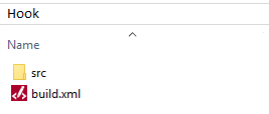
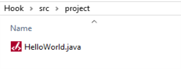
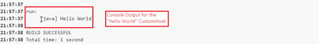

                         

Custom Hooks
============

A **Custom Hook** is custom logic that is written in **java code**, and also contains a **build script** to compile or run the java code. The build script is written as an Ant script (build.xml) or a Maven script (pom.xml). Custom Hooks run at specific stages of the build pipeline, such as **pre-build** or **post-build**.

App Factory extracts the zip file at the specified stage and calls the Ant or Maven script based on the **Build Action** parameter of the [Iris Custom Hook](CustomHooksIris.md#action) or the [Foundry Custom Hook](CustomHooksFoundry.md#action).

Creating a Custom Hook
----------------------

To create a custom hook, you need to write the hook logic in a java code, create a hook script by using Ant or Maven, and then package the files in a zip archive. For more information, refer to the following sections.

### Writing the hook logic

The logic for a Custom Hook is written in a java code. Let's take an example of a **Hello World** java program.

```
package project;

public class HelloWorld
{
	public static void main(String[] args)
	{
		System.out.println("Hello World");
	}
}
```

> **_Note:_** Ensure that the **package name** matches the folder structure of your Custom Hook.  
For example, if the folder structure is `src/prog/HelloWorld.java`, then the package name is `prog`.

### Creating the build script

After you create the java file, you need to create an Ant script or a Maven script to manage the java code. You can find more information about these scripts from the following links.

*   [Apache Ant](https://ant.apache.org/)
*   [Apache Maven](https://maven.apache.org/)
*   [Example for an Ant script](http://ant.apache.org/manual/tutorial-HelloWorldWithAnt.html#four-steps)
*   [Example for a Maven Script](http://maven.apache.org/guides/getting-started/maven-in-five-minutes.html#The_POM)

> **_Important:_**

*   Create the **script** in a way that includes **goals**. The goals can be specific jobs such as **compiling java code** or **building a jar file**. You can call these jobs by passing them as Script Arguments in the Custom Hook Parameters.
*   A Custom Hook that runs as part of a **Pre-Build** or **Post-Build** stage has direct access to the project files. Therefore, your Custom Hooks can contain goals that are specific for these files. For example, a Custom Hook that configures Xcode settings for iOS, or a Custom Hook that configures Android permissions.

Let's take an example of an **Ant** script for the given **Hello World** java program. This script must be in a **build.xml** file at the root location of your Custom Hook zip archive.

```
<project>

<target name="clean">
	<delete dir="build"/>
</target>

<target name="compile">
	<mkdir dir="build/classes"/>
	<javac srcdir="src" destdir="build/classes"/>
</target>

<target name="jar">
	<mkdir dir="build/jar"/>
	<jar destfile="build/jar/HelloWorld.jar" basedir="build/classes">
	<manifest>
		<attribute name="Main-Class" value="project.HelloWorld"/>
	</manifest>
	</jar>
</target>

<target name="run">
	<java jar="build/jar/HelloWorld.jar" fork="true"/>
</target>

</project>
```

> **_Note:_** For information on **Environment Specific Variables in Volt MX Iris App**, [click here](Environment_Variables_in_CustomHooks.md).

### Packaging the files

After you create the java file and the Ant script, your folder structure should look similar to the structure in the following screenshots.

   

You need to then **compress** the hook folder to a **zip** archive to upload it as a Custom Hook to your App Factory Project.

When you run this Custom Hook as part of any job, you will see **\[ java \] Hello World** in the console output of the job.



After you create a zip archive for your Custom Hook, you can use it to create and run Custom Hooks on App Factory. For more information, refer to the following documents.

*   [Custom Hooks for Iris jobs](CustomHooksIris.md)
*   [Custom Hooks for Foundry jobs](CustomHooksFoundry.md)
