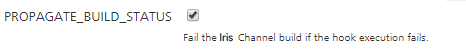
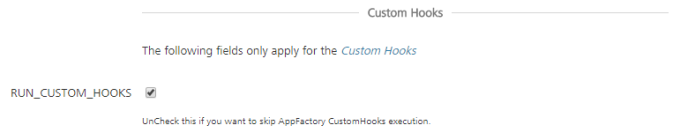

                           

Custom Hooks for Iris jobs
================================

Custom Hooks are custom pipelines that run at certain [stages](#stages) of the build flow in App Factory. You can define a custom logic as an [Ant](https://ant.apache.org/) script or a [Maven](https://maven.apache.org/) script.

To access Custom Hooks for Iris, navigate to the **Custom Hooks** sub-folder from the **Iris** folder of your project.

The **Custom Hooks Management Console** opens when you click the **Custom Hooks** folder.

Custom Hooks Management Console
-------------------------------

> **_Important:_** To run custom hooks, make sure that you have a custom hook archive. For more information, refer to [Custom Hooks](CustomHooks.md).

The **Custom Hooks Management Console** is a dashboard that you can use to manage your Custom Hooks. The console shows **Hook Points** that specify the stages at which the parent job (buildIrisApp) runs the given hooks.

There are **three** hook points, or stages, in the build flow.

*   **Pre-Build** - Runs the Custom Hooks after the initiation of the **CI** process and before the **Build** process.
*   **Post-Build** - Runs the Custom Hooks after the **Build** process and before the **Test** process.
*   **Post-Test** - Runs the Custom Hooks after the **Test** process and before the **Deployment** process.

### Creating a Custom Hook

1.  On the **Custom Hooks Management Console**, for the [stage](#stages) at which you want to run your Custom Hook, click **Upload**. The **\_createCustom Hook page** opens.  
    
2.  Configure the parameters that are required to create a custom hook. For more information about the parameters, refer to the following table.  
    
    <table style="mc-table-style: url]('Resources/TableStyles/Basic.css');width: 90%;" class="TableStyle-Basic" cellspacing="0"><colgroup><col class="TableStyle-Basic-Column-Column1" style="width: 20%;"><col class="TableStyle-Basic-Column-Column1" style="width: 70%;"></colgroup><tbody><tr class="TableStyle-Basic-Body-Body1"><th class="TableStyle-Basic-BodyE-Column1-Body1">Parameter</th><th class="TableStyle-Basic-BodyD-Column1-Body1">Description</th></tr><tr class="TableStyle-Basic-Body-Body1"><td class="TableStyle-Basic-BodyE-Column1-Body1"><b>HOOK_NAME</b></td><td class="TableStyle-Basic-BodyD-Column1-Body1">Specifies the name that is displayed in the respective hook point.</td></tr><tr class="TableStyle-Basic-Body-Body1"><td class="TableStyle-Basic-BodyE-Column1-Body1"><b>HOOK_CHANNEL</b></td><td class="TableStyle-Basic-BodyD-Column1-Body1">Specifies the channel on which you want to run your Custom Hook. This includes both Native and SPA channels.The Hook Channel parameter is set to <b>ALL</b> by default.The IPA_STAGE for iOS platforms is the stage that generates the KAR file for iOS&nbsp;builds. At this stage, you can include iOS&nbsp;specific hooks, such as hooks for Xcode settings.<b><i>Note: </i></b>Currently, you can only select one Hook Channel. If you want to run the same hook for multiple channels, you need to create multiple Custom Hooks with the same <b>Hook Archive</b>.</td></tr><tr class="TableStyle-Basic-Body-Body1"><td class="TableStyle-Basic-BodyE-Column1-Body1"><b>BUILD_ACTION</b></td><td class="TableStyle-Basic-BodyD-Column1-Body1">Specifies the type of script you want to run for the Custom Hook.You can run an Ant&nbsp;script or a Maven script. The Build Action parameter is set to <b>Execute Ant</b> by default.</td></tr><tr class="TableStyle-Basic-Body-Body1"><td class="TableStyle-Basic-BodyE-Column1-Body1"><b>HOOK_ARCHIVE_FILE</b></td><td class="TableStyle-Basic-BodyD-Column1-Body1">Specifies the archive file for the Custom Hook. For more information, refer to <a href="CustomHooks.html">Custom Hooks</a>.To upload an archive file, click <b>Choose File</b>, and then select the custom hook zip file from the file explorer.</td></tr><tr class="TableStyle-Basic-Body-Body1"><td class="TableStyle-Basic-BodyE-Column1-Body1"><b>SCRIPT_ARGUMENTS</b></td><td class="TableStyle-Basic-BodyD-Column1-Body1">This text field specifies the arguments you want to pass to the Custom Hook Script. These arguments are specific the <b>targets</b> or <b>goals</b> for the script. If you leave the Script Arguments empty, the Custom Hook script will only execute the default goals.<b><i>Note: </i></b>The arguments must be separated by using <b>space</b>, and must be in the order in which you want to execute them.</td></tr><tr class="TableStyle-Basic-Body-Body1"><td class="TableStyle-Basic-BodyB-Column1-Body1"><b>PROPAGATE_BUILD_STATUS</b></td><td class="TableStyle-Basic-BodyA-Column1-Body1">This check-box specifies whether the <b>parent job</b> should <b>fail</b> if the Custom Hook execution fails. This check-box is <b>enabled</b> by default.</td></tr></tbody></table>
    
3.  After you configure the parameters, click **Build**.

> **_Note:_** For information on **Environment Specific Variables in Volt MX Iris App**, [click here](Environment_Variables_in_CustomHooks.md).

### Configuring Custom Hooks

After you build the Custom Hooks, you can configure them from the **Custom Hooks Management Console**. You can add upto **five** Custom Hooks in every stage.

Any Custom Hook that you create is set **disabled** by default. You need to manually enable the hooks from the Console to run them during the build process.

You can perform the following tasks from the Custom Hooks Management Console.

*   You can **enable** a hook by clicking the **tick** icon.
*   You can **edit** a Custom Hook by clicking the **Edit** icon.
*   You can **disable** an enabled Custom Hook by clicking the **Disable** icon.
*   You can **delete** a disabled hook by clicking the **bin** icon.  
    *   If you **delete** a Custom Hook from the console, it will be deleted **permanently**.
    *   You can only delete **disabled** hooks. To delete an **enabled** hook, you need to disable the hook first.

*   You can **drag and drop** the enabled hooks to change their order of execution.
    

> **_Note:_** The **Edit** and **Disable** buttons are displayed when you hover your cursor over a Custom Hook.  

### Editing a Custom Hook

To edit a custom hook from the Custom Hook Management Console, click the **edit** icon for the Custom Hook that you want to update. The **\_updateCustom Hook** page opens

You can configure the parameters based on your requirements. For more information about the parameters, refer to [Creating a Custom Hook](#creating-a-custom-hook).

### Enabling Custom Hooks in Iris Jobs

To run Custom Hooks as part of the **buildIrisApp** job, enable the RUN\_CUSTOM\_HOOKS build parameter.

If you disable RUN\_CUSTOM\_HOOKS in the build parameters, the **buildIrisApp** job will not run any Custom Hooks. You can choose which Custom Hooks to run from the Custom Hooks Management Console.

### Custom Hook Stages in Stage View

When you enable a Custom Hook in a parent job, the Custom Hook stages also show up in the parent job's **Stage View**.

If you enabled **PROPAGATE\_BUILD\_STATUS** in the [Hook Parameters](#Creating) and your Custom Hook fails to execute, then the you will see a failure message in the parent job's stage view.
