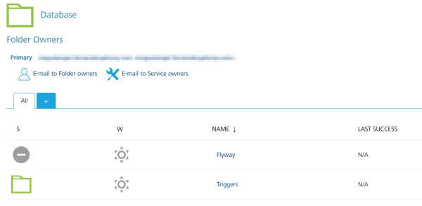
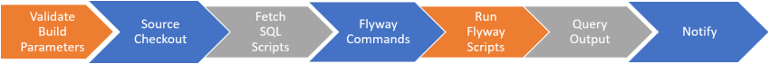
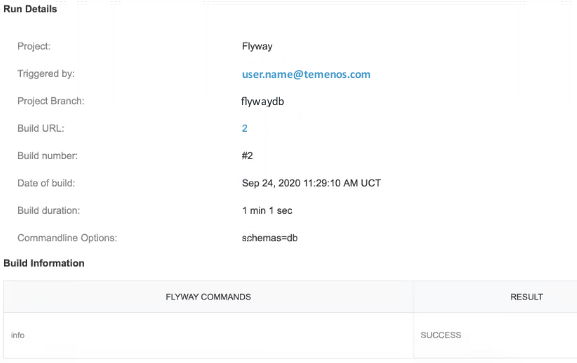
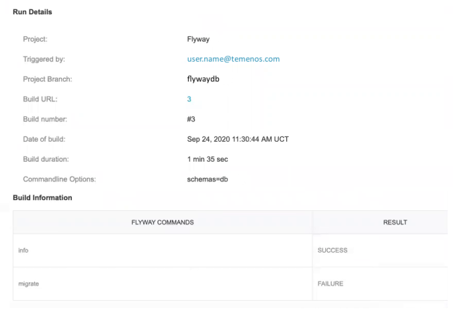

                         

Database Projects in App Factory
================================

From V9 ServicePack 2, App Factory supports executing Flyway scripts. If you have your Flyway scripts stored in source control, you can use App Factory to automatically execute them on your database, either on demand, periodically, or when a change is pushed.

Database project folder
-----------------------

When you create a project in App Factory, a **Database** folder is automatically added to it. The Database folder contains a **Flyway** job, and a **Triggers** folder.

### Flyway job

The Flyway job drives the execution of the Flyway scripts. The job consists of the following stages.

*   **Validate Build Parameters**
*   **Source Checkout**: The pipeline starts by checking out the scripts from the specified repository. The checkout is done based on the branch and location that is specified in the build parameters.
*   **Fetch SQL Scripts**
*   **Flyway Commands**: The job uses the specified database credentials and runs the scripts on the database.
*   **Run Flyway Scripts**
*   **Query Output**: The pipeline fetches the query output from the database and adds it to the logs.
*   **Notify**: The job sends out notifications that contain the build information, links to view the outputs, and the changelog details.

For more information, refer to [Running Flyway Jobs](RunningFlywayJobs.md).

### Triggers

App Factory provides the ability to mix and match different ways to initiate your Flyway execution. This is done by creating **trigger** jobs. Trigger jobs run on a specific schedule, or whenever a change is pushed to a specific branch of a source code repository, and in turn invoke the main job.

The Triggers folder contains the **createFlywayTrigger** job, which can be used to schedule Flyway jobs, or configure build on push jobs. Scheduled jobs are stored in the **Schedulers** sub-folder, and build on push jobs are stored in the **Watchers** sub-folder.

For more information, refer to the following sections

*   [Scheduling a Flyway job](SchedulingFlywayJob.md)
*   [Build on push for Flyway jobs](BuildOnPush_Flyway.md)

### Build Results Notification

After a Flyway job is completed, App Factory sends an email to the recipients that are specified in the RECIPIENTS\_LIST build parameter. The email contains information about the Flyway job, such as build duration, date and time of build, and the link to find it in the console. The email also contains information about the Flyway commands and command-line options that are used for the execution.

The **Build Information** section of the email contains the status of individual Flyway commands that were run on the database during the job. The final status of the execution depends on the individual commands.

*   If all the commands are successfully run on the database, the build is successful.
*   If all the commands are unable to run on the database, the build fails.
*   If some of the commands successfully run and other commands fail, the build is unstable.

For example: The `info` and `migrate` commands are run on the database. If the info command succeeds and the migrate command fails, then the build is unstable.

