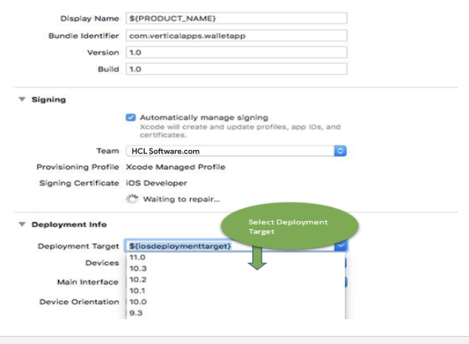

                           

Environment Variables
=====================

The Custom Hooks feature in Volt MX App Factory allows you to add a custom pipeline at specific points to an existing pipeline by using custom code/programs. Using the Custom Hooks feature, you can extend and customize the build process, while maintaining the core functionality of the App Factory build process. You can write custom logic and use it to override an existing operation or perform a new operation. For more information on Custom Hooks, refer [Configuring Custom Hooks](CustomHooksIris.md#configuring-custom-hooks).

HCL App Factory exposes **environment-specific variables** that you can use to customize the environment. The platform-specific channel job parameters are available during the execution of a Custom Hook.  
For example, you can access Android specific environment variables that will be exposed when you run Android specific jobs on Custom Hooks.

Custom Hooks also expose Source code specific variables, which point to the static location of Binaries, and other source code files.  
For example, you can use the `PROJECT_XCODEPROJECT` variable to get the location of the project, and then, update the XCode Project Settings or modify any file in the project using ANT or MAVEN files.

Common Environment Variables
----------------------------

The following table lists the environment variables that are common to all platforms in App Factory. These environment variables are exposed during the build execution of Custom Hooks in the channel jobs.

  
| Parameter | Platform |
| --- | --- |
| DEFAULT\_LOCALE | All |
| FOUNDRY\_APP\_CONFIG | All |
| RUN\_CUSTOM\_HOOKS | All |
| RECIPIENTS\_LIST | All |
| PROJECT\_BUILDNUMBER | All |
| PROJECT\_NAME | All |
| BUILD\_MODE | All |
| CLOUD \_CREDENTIALS | All |
| PROTECTED\_KEYS | All |
| PUBLISH\_FOUNDRY\_APP | All |
| PROJECT\_SOURCE\_CODE\_BRANCH | All |
| PROJECT\_SOURCE\_CODE\_REPOSITORY\_CREDENTIALS\_ID | All |
| PROJECT\_WORKSPACE | All |

Platform Specific Environment Variables
---------------------------------------

Following are the environment variables for different platforms in App Factory. These environment variables are exposed during the build execution of Custom Hooks in the channel jobs.

  
| Parameter | Platform |
| --- | --- |
| ANDROID\_APP\_VERSION | Android |
| ANDROID\_KEYSTORE\_FILE | Android |
| ANDROID\_KEYSTORE\_PASSWORD | Android |
| ANDROID\_KEY\_ALIAS | Android |
| ANDROID\_KEY\_PASSWORD | Android |
| ANDROID\_MOBILE\_APP\_ID | Android |
| ANDROID\_TABLET\_APP\_ID | Android |
| ANDROID\_UNIVERSAL\_APP\_ID | Android |
| ANDROID\_VERSION\_CODE | Android |
| FORM\_FACTOR | Android |
| GOOGLE\_MAPS\_KEY\_ID | Android |
| ALWAYS\_EMBED\_SWIFT\_STANDARD\_LIBRARIES\_ENABLEMENT | iOS |
| CLOUD\_CREDENTIALS\_ID | iOS |
| APPLE\_ID | iOS |
| APPLE\_DEVELOPER\_TEAM\_ID | iOS |
| APPLE\_SIGNING\_CERTIFICATES | iOS |
| IOS\_MOBILE\_APP\_ID | iOS |
| IOS\_TABLET\_APP\_ID | iOS |
| IOS\_UNIVERSAL\_APP\_ID | iOS |
| IOS\_APP\_VERSION | iOS |
| IOS\_BUNDLE\_VERSION | iOS |
| IOS\_DISTRIBUTION\_TYPE | iOS |
| APPLE\_WATCH\_EXTENSION | iOS |
| FORM\_FACTOR | iOS |
| PROJECT\_VMWORKSPACE\_PATH | iOS |
| PROJECT\_XCODEPROJECT | iOS |

  
For more information on Environment Variable parameters, refer [Configuring Parameters for Building a Iris App](BuildingAnApp.md).

Custom Hook Specific Environment Variables
------------------------------------------

  
| Property | **Value** |
| --- | --- |
| BUILD\_SCRIPT | URL |
| BUILD\_STEP | PRE\_BUILD\_STEP |
| HOOK\_CHANNEL | ANDROID\_MOBILE |
| BUILD\_ACTION | Execute ANT |
| HOOK\_NAME | UpdateXcodeLib |
| SCRIPT\_ARGUMENTS | ParameterList |
| HOOK\_SLAVE | MacOSXHookAgent01 |
| BUILD\_SLAVE | MacOSXBuildAgent01 |
| UPSTREAM\_JOB\_WORKSPACE | Workspace Location |

 

> **_Note:_** The values mentioned for all the parameters and properties change dynamically based on your selection at the run-time.

Predefined Platform Binary Locations for Respective Platforms
-------------------------------------------------------------

For retrieving artifacts in post build Custom Hooks, use PROJECT\_WORKSPACE to get into the workspace folder and access binaries for a specific channel.

**For example:**

| Binary Location | Description |
| --- | --- |
| ${PROJECT\_WORKSPACE}/binaries/android/luavmandroid.apk | for Android Mobile |
| ${PROJECT\_WORKSPACE}/binaries/androidtablet/\*apk | for Android Tablet |
| ${PROJECT\_WORKSPACE}/binaries/iphone/\*.kar | for iOS Mobile KAR |
| ${PROJECT\_WORKSPACE}/binaries/ipad/\*.kar | for iOS Tablet KAR |
| ${PROJECT\_WORKSPACE}/binaries/universalios/\*.kar | for iOS Universal KAR |
| ${PROJECT\_WORKSPACE}/../temp/${PROJECT\_NAME}/build/server/iphonekbf | for iOS Mobile IPA |
| ${PROJECT\_WORKSPACE}/../temp/${PROJECT\_NAME}/build/server/ipadkbf | for iOS Tablet IPA |

 

Sample Use-Case Scenario
------------------------

For example, if you have installed Volt MX Iris on your Mac machine. You follow a few manual steps to build the IPA by extracting the KAR on your Mac machine. During the IPA generation, you perform additional manual settings in the Xcode project to change the deployment target as shown in the following image.



When you modify the Xcode Project's General Settings, these settings will update the **projectpbx** (VMAppWithVoltMXlib.xcodeproj/project.pbxproj) file in your local Xcode Workspace folder. Since you modified the Deployment Target in the Xcode settings, it internally modifies the **`IPHONEOS_DEPLOYMENT_TARGET`** key in the **projectpbx**.

Consider that you have the following ANT Script in your local workspace to update the **projectpbx** file. The script finds and replaces the value of the key.

```
<target name =””
<property name="PROJECT_XCODEPROJECT" value="VMAppWithVoltMXlib.xcodeproj/project.pbxproj"/>
	
     <property name="lt" value="&#60;"/>
     <property name="gt" value="&#62;"/>

     <echo message="Updating deployment target" />
    <replaceregexp 
        file="${PROJECT_VMWORKSPACE_PATH}/${PROJECT_XCODEPROJECT}" 
        match='IPHONEOS_DEPLOYMENT_TARGET(.+?)/string' 
        replace="IPHONEOS_DEPLOYMENT_TARGET${lt}/key${gt}
                &#10;${lt}string${gt}${IPHONEOS_DEPLOYMENT_TARGET}${lt}/string" 
        flags="gism" 
        byline="false"/>
</target>

```

If you want to run this program as part of the App Factory build during the IPA generation, you must hook this program through the App Factory Custom Hook Dashboard. But you need the location of the Xcode Project or the project workspace on App Factory.  

App Factory exposes all the job build parameters and file-system variables to Custom Hooks. You can directly access these environment variables in the ANT and MAVEN scripts.

> **_Note:_** The program can be written in any programming language, but, it must be executed by an ANT or MAVEN script that App Factory invokes during the execution of the Custom Hook in the build process.

### Adding Custom Hooks in App Factory

*   You can use the `PROJECT_VMWORKSPACE_PATH` variable in the ANT file to get the absolute path of the Xcode project in the App Factory Workspace.
*   To update the Deployment Target on Xcode, you must update the **VMAppWithVoltMXlib.xcodeproj/project.pbxproj** file that contains the `IPHONEOS_DEPLOYMENT_TARGET` key. You can make similar changes in the project for custom requirements using Custom Hooks.
*   Add the following ANT script to the **build.xml** file of the Custom Hook that contains the logic to update the `IPHONEOS_DEPLOYMENT_TARGET` key with the required version mentioned in the **SCRIPT\_ARGUMENTS**.  
    SCRIPT\_ARGUMENTS is passed as the argument during the Custom Hook upload.  

```
<project name="default" default="project_xcodesettings_update">
<target name="project_xcodesettings_update">
     <property name="PROJECT_XCODEPROJECT" value="VMAppWithVoltMXlib.xcodeproj/project.pbxproj"/>
	
     <property name="lt" value="&#60;"/>
     <property name="gt" value="&#62;"/>

     <echo message="Updating deployment target" />

    <replaceregexp match="IPHONEOS_DEPLOYMENT_TARGET = (.*);" flags="gis" byline="true">
        <substitution expression="IPHONEOS_DEPLOYMENT_TARGET = ${IPHONEOS_DEPLOYMENT_TARGET};"/>
        <fileset dir="${PROJECT_VMWORKSPACE_PATH}" includes="${PROJECT_XCODEPROJECT}"/>
    </replaceregexp>
    
    <replaceregexp 
        file="${PROJECT_VMWORKSPACE_PATH}/${PROJECT_XCODEPROJECT}" 
        match='IPHONEOS_DEPLOYMENT_TARGET(.+?)/string' 
        replace="IPHONEOS_DEPLOYMENT_TARGET${lt}/key${gt}
                &#10;${lt}string${gt}${IPHONEOS_DEPLOYMENT_TARGET}${lt}/string" 
        flags="gism" 
        byline="false"/>
		
<echo message="Updated deployment target to ${IPHONEOS_DEPLOYMENT_TARGET}" />
</target>
</project>

```  

*   Add the **build.xml** file to a zip file, and upload it to the Custom Hook Dashboard with the following parameters.

| Binary Location | Description |
| --- | --- |
| HOOK\_NAME | DeploymentTarget |
| HOOK\_CHANNEL | IOS\_MOBILE\_IPA\_STAGE / IOS\_TABLET\_IPA\_STAGE |
| BUILD\_ACTION | Execute ANT |
| HOOK\_ARCHIVE\_FILE | Upload the downloaded file |
| SCRIPT\_ARGUMENTS | \-DIPHONEOS\_DEPLOYMENT\_TARGET=10.0 |
| PROPAGATE\_BUILD\_STATUS | Enable |

For more information on Custom Hooks, refer [Configuring Custom Hooks](CustomHooksIris.md#configuring-custom-hooks).


**Custom Hook build.xml (Ant Script)**  

```
<?xml version="1.0" encoding="ISO-8859-1"?>
<project name="appfactory" basedir="." default="updateModules ">

<target name="updateModules">
<property name="antjar.file" value="${basedir}/ant-contrib-0.6.jar"/>
     <echo message="Looking for JAR antcontrib.jar at : ${antjar.file}"/>
     <taskdef resource="net/sf/antcontrib/antcontrib.properties">
             <classpath>
                    <pathelement location="${antjar.file}"/>
             </classpath>
     </taskdef> 
                                                
     <switch value="${FOUNDRY_APP_CONFIG}">
     <case value="DEV_ENV_NAME_ID">
             <property name="environmentvalue" value="DEV"/>
     </case>
     <case value="SIT_ENV_NAME ">
             <property name="environmentvalue" value="SIT"/>
     </case>
     <case value="PROD_ENV_NAME ">
             <property name="environmentvalue" value="PROD"/>
     </case>
   </switch>

     <echo message="Copying environment specific object svc folder"/>
           <copy file="../modules/Objectsvc/${environmentvalue}/objectSvcMeta.js"
                          todir="../modules" overwrite="true"/>
     <echo message="Copied environment specific object svc folder"/>
     <echo message="Editing i18 file based on environment"/>
           <propertyfile file="../i18n.properties">
                <entry key="i18n.getAppURL.value" value="${environmentvalue}~|~"/>
           </propertyfile>
     <echo message="Edited i18 file based on environment"/>
</target>               
</project>
```
