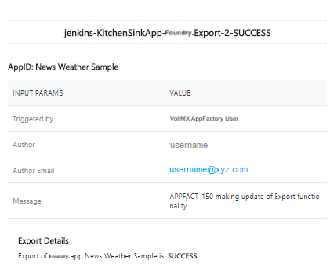

                           

Export a Foundry app
-------------------

The Volt MX Foundry export is used to export the existing Volt MX Foundry application to your SCM.

The export job keeps track of the application code that is exported in the previous build. If there are no changes from the previous build, the push part of the pipeline is omitted.

### Configuration  

You can build the Export job by using the **Build with Parameters** option. You can access the option by following either of these steps.

*   On the right-side of the job row, select the icon that represents Build with Parameters
*   Open the drop-down list for the **buildFoundryApp** job, and then select **Build with Parameters**
*   Open the **buildFoundryApp** job and click **Build with Parameters** on the left panel

> **_Note:_** If you don’t see the option, you might not have ownership permissions to the project. You can verify whether your name is listed in the Folder Owners section of the project. The Primary owner of the project can add users as secondary owners to grant permissions to the builds.

To build the job, you need to configure the build parameters. For more information about the parameters, refer to the following sections.

[Source Control related parameters](javascript:void(0);)

<table style="width: 80%;mc-table-style: url('Resources/TableStyles/Basic.css');" class="TableStyle-Basic" cellspacing="0"><colgroup><col class="TableStyle-Basic-Column-Column1"> <col class="TableStyle-Basic-Column-Column1"></colgroup><tbody><tr class="TableStyle-Basic-Body-Body1"><th class="TableStyle-Basic-BodyE-Column1-Body1">Parameter</th><th class="TableStyle-Basic-BodyD-Column1-Body1">Description</th></tr><tr class="TableStyle-Basic-Body-Body1"><td class="TableStyle-Basic-BodyB-Column1-Body1">SCM_BRANCH</td><td class="TableStyle-Basic-BodyA-Column1-Body1">Specifies the branch, release tag, or the commit ID of the repository that contains the source code of the Foundry app.</td></tr></tbody></table>

[Foundry related parameters](javascript:void(0);)

<table style="mc-table-style: url]('Resources/TableStyles/Basic.css');width: 80%;" class="TableStyle-Basic" cellspacing="0"><colgroup><col class="TableStyle-Basic-Column-Column1"> <col class="TableStyle-Basic-Column-Column1"></colgroup><tbody><tr class="TableStyle-Basic-Body-Body1"><th class="TableStyle-Basic-BodyE-Column1-Body1">Parameter</th><th class="TableStyle-Basic-BodyD-Column1-Body1">Description</th></tr><tr class="TableStyle-Basic-Body-Body1"><td class="TableStyle-Basic-BodyE-Column1-Body1">FOUNDRY_CREDENTIALS</td><td class="TableStyle-Basic-BodyD-Column1-Body1">Specifies the credentials that App Factory uses to import and publish the app to the Foundry cloud. The Foundry cloud must be specified in the FOUNDRY_APP_CONFIG. For more information, refer to <a href="ManagingCredentials.html#Cloud" target="_blank">Adding New Cloud Credentials</a>.</td></tr><tr class="TableStyle-Basic-Body-Body1"><td class="TableStyle-Basic-BodyB-Column1-Body1">FOUNDRY_APP_CONFIG</td><td class="TableStyle-Basic-BodyA-Column1-Body1">Specifies the configuration that App Factory uses to connect the Iris ](client) app to corresponding Foundry (server) app. The configuration includes the hosting type, cloud account, environment name, and the Foundry app name. The build pipeline refers to this parameter for the Foundry Account details to Import and Publish the app. For more information, refer to <a href="ManagingCredentials.html#Adding_Foundry" target="_blank">Adding new Volt MX Foundry App Config</a>.</td></tr></tbody></table>

[Export options](javascript:void(0);)

<table style="mc-table-style: url]('Resources/TableStyles/Basic.css');width: 80%;" class="TableStyle-Basic" cellspacing="0"><colgroup><col class="TableStyle-Basic-Column-Column1"> <col class="TableStyle-Basic-Column-Column1"></colgroup><tbody><tr class="TableStyle-Basic-Body-Body1"><th class="TableStyle-Basic-BodyE-Column1-Body1">Parameter</th><th class="TableStyle-Basic-BodyD-Column1-Body1">Description</th></tr><tr class="TableStyle-Basic-Body-Body1"><td class="TableStyle-Basic-BodyE-Column1-Body1">VALIDATE_VERSION</td><td class="TableStyle-Basic-BodyD-Column1-Body1">Specifies whether App Factory must validate the app version from the Foundry console with the app version in the SCM. If the two versions do not match, the changes are not committed to the SCM.</td></tr><tr class="TableStyle-Basic-Body-Body1"><td class="TableStyle-Basic-BodyE-Column1-Body1">FOUNDRY_APP_VERSION</td><td class="TableStyle-Basic-BodyD-Column1-Body1">Specifies the version of the Foundry app that you want to export. The version must be in the format &lt;major&gt;.&lt;minor&gt;, for example: <b>1.0</b> or <b>999.99</b>. The major version must be between 1 and 999, and the minor version must be between 1 and 99.</td></tr><tr class="TableStyle-Basic-Body-Body1" data-mc-conditions=""><td class="TableStyle-Basic-BodyE-Column1-Body1">FOUNDRY_DIR</td><td class="TableStyle-Basic-BodyD-Column1-Body1">Specifies the directory in the repository that contains the source code of the Foundry app. For example, if the path to the Foundry source code is path/to/FoundryApp/Apps, the Foundry directory is path/to/FoundryApp. If the source code of your Foundry app is at the root of the SCM, leave this parameter blank.</td></tr><tr class="TableStyle-Basic-Body-Body1"><td class="TableStyle-Basic-BodyE-Column1-Body1">IGNORE_JARS</td><td class="TableStyle-Basic-BodyD-Column1-Body1">Specifies whether the dependent JAR files must be ignored while committing the app to the SCM.</td></tr><tr class="TableStyle-Basic-Body-Body1"><td class="TableStyle-Basic-BodyE-Column1-Body1">SERVICE_CONFIG_PATH</td><td class="TableStyle-Basic-BodyD-Column1-Body1">Specifies the path in source control to which the service configuration JSON file must be exported and placed. The path must be relative to the root of the repository. This is useful if you have manually configured the back-end endpoints and other settings in the Foundry Console, and you want App Factory to push the configuration to source control. If the path is left blank, App Factory exports the Foundry app, but not the corresponding service configuration. For information about service configurations, refer to <a href="../../../Foundry/voltmx_foundry_user_guide#ServiceConfigProfile.md" target="_blank">Managing Service Profiles</a>. <b><i>Important: </i></b>This parameter is only applicable for Foundry Console versions V9SP2 or later. App Factory supports custom locations for the configuration file, but HCL recommends naming the folder <code class="codefirst" style="font-size: 11pt;">configuration</code>. HCL also recommends naming every JSON file after the environment it is meant for. For example: If your environment is called <b>Test Env</b>, your configuration file should be <code class="codefirst" style="font-size: 11pt;">configuration/Test_Env.json</code>.</td></tr><tr class="TableStyle-Basic-Body-Body1"><td class="TableStyle-Basic-BodyE-Column1-Body1">AUTHOR_EMAIL</td><td class="TableStyle-Basic-BodyD-Column1-Body1">Specifies the email address that is used for the Git client configuration to push changes to the remote repository.</td></tr><tr class="TableStyle-Basic-Body-Body1"><td class="TableStyle-Basic-BodyE-Column1-Body1">COMMIT_AUTHOR</td><td class="TableStyle-Basic-BodyD-Column1-Body1">Specifies the author name that is used for the commit. For example: <b>user.name</b> The default author name is <b>App Factory</b>.</td></tr><tr class="TableStyle-Basic-Body-Body1"><td class="TableStyle-Basic-BodyB-Column1-Body1">COMMIT_MESSAGE</td><td class="TableStyle-Basic-BodyA-Column1-Body1">Specifies the message that is used for the commit. For example: <b>Code commit for Test_Env.json</b></td></tr></tbody></table>

### Exporting

After you configure the build parameters, you can trigger the export by clicking **BUILD**. The export process contains the following stages:

*   Prepare the build node environment
*   Export Volt MX Foundry application
*   Clone Volt MX Foundry application from Git
*   Check if there were changes
*   Configure local Git account
*   Prettify exported JSON files and move them to SCM
*   Push changes to remote storing artifacts
*   Notify on export status by email

After a successful export, the designated user receives an email alert.

After an unsuccessful export, the designated user receives an email alert on export failure.

