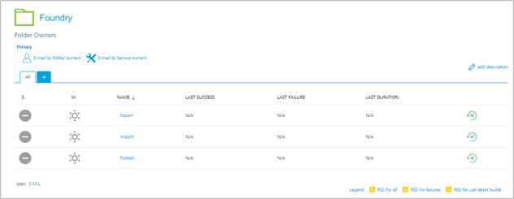
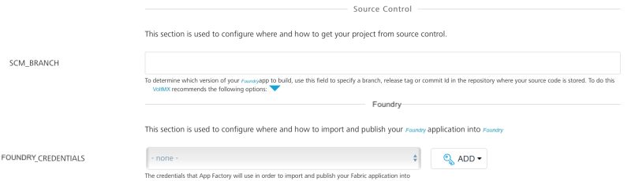

                          
Import a Foundry app
-------------------

> **_Important:_** The **Import** job is deprecated. HCL recommends using the `buildFoundryApp` job from the `Foundry/Builds` folder to achieve similar functionality. You can opt out from the CLEAN\_JAVA\_ASSETS and BUILD\_JAVA\_ASSETS options while configuring the build job to achieve the same functionality as the Import job.

Import job is responsible for uploading a Volt MX Foundry app from SCM to Volt MX Cloud. In addition, import job can publish a Volt MX Foundry app right after its upload to Volt MX Cloud. Refer parameters to specify, if a user wants to publish a Volt MX Foundry app or execute a publish job (see below).

### Configuration

The following parameters appear when a user selects 'Build with Parameters' job action.

1.  **Related to Source Control**
    
    *   **SCM\_BRANCH** is required to access the repository and choose the stored Volt MX Foundry app.
    
    
    
2.  **Import Options**
    
    *   **OVERWRITE\_EXISTING \_APP\_VERSION** - parameter required for overriding application if it’s already present in Volt MX Foundry.
    *   **ENABLE\_PUBLISH** - Once Import job execution finishes, **ENABLE\_PUBLISH** parameter is triggered to publish the job.
    *   **SET\_DEFAULT\_VERSION** - Click the checkbox to make the version specified at FOUNDRY\_APP\_VERSION field as a default version for your app.
        
    
    
    
3.  **VoltMX FOUNDRY RELATED**
    
    *   **FOUNDRY\_CREDENTIALS** - Volt MX Foundry credentials.
    *   **CLOUD\_ACCOUNT\_ID** - Volt MX account ID.
    *   **FOUNDRY\_CONSOLE\_URL** - Publicly accessible url for user's Volt MX Foundry Console (without context path), relevant for on-premise installation only. For example http://10.10.24.78:8081.
        
    *   **FOUNDRY\_IDENTITY\_URL** - Publicly accessible url for user's Volt MX Identity Services (without context path), relevant for on-premise installation only. For example http://10.10.24.79:8080.
        
    *   **FOUNDRY\_APP\_NAME** - An application ID in Volt MX Foundry (in most of the cases it is same as application name).
    *   **FOUNDRY\_APP\_VERSION** is the version of Volt MX Foundry. The default version is 1.0.
    
    
    

### Importing

Once all the parameters are set, trigger import with **BUILD** button. Importing process contains the following stages:

*   Prepare the build node environment
*   Import Volt MX Foundry application
*   Clone Volt MX Foundry application from git
*   Create zip file of Volt MX Foundry git project
*   Notify on import status by email

On successful import, the designated user receives an email alert with success details.

On unsuccessful import, designated user receives an email alert with failure details.

