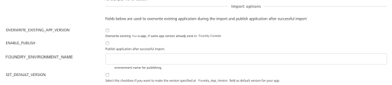

                          

Migrate a Foundry app
--------------------

> **_Important:_**

The **Migrate** job is deprecated. HCL recommend using the following approach to achieve similar functionality.

1.  Use the **Export** job from the `Foundry/Builds/FoundryTask` folder to export an app from the source environment to an SCM GIT repository. You can opt out from the IGNORE\_JARS option to include the Java assets from the Foundry app.
2.  Use the **buildFoundryApp** job available from the `Foundry/Builds` folder to import the app from the SCM GIT repository to the destination environment. You can opt out from the CLEAN\_JAVA\_ASSETS and BUILD\_JAVA\_ASSETS options while configuring the build to import the Foundry app with the Java assets.

Migrate Job is responsible for Migrating an App from one Foundry Account to another. Now users can also migrate apps between Onprem<->Cloud/OnPrem<->OnPrem instances of foundry.

In addition,migrate job can publish a Volt MX Foundry app right after its upload to Volt MX Cloud/OnPrem. Refer parameters to specify, if a user wants to migrate a Volt MX Foundry app.

### Configuration

The following parameters appear when a user selects 'Build with Parameters' job action.

1.  **Related to Source Control**
    
    *   **SCM\_BRANCH** is required to access the repository and choose the stored Volt MX Foundry app.
        
    
    
    
2.  **Foundry Details for Export**  
    Used to configure settings related to Volt MX Foundry Account and App.
    
    *   **EXPORT\_FOUNDRY\_CREDENTIALS** - Volt MX Foundry credentials.
    *   **EXPORT\_FOUNDRY\_APP\_CONFIG** \- Configuration of the Volt MX Foundry App.
        *   **Environment Name** - Foundry Environment on which the app is published.
        *   **Application Name** - The name of the application that must be migrated (in most of the cases it is same as application name).
        *   **Application Version** - The version of the Volt MX Foundry app that must be migrated. Only the specified version of the app is used for migration.
        
        > **_Note:_** Version input should be in the major.minor format, where major and minor are numbers and 1 <= major <= 999 and 0 <= minor <= 99. For example, '1.0' or '999.99'.
        
        *   **Account Id** - Volt MX Foundry account ID.
        *   **Console URL** - Publicly accessible URL of your Volt MX Foundry Console (without the context path). Only relevant for on-premise installation.  
            For example, `http://10.10.12.34:8080`
        *   **Identity URL** - Publicly accessible URL of your Volt MX Identity Services (without the context path). Only relevant for on-premise installation.  
            For example, `http://10.10.12.34:8081`
    
    
    
3.  **Export Options** - Use the following fields during the Foundry application export process.
    
    *   **OVERWRITE\_EXISTING\_SCM\_BRANCH** - Select the check box to overwrite the existing SCM branch.  
        
    
    > **_Note:_** Selecting the option overwrites the app content that exists in the specified branch with the latest exported Foundry app content.
    
    *   **AUTHOR\_EMAIL** - For Git client configuration, provide the email ID to push the changes to the remote repository.
        
    *   **COMMIT\_AUTHOR** - Provide the author for commit. App Factory value is set by default.
        
    *   **COMMIT\_MESSAGE** - Provide the message for commit. The auto-generated text is set by default.
        
    
    
    
4.  **Foundry Details for Import**  
    Used to configure settings related to Volt MX Foundry Account and App.
    
    *   **IMPORT\_FOUNDRY\_CREDENTIALS** - Volt MX Foundry credentials.
    *   **IMPORT\_FOUNDRY\_APP\_CONFIG** \- Configuration of the Volt MX Foundry App.
        *   **Environment Name** - Foundry Environment on which the app must be imported.
        *   **Application Name** - The name of the application that must be migrated (in most of the cases it is same as application name).
        *   **Application Version** - The version of the Volt MX Foundry app that must be migrated. Only the specified version of the app is used for migration.
        
        > **_Note:_** Version input should be in the major.minor format, where major and minor are numbers and 1 <= major <= 999 and 0 <= minor <= 99. For example, '1.0' or '999.99'.
        
        *   **Account Id** - Volt MX Foundry account ID.
        *   **Console URL** - Publicly accessible URL of your Volt MX Foundry Console (without the context path). Only relevant for on-premise installation.  
            For example, `http://10.10.12.34:8080`
        *   **Identity URL** - Publicly accessible URL of your Volt MX Identity Services (without the context path). Only relevant for on-premise installation.  
            For example, `http://10.10.12.34:8081`
    
    
    
5.  **Import Options** - Used to overwrite the existing application during the import process and publish the application after successful import.
    
    *   **OVERWRITE\_EXISTING\_APP\_VERSION** - Select the check box to overwrite the existing Foundry app.
        
    *   **ENABLE\_PUBLISH** - Select the check box to publish the application after successful import.
        
    *   **FOUNDRY\_ENVIRONMENT\_NAME** - Provide the Foundry environment for publishing.
        
    *   **SET\_DEFAULT\_VERSION** - Select the check box to make the specified version in the FOUNDRY\_APP\_VERSION field as the default version for your app.
        
    
    
    

### Migrating

Once all the parameters are set, trigger migrate with BUILD button. Migrating process contains the following stages:

*   Prepare environment for Migrate task.
*   Export Volt MX Foundry App from Export Account.
*   Clone Volt MX Foundry application from Git.
*   Check if there were changes.
*   Configure local Git account.
*   Prettify exported JSON files and move them to SCM.
*   Push changes to remote storing artifacts.
*   Validate the Local Foundry App before Import.
*   Create zip file of Volt MX Foundry git project.
*   Import Volt MX Foundry application project to Import Account.
*   Notify on migrate status by email.

On successful migrate, the designated user receives an email alert with success details.

On unsuccessful migrate, designated user receives an email alert with failure details.

