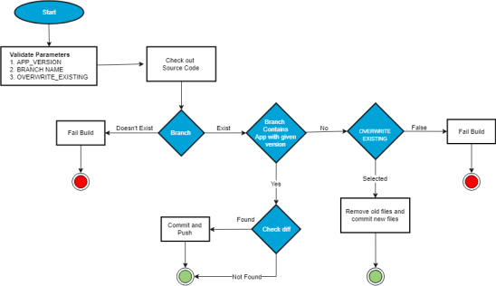
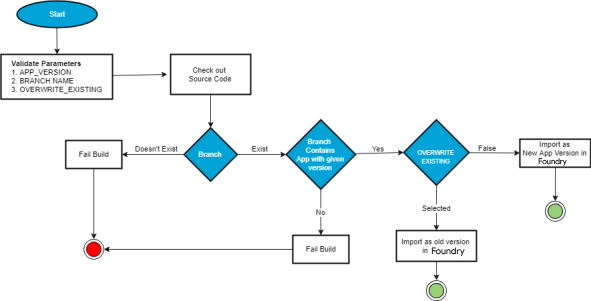
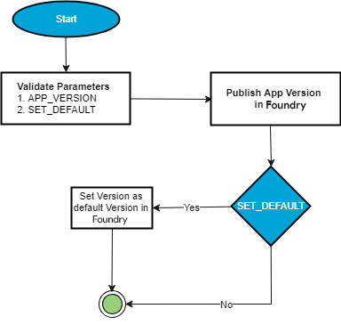

                         

Foundry Tasks
============

In App Factory, the Volt MX Foundry functionality is placed in the project folder with the corresponding app name from Foundry. Currently, there are four basic operations which are available for Foundry apps:

*   [Foundry Export](FoundryExport.md)
*   [Foundry Import](FoundryImport.md)
*   [Foundry Publish](FoundryPublish.md)
*   [Foundry Migrate](FoundryMigrate.md)

> **_Important:_**

The **Import**, **Publish**, and **Migrate** jobs have been deprecated. To achieve similar functionality, HCL recommends using the alternative approaches that are specified in the respective sections.

**App Versioning**: Volt MX Foundry contains multiple versions of the same application. App Factory supports versioning of the Volt MX Foundry app during Export (or) Import (or) Publish. The App Versioning feature impacts App Factory in various scenarios.

The following flowcharts explain the export, import, and publish processes in App Factory.

*   **Foundry Export**: The Foundry export is used to export the existing Volt MX Foundry application to SCM (git in our case). The following flow chart explains the process of exporting an application from Volt MX Foundry. After configuring the parameters in the App Factory Console for exporting a Volt MX Foundry app, and then clicking the **Build** button, the following process is performed at run time.

The following steps are performed at the run time to export a Volt MX Foundry app from Volt MX Foundry:

1.  During the export process, App Factory validates certain parameters that are provided during configuration, such as **APP\_VERSION**, **BRANCH\_NAME**, and **OVERWRITE\_EXISTING**.  
    For detailed information on the parameters, refer to [Configuring Parameters to Export an App from Volt MX Foundry.](FoundryExport.md#configuration)
2.  After verifying the parameters, App Factory checks out the source code and checks for the branch name.  
    If the branch name does not exist, the build fails.
3.  If the branch name exists, App Factory verifies the specified app\_version.
    *   If the app version of the build matches the app version of the Volt MX Foundry app in the Git repository branch, App Factory checks for the differences between both the apps.
        *   If the differences in the files are found, App Factory commits and pushes the changes.
        *   If the differences are not found, App Factory commits and pushes the build.
    *   If the specified app\_version does not match with the existing app\_version, App Factory checks whether the OVERWRITE\_EXISTING checkbox is selected. (This is done during the configuration of the Volt MX Foundry app in App Factory).  
          
        For more information on **OVERWRITE\_EXISTING**, refer [Configuring Parameters to Export an App from Volt MX Foundry](FoundryExport.md#configuration) .
        *   If **OVERWRITE\_EXISTING** is selected, App Factory removes the old files and commits new files.
        *   If **OVERWRITE\_EXISTING** is not selected, the build fails.

*   **Foundry Import**: The Foundry Import is used to import an app from the SCM to the Volt MX cloud. A user must configure a few parameters to publish an imported Foundry app or execute a publish job. After configuring the parameters and clicking the **Build** button, the following process is performed at run time.
    
    
    
    The following steps are performed at the run time to import an app to Volt MX Foundry:
    
    1.  During the import process, App Factory validates certain parameters provided during configuration like **APP\_VERSION**, **BRANCH\_NAME**, and **OVERWRITE\_EXISTING**.  
        For detailed information on the parameters, refer [Configuring Parameters to Import an App to Volt MX Foundry](FoundryImport.md#configuration).
    2.  After verifying the parameters, App Factory checks out the source code and checks for the branch name.  
        If the branch name does not exist, the build fails.
    3.  If the branch name exists, App Factory verifies the specified app\_version.
        *   If the specified app\_version does not match with the Foundry app\_version available in SCM at the specified branch, the build fails.
        *   If the app version of the build matches the app version of the Volt MX Foundry app, App Factory checks whether the **OVERWRITE\_EXISTING** checkbox is selected. (This is done during the configuration of the Volt MX Foundry app in App Factory).  
              
            For more information on **OVERWRITE\_EXISTING**, refer [Configuring Parameters to Import an App to Volt MX Foundry](FoundryImport.md#configuration) .
            *   If **OVERWRITE\_EXISTING** is selected, App Factory imports the app as an old version in Foundry.
            *   If **OVERWRITE\_EXISTING** is not selected, a new app version is imported to Foundry.
    
    > **_Important:_** The **Import** job is deprecated. HCL recommends using the `buildFoundryApp` job from the `Foundry/Builds` folder to achieve similar functionality. You can opt out from the CLEAN\_JAVA\_ASSETS and BUILD\_JAVA\_ASSETS options while configuring the build job to achieve the same functionality as the Import job.
    
*   **Foundry Publish**: The Foundry Publish is used to publish an existing application to a specific environment.
    
    
    
    The following steps explain the process of publishing an application in Foundry to a specific environment.
    
    1.  During the publishing process, App Factory validates certain parameters provided during configuration like **APP\_VERSION** and **SET\_DEFAULT**.
    2.  After validating the parameters, App Factory publishes the app in Foundry.
    3.  If **SET\_DEFAULT** is selected, the specified App\_version is set as default in Foundry.  
          
        You can publish multiple versions of Foundry applications in same app. But your iris app uses the services of a specific version in Foundry, that is set as a default version. To make the published Foundry version as the default version, select the **SET\_DEFAULT** check box while configuring the Foundry parameters.
    
    > **_Important:_** The **Publish** job is deprecated. HCL recommends using the **buildFoundryApp** job from the `Foundry/Builds` folder to achieve similar functionality. You can opt in to the **IMPORT** and **PUBLISH** options while configuring the build job to achieve the same functionality as the Publish job.
    
*   **Foundry Migrate**: The Migrate Job is used to migrate an app from one Foundry Account to another. Now users can also migrate apps between Cloud and On-premises instances of foundry. Additionally, the migrate job can also publish a Foundry app after it is uploaded to Foundry.
    
    > **_Important:_**
    
    The **Migrate** job is deprecated. HCL recommend using the following approach to achieve similar functionality.
    
    1.  Use the **Export** job from the `Foundry/Builds/FoundryTask` folder to export an app from the source environment to an SCM GIT repository. You can opt out from the IGNORE\_JARS option to include the Java assets from the Foundry app.
    2.  Use the **buildFoundryApp** job available from the `Foundry/Builds` folder to import the app from the SCM GIT repository to the destination environment. You can opt out from the CLEAN\_JAVA\_ASSETS and BUILD\_JAVA\_ASSETS options while configuring the build to import the Foundry app with the Java assets.
