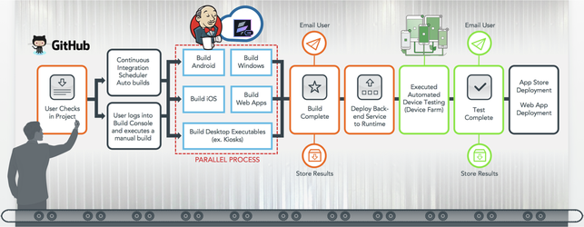

                    

App Factory User Guide
======================

The development of multi-platform applications is driven by customer demand more so than ever before. The demand for both B2C and B2E apps is driving organizations to move quickly to deploy apps and new features in shorter delivery cycles. MXDP tools help developers meet this demand. However, development teams face tight deadlines during release cycles, and instead of focusing on designing and building engaging digital experiences, they struggle to dedicate the time and effort to build, test, and prepare a release.

If the teams cannot build on demand or use a continuous integration and delivery approach, they are more likely to have merging challenges. Problems may occur when a large set of features are released without being tested in shorter build cycles. Agile is said to be fully functional only when we can constantly test and adjust the development process. The HCL App Factory CI and/or CD (Continuous Integration (or) Continuous Delivery) services complete the agile delivery process by allowing developers to continuously build, test, and deploy apps.

This document details the Volt MX App Factory CI and/or CD services and how they can help your organization successfully deliver apps. In this document, you will learn how to configure App Factory to build and test both the front end and the integrations of your multi-experience app, from your source code repository. You will also learn how to build and deploy your first app as well as test your application on your target devices using the HCL App Factory testing services.

You can also access the [Revision History](Revision_History.md) of the document.

> **_Note:_** From V8SP4, App Factory supports Xcode 10 upgrade for building and deploying the apps after Iris framework supports iOS12 with Xcode 10 for app generations. AWS device farm and Appium in App Factory supports iOS12 and Xcode10.  
  
App Factory upgrades the environment to support Xcode 10 based on the user request.
