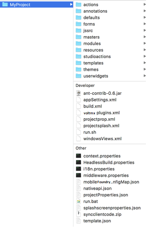

                         
Versioning a Iris project in SCM
======================================

The Iris directory in the SCM must contain unzipped packages of the app. To obtain a zipped package, [export a project](../../../Iris/iris_user_guide/Content/ShareProjectOnTheCloud.md) from Iris. When you extract the zip file, it creates an export folder for the project source. Make sure that you check-in the project source to your repository.

> **_Important:_** Currently, the only SCM supported by App Factory is Git. You can choose a Git vendor based on your preference, for example: GitHub, Bitbucket, Gitlab, AWS CodeCommit, Azure Repos, or a Git server that you're running locally.

If you check-in your entire project to a directory in your SCM, the root of the project is the project name. The following screenshot shows an app and the contents of the project in the SCM. The name of the app in this case is **MyProject**.

> **_Note:_** You can also use a Monorepo strategy to version Iris projects and Foundry projects in your SCM. For more information, refer to [Monorepo strategies in SCM](FoundryProjectVersioning.md#monorepo-strategies-in-scm).
