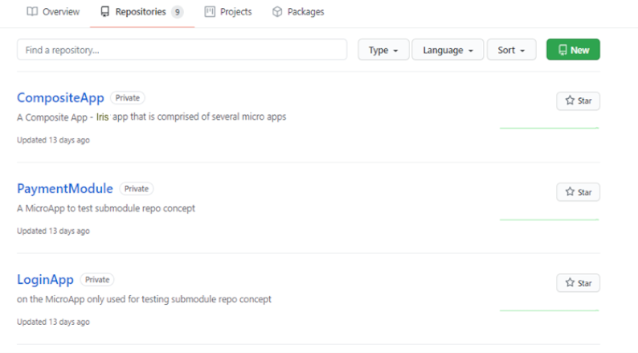
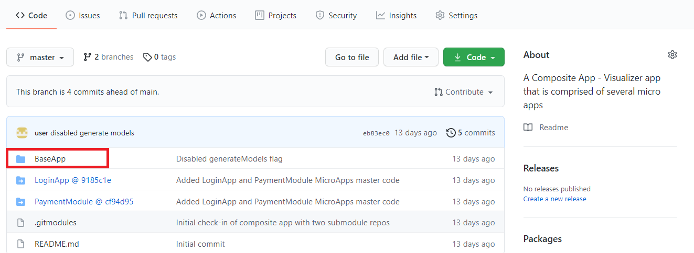
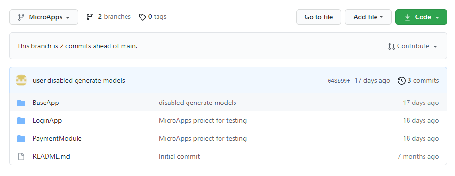

Micro Apps Best Practices
===========================

From V9 ServicePack 3, App Factory supports building Micro Apps in Iris projects. To build Micro Apps by using App Factory, you need to version the Base App and the dependent Micro Apps in your source control repository. You can version your project source code in Git based on the [Submodule Repository Approach](#submodule-repository-approach) or the [Mono Repository Approach](#mono-repository-approach). Both the approaches are supported by App Factory. However, HCL recommends the Submodule Repository Approach based on its advantages.

If you follow any other approaches (such as maintaining the base app and the micro apps in separate repositories), the approach loses control of the micro app dependencies and is not supported by App Factory.

Submodule Repository Approach
-----------------------------

In the Submodule Repository approach, the Base App and the dependent Micro Apps can be versioned in separate repositories. The Micro Apps can then be linked to the Base App by using the Git Submodule concept. For more information, refer to [Git Tools - Submodules](https://git-scm.com/book/en/v2/Git-Tools-Submodules).

Even though the micro apps are in separate repositories, when you clone the base app repository, the Git client will checkout the base app content and the micro apps content to your workspace folder. For an example, refer to the following screenshot about the project structure in GitHub.



The `CompositeApp`, `PaymentModule`, and `LoginApp` are in separate repositories.

After you create repositories to maintain the micro apps, you can link them to the parent app (base/composite app) repository by adding a submodule. To add a new submodule, you need to use the `git submodule add` command with the absolute or relevant URL of the project. For example:

```
git submodule add https://github.com/<user>/LoginApp
```

By default, the submodule is added into a directory with the same name as the repository, which in this case is `LoginApp`.

For the submodule repository approach, make sure that the base app contents are versioned in a separate folder at the root level of the repository.  


### Advantages

*   Every Micro App repository maintains its own separate change history and the submodules are updated independent of the main repository.
*   Merging submodules into the main repository can be avoided.
*   The benefits of using Submodules outweigh the complexity.

### Disadvantages

*   If any are changes made to a Micro App from Iris, the `git status` command on the current working directory does not show the changes that were staged.

Mono Repository Approach
------------------------

In the Mono Repository approach, you need to version all the Micro Apps along with the Base App in separate folders of the same repository. For an example, refer to the following screenshot about the project structure in GitHub.



The `BaseApp` folder refers to the app that contains the Iris workspace content of the base app. The `LoginApp` and `PaymentModules` sub-folders refer to the micro apps that are linked to the base app. These sub-folders contain the Iris workspace content of the respective micro app projects.

### Advantages

*   A Mono Repo is a simple approach to version multiple apps.
*   If any changes are made to a Micro App from Iris, the `git status` command on the current working directory shows the changes that were staged.

### Disadvantages

*   As a developer, you need to version all the micro apps in the same place.
*   Submodules are not an ideal solution to maintain the source code of multiple apps that are probably maintained by different development streams in a single repository.
*   You cannot manage sub-folder access management, instead you need to provide repository access to everyone.
