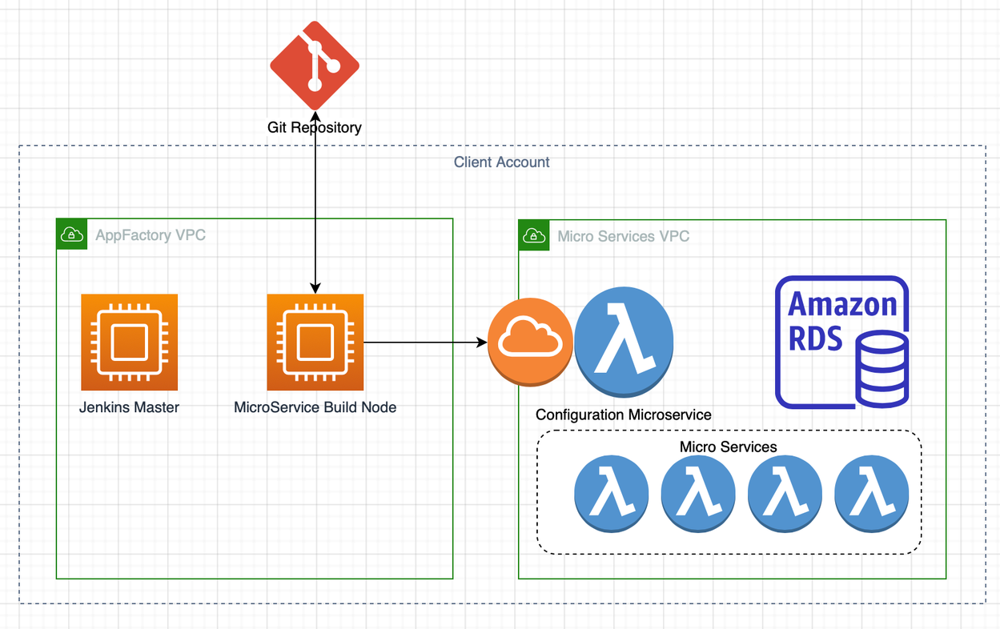
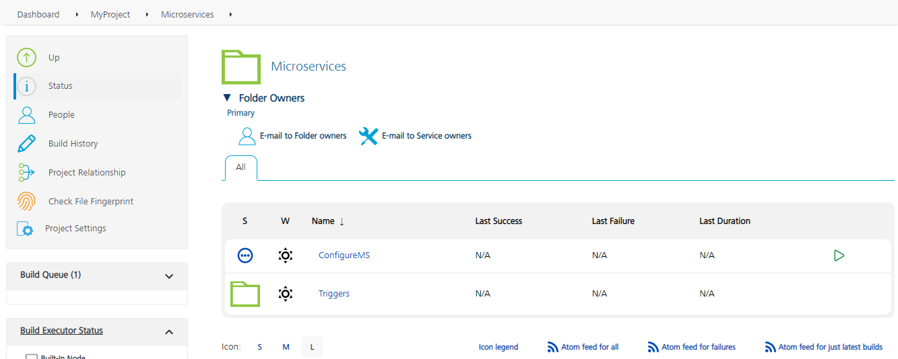

# Microservice Projects in App Factory

Microservices are architectural components that use autonomous services to construct applications. Every service is self-contained and is modeled around a business domain. 

<!-- For more information about Microservices, refer to the [Temenos Microservices Documentation](https://docs.temenos.com/docs/Solutions/Infinity/Microservices/Modules/Microservices/Misc/Introduction.html).

To view the Microservices documentation, you need to sign-in as a Temenos User, a Temenos Customer, or a Temenos Partner. -->

For information about the work flow of the Microservice projects in App Factory, refer to the following diagram.

## Microservice project folder

To run jobs for a Microservice, open the project folder from the App Factory console. The **Microservices** folder in your Project contains the **ConfigureMS** job and a **Triggers** folder.

### ConfigureMS

The **ConfigureMS** job pulls the policy and jolt files from the provided repository, and then deploys them to the configuration Microservice with an API call. The job is divided into the following steps, which the build pipeline performs during the build process.

*   **Code Checkout**: The pipeline starts with the code checkout from the source code repository. It can be done by using a branch, a tag, or a commit-id from the source code repository.
*   **Fetch Configuration Files**: In this stage, the pipeline fetches the configuration files from the specified directory and validate the file size. If any property is found invalid, the build fails with an exception message.
*   **Invoking Deploy Config API**: In this stage, the pipeline constructs the generic Microservice API from the provided **config base URL**, **groupID**, and **configName**. The pipeline also creates the required JSON request body by passing the provided configuration file content to the specified **data** key.
*   **Deploy Jolt Configuration Files**: In this stage, the provided jolt files are deployed to the specified Microservice by using an API Post request.
*   **Deploy Policy Configuration Files**: In this stage, the provided policy files are deployed to the specified Microservice by using an API Post request.
*   **Notify**: The pipeline sends the build status by e-mail to all the recipients. The email contains the build information, links to download the build artifacts, and the Git changelog details.

### Triggers

The Triggers folder contains **createConfigureMSTrigger** job, which orchestrates the scheduled run of the ConfigureMS job with time intervals that are configured by a developer. For more information, refer to [Scheduling a Job for Microservices](AutoTriggeredJobs_Microservice.md) and [Build on Push for Microservice jobs](BuildOnPush_Microservice.md).