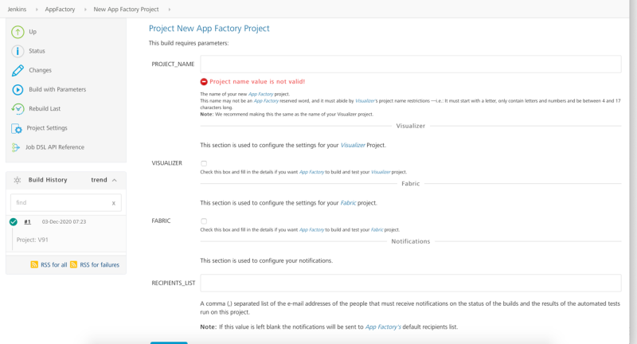
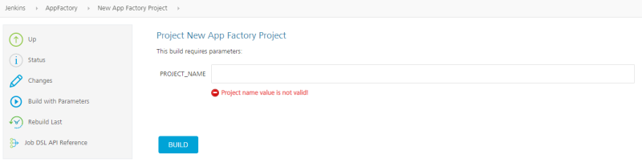
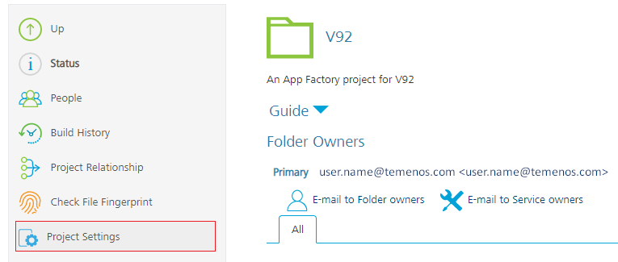
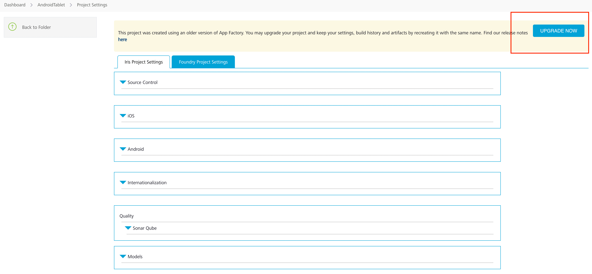
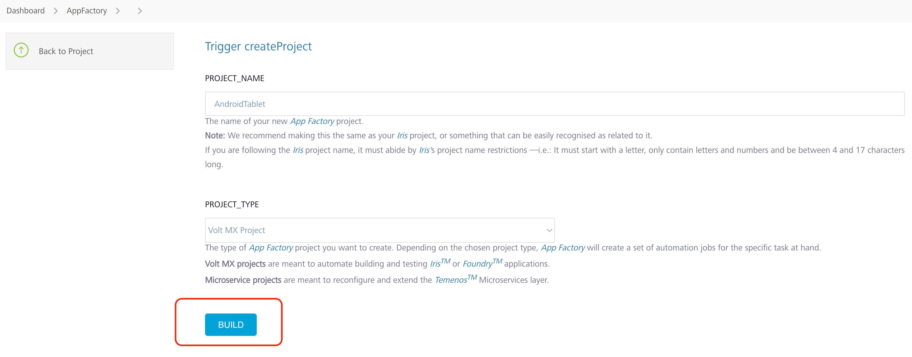

                         

Upgrading a Project in App Factory
==================================

With every release, App Factory introduces new features or fixes. To use the new features in existing App Factory projects, you need to upgrade the projects by recreating them with the **New App Factory Project** option on the left panel of your App Factory Console home page. From V9 ServicePack 2, **New App Factory Project** has been updated to contain just one parameter, PROJECT\_NAME.

The following images show the **New App Factory Project** screen before and after the V9 ServicePack 2 release.

New App Factory Project in V9 ServicePack 1:

New App Factory Project in V9 ServicePack 2:

From V9 ServicePack 2, on the New App Factory Project page, to upgrade an existing project, type the name of the project in the PROJECT\_NAME box, and then click **BUILD**. If a project with the same name exists in App Factory, it is upgraded with latest features.

V9 ServicePack 2 introduces a new feature called **Project Settings**, which can be used to enter and set up a few default values which are common across different channels, such as details that are related to the source code. Therefore, after you upgrade your project, you need to configure the Project Settings.

Setting up the project
----------------------

After you upgrade a project, navigate to the project folder and select **Project Settings** from the left panel. As a one-time setup for the project, you need to fill and save the Iris and Foundry settings based on your requirement. For more information about the fields that must be configured, refer to [Project Settings](Project_Settings.md).

After saving these settings, you can [Build a Iris app](BuildingAnApp.md) or [Build a Foundry app](BuildingFoundryApp.md) for your Project. You can also use the [Database](Database.md) service and the [Flyway job](RunningFlywayJobs.md) to run Database migrations.

> **_Important:_** If the **Project Settings** are not configured after upgrading an existing project, the build jobs will fail.

### Post Upgrade Instructions:

There are UI fixes in AppFactory project.The projects created in the older version of AppFactory will be required to be updated. 

**How to upgrade AppFactory Project** : Project Settings page for older project will show a banner with 'Upgrade Now' button which which when clicked redirects to a build page which when built, upgrades the project. 

   

