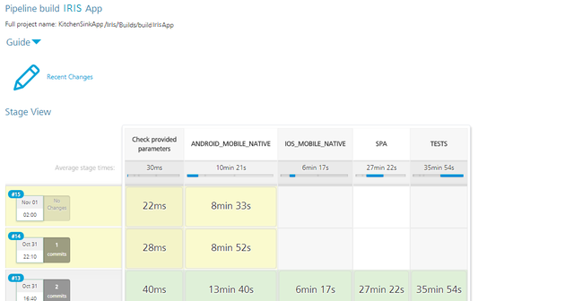

                          

Results
=======

You can review the build and test results from the Jenkins console and Testing console locations, directly in S3, by email.

Reviewing Results at Jenkins Console
------------------------------------

After a successful sign-in to the Jenkins console, navigate to the project you are building or testing.

For example, the buildIrisApp job is unstable and is denoted by a corresponding icon on the left side. You can also see an error message that specifies the stage that failed. You can troubleshoot the issues by following the instructions in the [Troubleshooting](TestingAnApp.md#troubleshooting-issues) section.

Reviewing Results at Testing Console
------------------------------------

You can log into the Volt MX Foundry Console and open Testing console in App Factory environment using your developer credentials. Navigate to the project list and select required project for analysis. If you refer to build statistics, you see a list of jobs build with a link to original HTML template (with build artifacts at S3). Also, refer to test statistics for finding information on test jobs with test artifacts at S3.

Reviewing Results by Email
--------------------------

The developers receive email notifications when the build and tests are complete. For more information, refer to the following sections:

*   [Building a Iris App](BuildingAnApp.md)
*   [Building a Foundry App](BuildingFoundryApp.md)
*   [Testing an App - TestNG](TestingAnApp.md)
*   [Testing an App - Jasmine](TestingAnAppJasmine.md)
