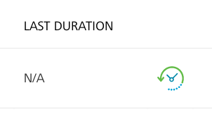
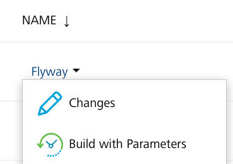
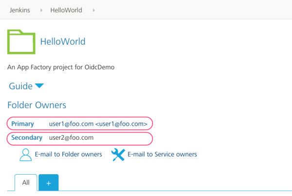

                          

Running Flyway jobs
===================

To run the Flyway job for the first time, follow these steps:

1.  From the folder of your App Factory project, navigate to **Database** → **Flyway**.
2.  Select the **Flyway** job, and then select **Build with parameters** option from the menu on the left side. Alternatively, you can run the build with parameters by following either of these steps.
    
    *   On the right-side of the job row, select the icon that represents **Build with Parameters**  
        
    *   Open the drop-down list (context-menu) for the Flyway job, and then select **Build with Parameters**  
        
    
    > **_Note:_** If you do not see the option, you might not have ownership permissions to the project. You can verify whether your name is listed in the **Folder Owners** section of the project. The Primary owner of the project can add users as secondary owners to grant permissions to the builds.  
    
    
3.  Configure the build parameters for the job. For more information about the parameters, refer to the following sections.  
    
    

Source Control related parameters

    ***
    <table style="mc-table-style: url]('Resources/TableStyles/Basic.css');width: 80%;" class="TableStyle-Basic" cellspacing="0"><colgroup><col class="TableStyle-Basic-Column-Column1" style="width: 15%;"><col class="TableStyle-Basic-Column-Column1" style="width: 65%;"></colgroup><tbody><tr class="TableStyle-Basic-Body-Body1"><th class="TableStyle-Basic-BodyE-Column1-Body1">Parameter</th><th class="TableStyle-Basic-BodyD-Column1-Body1">Description</th></tr><tr class="TableStyle-Basic-Body-Body1"><td class="TableStyle-Basic-BodyE-Column1-Body1">SCM_URL</td><td class="TableStyle-Basic-BodyD-Column1-Body1">Specifies the URL of the source control repository that contains the Flyway scripts. The URL must be accessible by App Factory.</td></tr><tr class="TableStyle-Basic-Body-Body1"><td class="TableStyle-Basic-BodyE-Column1-Body1">SCM_BRANCH</td><td class="TableStyle-Basic-BodyD-Column1-Body1">Specifies the branch of the source control repository that contains the specific version of the Flyway scripts that you want to use.</td></tr><tr class="TableStyle-Basic-Body-Body1"><td class="TableStyle-Basic-BodyB-Column1-Body1">SCM_CREDENTIALS</td><td class="TableStyle-Basic-BodyA-Column1-Body1">Specifies the credentials that are used to access the source control repository.For more information, refer to <a href="ManagingCredentials.html#Adding_SourceCode" target="_blank">Adding New Source Code Repository Credentials</a>.</td></tr></tbody></table>
    ***

Flyway related parameters

    ***
    <table style="mc-table-style: url]('Resources/TableStyles/Basic.css');width: 80%;" class="TableStyle-Basic" cellspacing="0"><colgroup><col class="TableStyle-Basic-Column-Column1" style="width: 15%;"><col class="TableStyle-Basic-Column-Column1" style="width: 65%;"></colgroup><tbody><tr class="TableStyle-Basic-Body-Body1"><th class="TableStyle-Basic-BodyE-Column1-Body1">Parameter</th><th class="TableStyle-Basic-BodyD-Column1-Body1">Description</th></tr><tr class="TableStyle-Basic-Body-Body1"><td class="TableStyle-Basic-BodyE-Column1-Body1">LOCATION</td><td class="TableStyle-Basic-BodyD-Column1-Body1">Specifies a comma-separated list of paths that contain the Flyway scripts, relative to the root of the source control repository.</td></tr><tr class="TableStyle-Basic-Body-Body1"><td class="TableStyle-Basic-BodyE-Column1-Body1">FLYWAY_COMMAND</td><td class="TableStyle-Basic-BodyD-Column1-Body1">Specifies the commands that are run as part of the Flyway job. For example: <code class="codefirst" style="font-size: 11pt;">migrate</code>, <code class="codefirst" style="font-size: 11pt;">info</code>, or <code class="codefirst" style="font-size: 11pt;">validate</code>For more information, refer to <a href="https://flywaydb.org/documentation/command/migrate" target="_blank">Commands</a> in the Flyway documentation.</td></tr><tr class="TableStyle-Basic-Body-Body1"><td class="TableStyle-Basic-BodyE-Column1-Body1">DB_CREDENTIALS</td><td class="TableStyle-Basic-BodyD-Column1-Body1">Specifies the credentials that are used to access the database and run the Flyway scripts.For more information, refer to <a href="ManagingCredentials.html#Adding_Database" target="_blank">Adding New Database Credentials</a>.</td></tr><tr class="TableStyle-Basic-Body-Body1"><td class="TableStyle-Basic-BodyB-Column1-Body1">OPTIONS</td><td class="TableStyle-Basic-BodyA-Column1-Body1">Specifies command line options that are used with the Flyway command. For example: <code class="codefirst" style="font-size: 11pt;">-schemas=dbpdblocal</code>For more information, refer to <a href="https://flywaydb.org/documentation/commandline/" target="_blank">Command-line</a> in the Flyway documentation.</td></tr></tbody></table>
    ***

Notification related parameters

    ***
    <table style="mc-table-style: url('Resources/TableStyles/Basic.css');width: 80%;" class="TableStyle-Basic" cellspacing="0"><colgroup><col class="TableStyle-Basic-Column-Column1" style="width: 15%;"><col class="TableStyle-Basic-Column-Column1" style="width: 65%;"></colgroup><tbody><tr class="TableStyle-Basic-Body-Body1"><th class="TableStyle-Basic-BodyE-Column1-Body1">Parameter</th><th class="TableStyle-Basic-BodyD-Column1-Body1">Description</th></tr><tr class="TableStyle-Basic-Body-Body1"><td class="TableStyle-Basic-BodyB-Column1-Body1">RECIPIENTS_LIST</td><td class="TableStyle-Basic-BodyA-Column1-Body1">Specifies a comma-separated list of the e-mail addresses that must receive notifications on the results of this job.</td></tr></tbody></table>
    ***

4.  After you configure all the parameters, click **BUILD**.

After a Build is successfully triggered, you can check the status of the build in the Build History panel. The following screenshot displays a build that is in progress (#4965) with the progress indicator icon.

You can click the icon to see the detailed output of the current build or click the progress bar to open the build page of the job. From the build page, you can click Console Output to display the detailed output of the running build.
