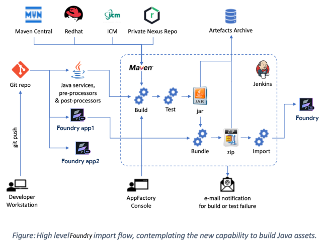
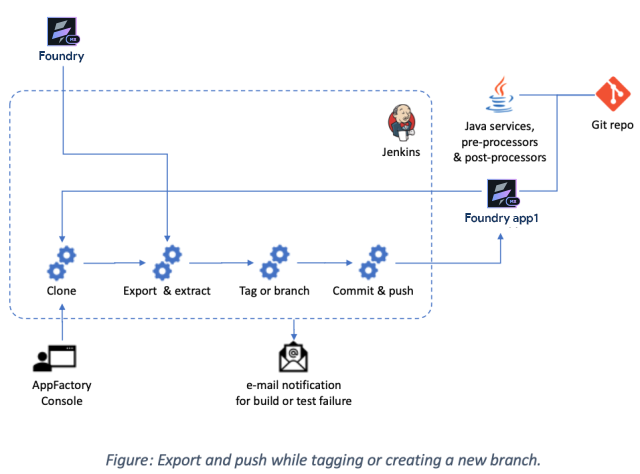
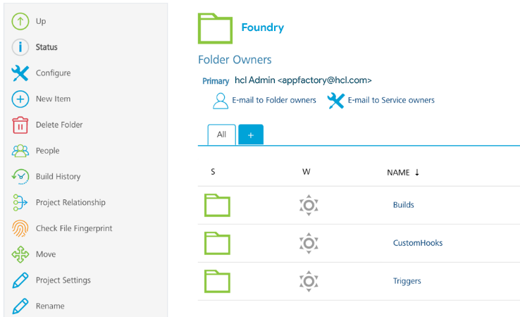
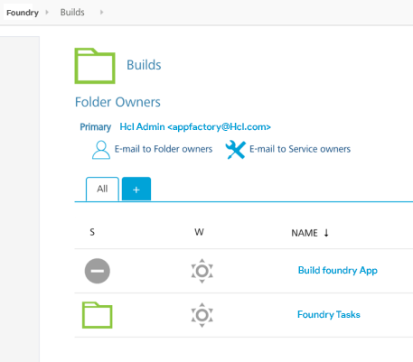
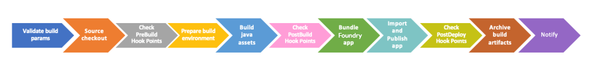
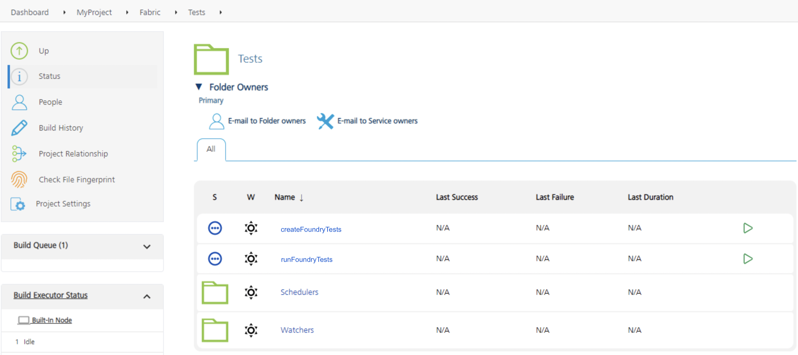

                          

Foundry Projects in App Factory
==============================

In App Factory, you can enable CI/CD for the source code of a Volt MX Foundry app by creating a Foundry app project. You can then use appropriate Foundry related Jobs to trigger builds that can generate the final app, Import the app to a Foundry cloud, and Publish the app to a Foundry environment.

From V9 ServicePack 1, App Factory supports the import, build, and export of Java assets of a Foundry app. For more information, refer to [Building Java Dependencies](BuildingJavaDependencies.md).

For more information about the import flow and the export flow, you can refer to the following diagrams:

Foundry project folder
---------------------

The following section contains information about how to run, build, and deploy a Foundry app by using the App Factory CI/CD process. After the build is completed, an email notification is sent about the build result with information about the build artifacts, changelog from the Git tool, and build settings.

To run jobs for a Foundry app, open the project folder from the App Factory console, and then open the **Foundry** folder. The Foundry folder contains three nested folders.

*   Builds
*   Custom Hooks
*   Tests
*   Triggers

### Builds

The **Builds** folder contains the **buildFoundryApp** job, which orchestrates the build and publish logic of a Foundry app to the Volt MX Foundry environment.

The **buildFoundryApp** job initiates the Foundry project build stage, which depends on (but is not limited to) the following parameters:

*   The **VoltMX Foundry App Config Environment** that is used to build a Foundry app and then publish the app. You can use different Foundry environments to split the release stages into three phases: Development, Staging, and Production.  
    *   Developers or testers use a **development** environment to test the features that are developed in a specific branch
    *   Developers or testers use a **staging** environment to test features that are developed in a sprint or a release
    *   An administrator uses a **production** environment to deploy the features that are developed in a sprint or a release

The **buildFoundryApp** job is divided into the following steps that the build pipeline performs during the build process.

*   **Source Checkout**: The pipeline starts with the code checkout from the repository. It can be done by using a branch, a tag, or a commit-id from the source code repository.
*   **Build Java Assets**: An optional stage in which the pipeline builds the java assets (pre-processors, post-processors or custom service java code) of the Foundry app. Based on the JAVA\_BASE\_DIR parameter and the Maven POM files in the source code, the pipeline runs all Maven commands.
*   **Bundle Foundry App**: The pipeline generates the final Foundry App package that can be used in later stages for the Import and Publish to a Foundry environment. The package also given to the user as an artefact that is available for download.
*   **Import and Publish App**: An optional stage in which the pipeline Imports and Publishes the app to the selected Foundry Environment. Based on the choices that are selected at the build screen, the pipeline automatically completes this activity.
*   **Archive Build Artifacts**: The pipeline archives the Foundry App package and the binaries of the Java assets that are generated during the pipeline build process and stores it on S3 bucket.
*   **Notify**: The pipeline sends the build status by e-mail to all the recipients. The email contains the build information, links to download the build artifacts, and the Git changelog details.

For more information, refer to [Building a Foundry app](BuildingFoundryApp.md).

### Custom Hooks

Custom Hooks are custom pipelines that consist of a Java source code and a build script, which is either an ANT script or a MAVEN script. The hooks can be set to run at certain stages of the build flow, such as pre-build and post-build.

For more information, refer to [Custom Hooks for Foundry jobs](CustomHooksFoundry.md).

### Tests

The Tests folder contains jobs to create and run tests. It also contains sub-folders that store the created tests based on the trigger mechanism.

For more information, refer to Testing a [Foundry app with the Cucumber Framework](TestFoundryApp_Cucumber.md).

### Triggers

The Triggers folder contains the **createFabricAppTrigger** job, which creates a trigger to perform a build based on a schedule or based on a push to the source code. There are two sub-folders that store the created triggers based on the trigger mechanism.

For more information, refer to the following sections:

*   [Scheduling a Foundry Build](AutoTriggeredJobs_Foundry.md)
*   [Build on Push for Foundry Apps](BuildOnPush_Foundry.md)

Build Results Notification
--------------------------

After a build job is completed, members that are added to the [Recipients](Project_Settings.md#Notifications_Foundry) project setting receive an email that contains generic information about the build. The email also contains the a list of artifacts with corresponding links to an S3 bucket.
